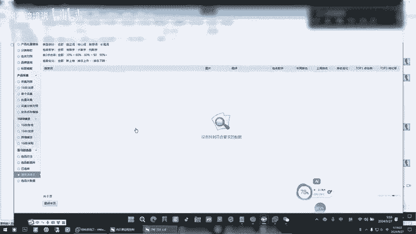
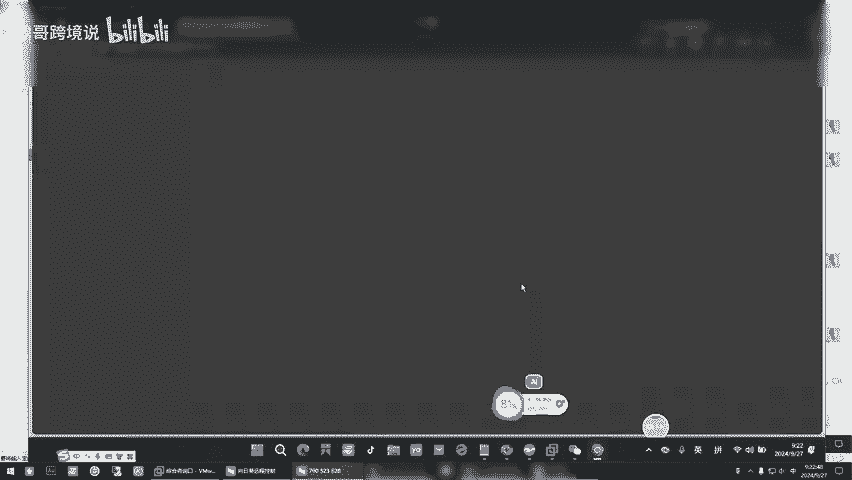
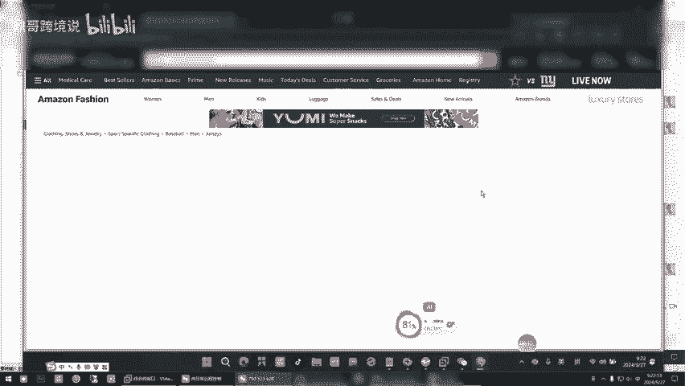
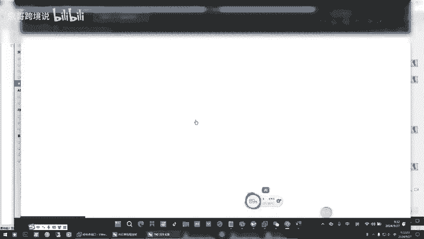

# 重要！新手亚马逊fbm模式怎么选品？鼎哥跨境说让你不走弯路！ - P1 - 鼎哥跨境说 - BV1Nvsde9EnS

喂。😊，哎，丁哥来，我告诉你问题在哪里。其实一个非常简单的问题，你忽略了一个细节啊，你忽略了一个细节。你看你虚拟机里啊，你你是在运作，你看打开虚拟机，你看啊。啊。你是不是在跑数据是吧？嗯对呀。

我是不是让你跟你说开的时候把这个点的右侧。点右侧这个箭头啊把它缩回去。对嗯，你看你不缩回去，它就点不了这个，现在缩回去了吧。啊，是吧你再看是不是535条了。啊，问题在这样他没毛病，你要把它伸出来。

他就点不了这个东西，知道了吧？啊，它会自动的点击保你保存任务呗。对对对，所以说你说他数字不变，那肯定是有问题，看起来在跑，你缺东西知道了吧？你就就我都累死了，我跑着数据跑的不是啊。

他就你看是不是往那一放它就没事了，正常了是吧？你看数据变了吗？啊，我就这么个小问题，对。啊，然后顶哥，我想问一下哈，就是当运行地板的时候，它下边那个条数会不会增加？呃，什么会呀都会增加。嗯。

不管A板还是B板条度都会有变化。你这个地方你别关注它这个的我我让你搞完，是为了让你数据多一些的，最主要的是在外面。它这个大概率你看上你看变了吧，上千条的时候多点，它这儿多了，这儿就多了。

你看你看点这个采集列表是吧，它这上面4000多条记录，你现在还不够多啊，你这你就采，因为你在这个过程中，你你要把这个东西干掉，你把这个不看的，不看不看这个的，你再把它干掉。看3000多。

你其实没多少条数据，你就一直让他跑就行了。这就没，你看现在都是中国卖家了，他才1000多条记录知道了吧？那我那我昨天晚上就是像那个地方我没给缩起来的时候，他那跑白都白跑了。对，跑了无用功。

但是你这个东西我必须得你看这个远程给你讲明白，我给你微信里讲，你也不明白，那就这么点一下，完事了。啊，这么回事，对，远程给你一实操哦，就那么一丁点，你看你不给你，你看微信里说半天。

估计你也搞不明白啥原因，我我我对我都费s死劲了。对你现在你咱们稍微就动了他一下，你看他正常了吧。😊，是是。到这个地方，你看啊。你别管它外面。这个里面就中国卖家的数据越来越这个有点少，少了，它不好弄。

少了它大数据漏没有几条。嗯，其实维没有几，我们大部分是把FBA的过滤了。因为你现在不做FBA要做FBA的话，那些数据有用，不做就没有用，那你这个时候跑，我是说你这个跟那个要互相参考一下，知道了吧？

这个里面也有。你也可以去看，还有这个这个搜索词这个地方，你看师傅我给你大概的讲他们什么原理啊，哎，电脑有点卡，你的电脑啊。

嗯，你看它这个吧和咱们那个一代，它又有点不一样。哎，它也是我们预先预先就是导进来的数据啊，预先。导进来的数据。嗯，所以说这个东西我一般我是用的一代和这个多这个东西实话说了，它的搜索词啊。

它没有多大实际意义，你知道吧？它只是一个词，他出来给你弄推荐了这三个，别的你也看不着，实话你也看不着。嗯，尽可能的就在这个上面，这个上面多去多去。对吧看一看啊，对你就找那些未注册的是吧，是发货的。

一开始你的起点起点低是不是难度就低是吧？记住起点别太高，太高了，你难度大了以后，你搞了搞的，你自己都搞的没信心。因为一开始的先从简单的做起。简单的做起，你把这个0到1实现了。

你你把这一关就你就是在这个选品抓数据这一关可能要浪费些，不能就浪费时间，就用的时间多题。你一旦选出来。对对，一旦选出来的时候，做文案干那个就快了，那个就真快了。做文案投流那些啊可快了，完了就等出单。

你每天就上架等出单，上架等出单就行了，就等别的事儿，你别掺和就等就完事了。呀。😊，我告诉你那个配比，告诉你多少量，这个东西上多少个，那个东西上多少个，怎么投，你完了等等就完事了。就是现在你要练这个。

反正你这你得得一个星期左右，你才能摸的萌清，就是怎么个怎么玩，怎么抓这怎么筛选，怎么地做手感，你是不是你在咋的一个星期，说实话，这每个人跟每个人执行力不一样。你看今天你还让他跑吗？

你咋不得跑到上千条1000到1500100到1500差不多了，你这里面差不多这种中国卖家的中国卖家的有那么几千条记录的时候，我再给你讲一下，他应该一几千条记录就能筛选出一两个来了，你就能练手了。

知道了吧？你就能上手练了。现在没没别的事，你只能是等吧，你对吧？找见问题在哪，你就知道咋回事了嗯。嗯，是不是？然后我细节，这就是细节，你就没注意到哪个细节。我一开始就跟你讲过。对嗯。哦，然后我想问一下。

那个什么只看中国发货，不看中国发货，这是什么？这是从中国发货的，从中国发货的这大这大概率都是FBM你看是不是都是FBM。是，那这个呢另外一个呢不看中国发货的人，看中国发货就是FBA。还有啊这是FBA呀。

也有FBM，但是人家是美国，这个这个就是海外仓了。啊啊啊这个就类似于海外仓，因为他的店铺是美国铺子，你看他资料你看到了吗？你看他的资料，他显示的是美国铺子，地址都是美国的这这这人家的美国发货地址。

🎼这个不不看中国发货，它有两种里面，一种是FBA的，一种是美国的海外仓的。哦哦，要是只看中国发货，那肯定是FBM，那你就不用想了，绝对是FBM。嗯，但是我昨天也发现一个，就是我点进去以后。

发现它是FBA不有些时候是啥了，你可能点进去有人在跟卖。有些品啊，你FBM也能跟FB也能跟当这个FBA的抢到了购物车的时候啊，举例说这个品原来它是FBM，但是被FBA的给抢了购物车。

那你抢了购物车的时候，你点进去显示它就是FB对吧？你要看原啊，对就是这个啊，你看到你要看原始卖家，你明白意思吧？人家这个有原始卖家，你看跟卖的这么多，是先后顺序吗？降价的相后顺序的价格不一样。

越往上这是抢购物车越便宜。对它便宜。你看到了，人家最原始是14。99。对不对？这是那最原始的卖家。所以你点进去，有可能你有可能现在刚点进去看的那个正好是FBA给抢了购物车了。

它就显示是FB但里面的原来是FBM是这样子。嗯，然后我还想问一下，比如说这个链接我点进去怎么把它翻译成那个汉语呢？你上前台上我给你随便点一个啊，你上了前台以后打开你的那个我我让你装那个快乐上网。

打开快乐上网以后点这个右键点右键这个listing球衣别碰啊，球衣类的一个都别碰啊，那是侵权产品点这个翻译成中文看明白了吗？这个前提你得把那个东西打开就装了的那个东西知道吧？你打开才能翻译过来。

不打开翻译不过来，不是EDG也可以自动翻译，但是我建议用用谷歌知道吧？打开那个东西看见了无法他必须打开那个快乐上网，那个就就能翻译了。对对切记啊球衣类的一个都别碰啊，我跟你说。

我们是原来我们自己干时吃过亏好几万就搭进去了。

哦，血淋淋的教训是卖的快，真是那搞不住亚马逊搞你一下。亚马逊问你要授权，你上哪去找授权，这都是中国的高仿。不要碰哦哦，这么回事。对。雪淋灵的教训。

我昨天还看你说有一个地方就是卖家精灵那个地方没有数据哪嘞？那我来，我知道你说哪说我知道你说哪儿嘞。你这个网今天有点卡，你是说这个地方有些时候没数据是吧？啊，对，对对，没数据，别管没数据，它是不行的。

你看举例说他没数据，他这有数据或者软件里有数据，你像这个他有些时候没数据，因为它是他凡是这种爬虫类的软件，它都有延迟，它没出来，没知道，他可能过几天它就出来了，它是这个意思。有些时候你可以呃可以放弃。

你也不差于那一半个放弃大概率这没数据的时候，这些地方的数据不会太好，有可能小于5，知道了吧？哦哦哦，然后那个我想问我就是我得选什么样的品呢？就是每天的这三个数除以3除以30，每一天的销量在多少。

我可以选呢？你我昨天不是跟你讲过吗？你要做这个，你人家举例说计算出来，你看的那个品，他一天能出一单的时候，你如果做了，绝例是人家一天能出一个月出30单，你可能上去也就出十单，他能出100单的品。

有可能你也能你就能出个20单到30单，是这样子。哦，是肯定是选的时候，咱们尽可能的选销量为王的市场里面的产品，知道了吗？哦哦，因为它本身它都做不好呃，它销量都起不来，你跟上去是不是对吧？

你觉得你比他牛吗？刚上去不可能的事儿，是因为因为我昨天取的数据少嘛？我只看了几条，然后我就。等会儿啊。我就发现就是这个每一天这个30。一天就是4家5个两个这样的平均销量。

因为我的数据是一般他人家一天举例说能出两三单的，你就可以去试试了。你现在要做的是先从0到1的突破，知道了吧？把整个流程方法，你像那个球衣别碰啊。你看你写俩球衣，别碰啊，你可以干掉了，你不要碰是好卖单。

容易把你账户挂掉。嗯，然后你看这是三行，他们这个单价虽然是FM，但是它的这个价格是美元哈，价格特别低，价格你不用管，因为你要自己做产品的时候，你的价格跟它是不一样的。那是人家的价格。

但你肯定有可能比他高，但别高离谱就行。因为亚马逊它是A9算法是千人千面，但有些时候可能把你的就展示出来了，没有展示别人的。但你要跟人家FV的价格比你得放在放在一起，你是不占优势的。

有有些时候可能他看到的不是FB看到的是你，那正好他需要，对吧？哦，千人千面，他就给给每个人展示的东西都不一样。哦。对你这个公式没其，你就这么来，先把按销量来衡选以后遇到棒球类的球衣的。

遇到什么婴儿用品的，什么奶嘴什么什么尿尿布，就这个小孩穿的睡衣了么？尿垫了，你千万别碰，我跟你说。好哦，那个登山鞋呢，登山鞋不这个时候他这个可以，但是你要看一个什么东西啊。

这个登山鞋的主关键词你要去用那个呃这个地方用那个谷歌趋势，看一下它这个主关键词的趋势。那个那个前提也是得打开那个快乐上网，我打不开，你可能你的网站有点卡。今天有点卡，我不能打开你点开谷歌不能打啊。

点开谷歌，我跟你说，你确定了做一个东西的时候，你先去那个AMZ123。对，打开AMZ123。在谷歌谷歌里打开那个AMZ123。嗯。呃，这个地方你往下拉，它会有一个谷骼趋势。你拉吧，我我卡的不行。

你往下拉，看到那个看到那个补歌趋势。嗯，到了到了到了到了，就这个地方，谷歌趋势，谷歌趋势，你你你你前提得打开那个东西，你现在别打了，就是呃前你得打开那个快乐上网，然后把它那个主关键词输入，它能选地区。

你就选一下北美，你就看一下它的区看一下它的那个流量趋势，知道了吧？你先看它是每年的哪几个月忘，不过你说自发货无所谓。你它只要有有指数，有趋势就可以，知道了吧？嗯，看见了，他必须得用那个快乐上网。

它才能打开。

就是要看他有没有指数，就说就说咱们中国做些东西，他需要百度指数或者指数，看它的这个走势。你确定了这个主关键词，它有有指数。哎，你还能看到每年的几月份忘，那你这做了无所谓，知道吧？

别打别打别打，完后你自己打吧啊嗯先关了，别打嗯。就是我告诉你，你确定要做哪个的时候呃，再去看一下谷歌的趋势，知道了吧？哦，你把这个都删掉吧，球衣都把它干掉吧，你全删掉就行。啊，对你把这边有个批量删除。

把它干掉就完事了。嗯嗯。你看数据是不是多了，现在是吧？是是的哦，你还是没弄对嘛？你弄对了，不就拿个数据不是很受益人，轻而易举的就拿了，是吧？嗯，你看你电脑里那个我想88%，我想问哈，就是一次的话。

运行一次是200个产品。我我看了一下，一次大概是半个小时，200个关键词。哦，然后是一个小时搞400个是我跟你算一个小时举例说搞了400个关键词，对吧？

400个关键词原理上他是能搞404000个A审进来，但是400个A进来，估计有3000个3000个，就是FB的，就是不是中国卖家发货。你把它干掉以后，也就400个关键词，有1000个左右是中国卖家。

那你搞个一就是花两个小时或者三个小时，是不是就搞了三四千0条这个中国卖家的是吧？那么三四千条里面你肯定得过滤出来几个你能上手的。咱们选品啊不像他们怎么，咱们选品是找到这个源头。

我们去挖掘它背后的蓝海市场，就就举例说你叫刘某某，对吧？和你名字一样，长得不一样。那么我们去哪里挖掘去1688或者淘宝，你去输入它的主关键词会出来很多产品。那么这长得不一样的产品，它都叫刘某某。

听懂啥意思了吧？那我们把这些这些产品搞进去，完，后再用我们自己的头流技术，是不是别人如果跟你做同样的东西，说他不投流，他没曝光，你投流就你就曝光是吗？那你就比别人要快。所以说干啥事的时候。

咱先把逻辑思维弄明白，对不对？是吧？弄明白逻辑思维，接下来就是一个量化操作。嗯，嗯。我想问哈，就是比如说那个A，我运行一次是30分钟。比如说我A运行4次的话，就是两个小时，还都是说成功的前提下。

然后B呢我再运行4次，那就是。四几个小时，你就你你不要4个小时，你不用关注这个东西，这个地方是啥意思？咱这个地方的意思，我让你运行的目的是咱有数据够用就行了，对不对？没有数据的情况下，举例说。

你看你现在是600多条了哈，举例说你你不管运行了几个小时。那你这个里面的数据，你能筛选出来，你要练手的，或者你能选出来的，你就是好数据，对吧？你如果说搞了四五千条数据，这里的数据还是不理想。

那你就全部把它删除了，重新来过，因为你添加的这个关键词，它不会重复，知道吧？它不会重复，它添加一条删一条，不会重复，还有你要关注这个，因为毕竟它是19号的数据，新天都多少，你要关注它是否更新了。

更新了以后用新数据添加啊，用那个新数据。有任任何时候记住一定要拿最最最新的一手数据啊，你看啊你看还没更新呢，就快了，就这一半天的事，它就会更新。更新完了以后，你用最新的数据啊。

哦。好。就把细节做到位，其实你执行力可以，就是哎做的时候稳当点，多想想，多观察观察是吧，看哪个地方自己是不是疏忽了。对对对，你说是不是白跑一晚上远程跟我说一下比较好。我是昨天前天我一直都在跑。

但是一直他不出数呢。他就跟人讲了，你光看车笼子转了，没跑了公里数啊，那肯定是原地打滑了嘛，他没有接触地面嘛，对吧？嗯嗯，你把那个就往右一滑，是不是它就接触到地面了，它就开始了，就一个小小细节看一下就。

所以说干啥事，你别看一个小细节，你看在实操的过程中，你你就是稳扎稳打的弄对了以后，有些时候一开始认为哎，我怎么这么慢了，弄个这不是慢就是快快就是慢，慢的时候，你基础的东西可能你来回反复。

但你是不是基础打的牢。再往后面的时候，是不是轻车熟路，整个一个流程下来是吧？有的是有的人快快了以后干嘛？他要返攻，他前面的忘了。有这样的嗯，所以说一开始就是费时间，也就是在这个上面费点时间。

选品练手感和眼感。等到你写文案，把文案的那个思路这整明白了以后，你其实写上一个品，你等于是做了一个模板。做了一个模板，你换不同的品质换个图片，换了一些参数就这个别的不变，因为它关键词是通用的。

其实后面就简单了，你就设计一个模板，你往那套就行了。啊，是对，提升效率，哪能像你了做一个品，上午做的下午你的一天能做好几个品，剩至5到10个品就上去了。嗯，我记得我刚刚刚做亚马逊熟益9年。

我一天能上三四十个屏，那一天呀很细的，你好厉害，你咋上的呀？就用那个电脑密码，你得总结方法嘛，就自己设置了套模板，就一天就做图，一天举例说做了几十副图，完了把同一类产品，不同的图片。

做完了就开始就搭积木一样，挨做软件插，哎，就变就上去了。我们都是上午开始做产品，到晚上五六点钟那会儿下班的时候，下天下班的时候统一传产品。上午下午做产品，晚上统一全产品。那你们挺厉害的。

以前那叫海扑以前是海扑，现在铺了，现在就是精细化。即使说做产品也是精铺精铺铺的时候要投流，但是要提高效能了，不是数量效能还是不一样，这海这海扑没有用啊，铺多少条。

他干干铺他不得出单的对我有一个学员那个也是去了个线下机构每天上10百个品，回来我也检查到不行，你上了三四千个了，不行，你要是精铺上了三四千个，你一天不出二三十单，那了不得了，一天最少出二三十单。

我说精铺，你要铺了三四千个。嗯，是。然后顶哥，我想问您您十一有出行的计划吗？我这边十一的话，我这边问您问题，您那边白天能给我解答吗？呃，能解答一般问题，我要是出门肯定上不了电脑，但是微信上没问题。

你有啥，我告诉你咋操作就行。行行，对，好，我也不知道我出不出去啊，实话说我也不知道。但你要问问题，我微信看到了，我就都跟你说怎么回事怎么回事，要是操作，也可能是晚上能操作电脑，要出去，肯定白天操作不了。

对吧？嗯嗯嗯嗯嗯。好。😔，那我暂时先抓群，先抓吧。所以说你的这些问题都是小问题。哎。就你几句话就给解决了，我这自己整抠着抠着抠了半天是为啥说干啥事。

人得有老师带你不带你自我摸索的代价是非常大的那最大的成本是什么？是时间成本，最大的成本是时间成本。问题你付出了时间，你还不知不知道自己弄对了还是错了，这个才是最可悲的。然后干干干就不想干了。

对你就没信心了。是。你先忙吧哈你先忙吧。啊，行好的，好，谢谢顶哥。嗯，哎，好嘞，哎，好，拜拜拜拜。😊。

