# 重要！新手亚马逊选品实操，鼎哥跨境说教你不知道的选品方法！ - P1 - 鼎哥跨境说 - BV1bVtoeBE7m

hello，大家好，我是顶哥。很高兴呢今天又和小伙伴们见面了。😊，呃，老样子还是做个简单的自我介绍啊，顶格跨境说专注亚马逊的新手选品，独创亚马逊的新手综合选品法，让你选品不再难。

让你最快速的实现新手亚马逊运营出单，0到1的突破低成本的FBM轻铺翁模式，让你少走弯路少踩坑，谁的钱也是血汗钱，不学习就要被市场教训，学习的目的就是减少被教训的几率。本期分享的呢是和学员一对一实操。

直接拿结果。本期系列都是。因为顶哥这里只注重实操实操实操，咱们没有那么多的废话，直接拿结果啊。底下这个内容我就不说了，它是整个顶哥运营系列实操系列的步骤啊。

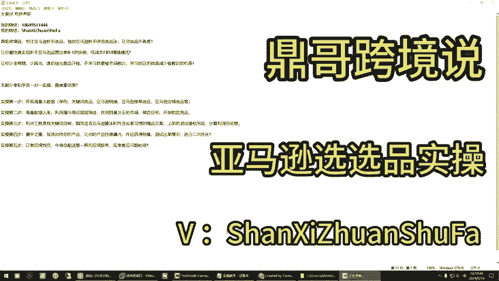

接下来我们直接开始。hello。哎，顶哥吃过饭了吗？嗯，吃过了吃过了。吃过了，咱们就开干。好嘞好嘞，先登录你的系统。🎼啊，对吧今天晚上现在是在那个你是主角啊。啊，等等你关掉它，不对不对啊。

它这个地方给转移了啊啊，这个转移到这儿了，你关掉它退灯一下。给搬了家了。一代还在这儿，你看到了？一代这个东西还在这儿啊，对，先从一代开始吧。二代二代去了这个地方了，记住二代在这儿啊。哦哦，他给移那去了。

😮，过了个节，他给移了，我我也是真天他妈找不着了。好嘞，咱们。🎼你来你来去搞啊，我来去帮和你一起分析啊，咱们才有采用这种方式我。我现在是搞了几个品，你先看一下吧。嗯。就几个，这是呃。

我先暂时呃这里面也有，但是我。因为什么，我我之前因为我都是按照FB那个什么那个跟脉走的啊，别管他说几个，就是他只是个形式，不用管它啊。😡，哦。我先看一个吧，嗯，没事，这么多里，你挑一两个就行了。

你把东西弄明白就行了。啊，他这个我现在与。这品是我这欧调的机吧，这种可能就是个。同类不同款啊之类的对，缝纫机，这是一个。啊，这个之间我在家缝衣服的，你稍等一下，你有没有那个快乐上网的东西，快乐上网。

你等我再说，我没用过怎没用过，没有。那你后面我给有没有我给你发个链接，在我不能在我不能在这个视频里发，知道了吧？我不能跟你视频里讲，我告诉你用要用要用到一个工具，在在这个地方呃，你去打开AMZ123。

在这个这个是不是你打开这，你要当你决定了要做一个屏的时候啊，决定的做一个品的时候，你这道这个东西是要用的，但是这个东西是需要那个东西才能打开，需要那个才能打开，要不然打不开知道知道明白啥意思了。好哦。

没关系，等这道我明白了，来继续，咱们先下面的，你拿出一个来拿出一个来，咱们去就咱们去分析它啊，咱们去分析它嗯。啊，行。嗯，这个吧。我先从这个。就是他那个他原来的那个衬针的嗯。我我是。😊。

这个是他卖的那个。他那个21美元嘛，然后的价格这些。对，这些是你给我那个报表，就是加了点东西啊。对我后来我又我又把那个这这是那个日销，嗯，就是三个三个那个就是加起来0啊，这几个销再除以30。

你就知道他日销了。对对对，嗯，这就是日销，我我的隐藏了，把那呃这这隐藏出来卖家进的销量。对我就是嫌他我隐藏了一下。对，这后面是那个。重量重量，然后运费运费我是用咱那个软件里边的那些那个公式。

我给预估搞了1个200到600的一个大概的对。然后运费加上这个成本，然后一加就是这个这个算出来的是是我实际的一个。对，就是这个成本是用你那个公式里算出来的嗯。因为用这个我我找了好多。

你看他有有的是像这个利润就没就达不到这个40%，这个只有25%。它下面的有一些就能达到它利润是怎么来的？你说你像上面达不到，是因为它的售价。因为你上去的产品售价跟肯定跟他是不一样的，你应该比它偏高。

售价比它偏高。对我我又用咱这咱这个软件里边的，不是乘以250%吗？对，是那个意思，是那个吧，这这个利润率是咱软件里边的对我算出来是这个利润。对，是这个。但这个是一个根据你那个公式算出来的。

就是我这个这个利润利润率嘞，就是咱们软件里边乘以就是这个总成本嘛，对就是我这个运费成本，然后乘以一个25%，再再乘以再减去他那个15%的那个那个费用。对。得出来的利润就是这个。

你看是不是基本上是这些有的品还能达到很高的利润是吧？电。所以说这不如果是他自己定价的话，我能达到这个对你心里不就乱了吗？你你肯定是自己定价嘛，对不对？因为你不你像他们冲到前面去了嘛，冲到那第一页。

第二页小类排名靠前你你不是说过嘛，冲的前面都是劣势，那不他不就被你给解决了吗？我的意思就是他们冲的，他们那个销量都比较高嘛。对你不要往前冲，因为他那个小类那个他这1页以后排名1000以后他也出单。

我要的是你的一个账户里面都是稳稳出单的，你别往前冲。所以说你这样计算在来个理论值其实达到这个已经很高了，对对，知道了吧，这就是一个让你自己你看这么你这个做的相当不错啊，你这么详细做一下。

你心里里面是不是更有谱了，你不一定要都要做这么多东西，是不是你挑上面其中几个利用率稍微高一些的。也不要太高，就中间值是最好的。你去你去咱们去研究它啊，你自己找一个找一个，咱们我跟你一起去研究。哦。

就是随便来这个啊稍微利用率高一些的。对我有个学，这个他成本可能高点，他卖的都是对不这个地方记住啊，记住有些时候。你要还有一个比例要控制什么？你的采购成本最好跟运费是1比1。你别你采购是10块。

运费100，你这玩意儿你都要赔个运费上，知道啥意思吧？举例说，采购30运费也就是个顶死1比1比1。51比2顶死，你千万别啊。就是这个有的就是有点高了，对运费高比这个运费太高了，一是件好事情。

🎼因为我这个运费是按咱那软件里边是按照最低的那种走的。对，预估的就行预估的。对对对，嗯，它实际的可能还有比较个高一点。对，大概率有个范围值，它能达到像这种38也好，从30开始到这个30到57。

这真是正常。像这个就有点不正常了，不可能这么高了。因为我们以往这个是我找了一个同同类不同款的那种，我知道以往差长得差不多。我让你看过我们的账户啊，基本上总的算下来，对对，他在49%、50%上下40左右。

对，是这样子就对了。所以说没事，找一个，咱们来，你这已经很细了，找一个咱们来看。🎼利润空间你算出来了，找下来干什么呀？货源货源你也能对比嘛？是吧？对它是不是带电渠道，是不是带电的，是不是不带电的。

带电的最贵这。嗯，对，这是带电的。因为这个对嗯。这个之所以高，就是因为这个这个它就是包装啊什么的，它比较好。对，因为它同类的其他的产品嘛，它就几10块钱，但是没有这么看着这么高大上的那种感觉。

你那盒子都比较高。我把那个拿出来，我主要是当个那个什么，因为它还有其他好多品，这个就是说是一种。那演唱会上的那种灯，我知道就那手里拿的那种东西。对对对。🎼这我就。这个品就是从那阿里巴巴上。

去年我们跟卖的时候卖过一批这东西，卖过很大的一批。哦。我这个是找了一个比较贵的，我比较好的，一般都在。我看他那们那个价格都在100多。你要也有二三十的，就那种就是次一点嘛。你有没有对比了一下。

就是说跟他长得一模一样的，价格不一样嘛。呃，我这里面应该有一个，我看看啊。🎼我不知道能不能找有没有你找件原链接，找亚马逊的原链接。🎼找到亚马亚马逊那个原链接A省队把它输到前台去，我们找见他来找。

在前台里面咱么输入台卡马逊前台。哦，我我在这里找一下吧。哎，这个找搞错了吗？你直接上前台就行了，亚马逊前台。🎼用那个插件，alex那个插件去找哦，那个不熟练，我找这个，我我都是找这个。

直接找用那个阿里插件把把同款找出来。阿里插件对你装了吧，就那个阿里阿里那个装了就这个嘛。对对。怎么你的是这个？嗯，我用的是这种。呃，我这个那个关掉了，他还有一个是这个。这个插件是。哎。

你稍等一下啊稍等稍等稍等关了这个。🎼不是这样，就现在你别管他了别管他了，打开这个界面，亚马逊界面啊。呃，我来看一下，你稍等，咱俩一起去分析一下。嗯，你自己分析了，销量还可以，我那个接。

但你要关注一个点卖家数。卖家树。像这个卖家说的挺。卖家数，这是一个这个这个像这种东西啊，它就类似于一些季节性东西啊，统称为季节性，因为它周期短。对，坐起软。你看卖家。🎼上架127天。

🎼这个地方有点不正常啊，他不他走的不是站内流量。他有点不正常。🎼因为他这个新品，它销量不压的很高，不，他10上架上架12020啊就是4个月了，上架4个月。🎼等一下啊，我们去他这个里面看一下。

🎼单独的看他这个屏就有点不正常。

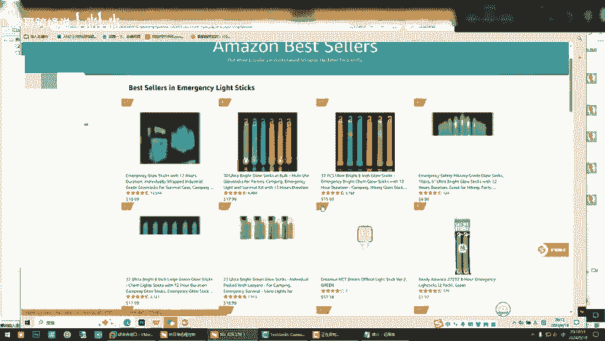

🎼你看明白了，这就是同类不同款，知道吧？它的类型都是这么个玩意，长得不一样，但用的是用的啥玩意一样，用个关键词一样，是吧？🎼嗯，来，我们继续看找到跟他找到跟他一样的，找到跟他一样的。

这里面有没有看看这个是吧？对对，这个是跟他一样的。🎼对。FBA卖家这个上架时间多久？🎼这个就有点意思了，400这个有点意思了。🎼你应该把它这个A3，你如果你想去搞它的情况下，记住把它这个A3先复制下来。

一会儿做对比，同样的东西东西做对比啊。你记住，先把它先把它举例说，你先把它放在这里啊。🎼因为他跟你是同类啊，我们继续继续去去观察他。哎，我怎么找不到那个浏览器，这个吗？啊，那就是对对对，好嘞。

我们再继续看啊。🎼你别看别的，你就看跟他差不多的一样的一模一样的是吧？对，一模一样的。既然那个东西能卖，那肯定你要找跟他一模一样的，先找一模一样的啊。这个是不是还一个我们再盯着看一下的。再盯一下。

别着急啊。你要记住这个流程啊，我还是会录下来，我放进去，你要记住这个你做不你做不做这个产品，不重要，你要把流程思维弄明白啊，记住我我知道。就是你选好一个东西，我们进行二次的时候。

就是举例说要深度的去考考察它的时候嗯，是。嗯。😊，顶哥跟你说了，你要弄啥，咱俩今天不管干啥，咱们每一次沟通都是有效沟通，一定要拿个结果出来。嗯，对。是。这个也把它弄下来。啊，这个是不是刚才那个我不知道。

我先不知道，咱们先把它先先搞下来再说下来再说。对。你当你你看你不是搞了这么多，当你确定要搞某一个的时候，你一定要找他跟他差不多一样的。你一定要看你的竞品在干什么。对。

通过竞品数据来衡量一下难易度难易度知道了吧？嗯。🎼就这样。🎼这又有一个事，你看这个是吧？这个是的。🎼哎，这个这。🎼这个就是刚才的那个咱们有了，有一审了。对啊，对啊，但刚才的咱们也是把它呃先复制下来。

放到另外，要不就乱了。咱们就知道他们三个一伙哎，对，你看。我们再继续看啊。一起。好，你从这个里面看的时候，他就基本是。就3啊，那我们统一打开它。一个。是啊，我们先进来一个。我们再综合考量它。

就任何东西你记住，就你干啥事怕细致，明白了吗？🎼你去越越细细的去盯着他去分析。没有什么东西能难倒你的。这个怎么缺了？😔，哎，咱们是不是。🎼没弄对啊。🎼我给打到哪去，这是F7D。这个是你看卖家。哎。

不对呀，我不是打开三个链接吗？哎，我打打哪儿去了，刚才打还3。🎼嗯咱们打到哪去了？咱们打了三个链接，难道是这个地方，一个两个是吧，在这儿呢是吧？嗯，还少一个是吧，还少一个两不对，他长怎么长得都一样呢？

不对。搞错了。搞错了，再来一遍。拿这个打吧。行，这有点搞不明白了那个浏览器。🎼这是这个D嘛，新窗口打开，把它。不对吧，它是一个链接。

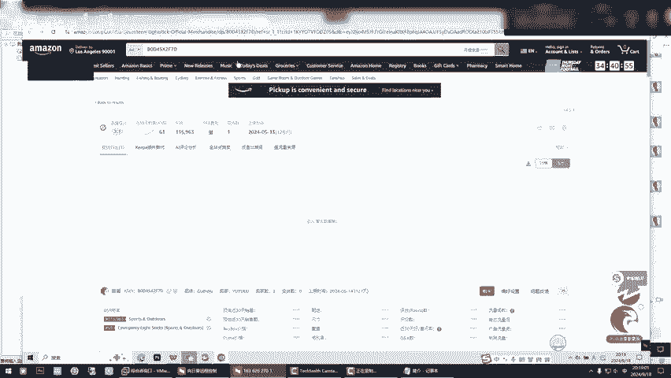

他是被人割麦了吗？嗯再把这个打开。

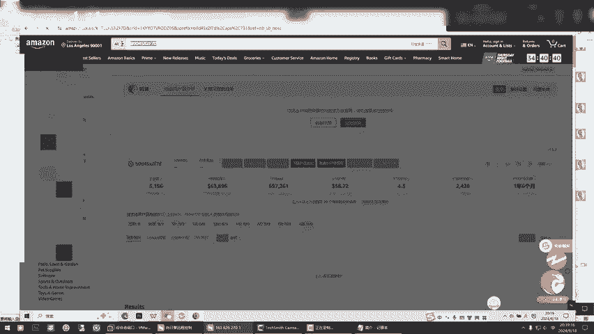

这个是63。🎼刚才那个缺了一个那个这是半喇子，这不对呀，把它咱们返回去编辑它编辑在哪里，退回去，退回去把那个。有有个编辑编辑编辑。这是编辑这里这里这里复原的。🎼哦，这个哦。对。

你所看到的是那个写的卖家数50的那个50。对对，你看这个屏一模一样的，上架时间400天了。也就一年多。嗯。🎼你是。是这个吗？那个400多天那个50的怎么找不到了？50那就刚才是50。

但现在就这个FFBM的这个。就是吧我是吧，对对对，我知道了。他他刚才看了个50个的羊，他是什么？他那个有延迟，因为有人跟麦他知道吧？然后他嗯还在上面爬，他有延迟。礼28天。都是一年多。

这个东西卖了一年多了，这个是个新品是吧？唯独就是这这个没这个。🎼你看首先你确定他是不是走的站内流量。确定他走的站内流量就简单了啊。走到站内流量，你就能下手。得し。嗯。但这个品太热了，我只能跟你这样说。

你懂得就行啊。能不能说你自己想他太热。就是如果说你单独的做这个屏啊。单独的说做这个品，你不是也找到同款了吗？你别管他是啥。嗯，如果人家说单独的这个品，如果他不行，还不可能坚持了这么多，知道了吧？

尤其是像这个卖的好的，对，是不是？よし？你看他的。从哪起来的？🎼37月份，他这是。😔，12。中间有空隙。看这个时候一。前面都不行。就8月份开始报起来。8月份开始包起。

你看这种品质做根卖的是最来来的最快的啊。实话说，做根卖是来的最快。哦。是吧也都是8月份报起来的对吧？嗯。🎼但是我觉得它太热，它也是属于一个你看它的周期就知道了。人家这个做的要稳定一些，是不是你看。

23年的8月是吧。🎼9月嗯23年的8月，它属于下降期，但是。8月是正常期，为什么我要让你用那个谷歌趋势，用了谷歌趋势以后，它这个里面有个主关键词，这个主关键词你去它的北美看一下，就知道它的趋势图了。

就是你能确定你是什么，你是该不该入手，知道了吧？如果它趋势已经趋势属于这种这种哈下降的情况下，不过对于你自发货自发货来说无所谓，你做就做了。不像FBFB它这个是肯定不能碰了，因为它下滑了。嗯。

🎼但总的曲线来说，看去年的10月上涨，1011月也在上涨，对吧？到1月份是下最最下端，就是最末端的时候，是不是？差不多看他们的销量中，1月份。嗯，所以说你做自发货没关系，知道了吧？首先咱们评定了这么多。

你看我让你去。做这个的目的是什么？找到跟他长得一模一样的，看别人的数据，你在想。你这心里面有个谱了吧。🎼你看了别人知道别人做的还可以是吧？那么如果说你要干他的时候，这个就更简单了。

但你那下一节课我再跟你讲的时候，咱就不录了啊，那个就是我给你录好给你我就，我知道那个东西不能录了，所以说这边就引导的你你看结合你做的事，你搞了这么多出来，随便你想搞哪一个的时候。

你先把它长的长的最一样的，拿出来看看他们综合数据。有些时候你不能单独的看着单个一个品的数据，有些是单个一个品，如果人家做了FBA是不是对吧？他跟你这个FB的录，你看路线不一样。

在跟卖的这个里面应该还有FBM的他们跟卖的，你应该是应该还有F从你从这里面看啊，这种就是。FBM跟卖的啊。🎼这种就是FBA啊，记住啊，上面这个这个这个带这个from哎阿玛，这就是FBA这个他没发货。

上下一样的，就是自发货啊。哦，我知道知道哦，知道了，上下不一样，那就是看到FB。所以说嗯咱们看这个屏里面，他进他卖家说这么多，肯定有自发货的在干他，也有人在干他。对吧。对，所以说这个事儿你想去玩。

你可以去说个，哎呀，打个擦边球是吧，少玩一下也可以去练练手，对不对？你可以去练练手啊。但是我咱们今天把这个视频一爆出来，肯定有人就上手了。明白了吗？肯定会有我这个产品我没打算是是属那个什么啊。

就当咱们去当课件了，但肯定有人看了这个视频他就去上手了，他绝对上手。我去年我记得第一次分享的时候，我就说了一个品，没过三天的品就连链接都没了，变狗了。啊，正好因为这个品吧，它是他你也你刚才也说了。

它是那种。嗯，季节性的那就上季节性的那种，这个是最适合跟麦上手上去挣一波子前，赶紧跑。啊。没事，你看啊你再咱们再回味一下是吧，咱们是不是盲选，嗯随便找一个出来，找一个出来以后我们。

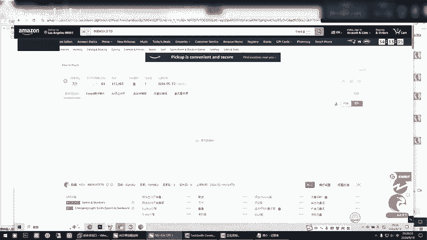

🎼你先别管它这个质量好与坏，这个质量好与坏，现在不是你考虑的范围，知道吧？不是说你考量的范围，像举例是16，不是你考量的范围。你现在要考量的是大概率，你要搞这个东西的时候。

你大概率你看到和他长得一模一样东西的。他们是个什么水平？你不能单独的看一个品，单独的看一个品的时候，你就看走眼了。明白了吧。啊，我知道了，刚才我们是看的是这个来，你把它翻译成英文时候，你还要干一些什么？

你是找了一个，我们是从小类，我们是从小类排名里面，你你找到了那么多是吧？对吧？好啊，你现在。这个是它的主关键词啊，这个哎你复制了吧嗯，是不是？你现在要从这个里面找了，有些时候你要干一个类目的时候啊。

市场。来，这个肯定是跟这个都挂钩的，你看有多少看见了看见了吗？看到了，这个时候不是你装了插件，你大数据你一看就明白了。你记住啊，应哥跟你讲，你要看什么，如果都是干这么个玩意儿的。

你要看他就我以前跟你讲的，看某个地方，知道吧？我不说了。哦，我懂了，看谁的数据好，就是说哎，就是说明他搞得好，你直接他就是咱们要下手的目标。你像这些这些看这些啊这这个这就不用看他，他们都不玩的不好。

知道吧？哦，我明白了嗯。如果有一种可能啊，就是说那个东西都是都是就是。🎼嗯，然后我跟你说，就是那个是说明这个类目不让去打打某个东西，知道了吧？但现在你看啊。没毛病，有人有数据。

有人有数据说明可以可以知道吧？有人有数据。嗯，看明白了吧？可以说明咱们也能去做那个东西。可以。所以说你看通过搜索它的主关键词，是不是从这个页面上也找出了一些卖的更好的，把它都罗列出来是吧？

你大概率罗列出来，你看他卖这么高价格的，你罗列出来它的销量，你看人家都不少了吧，是吧？你看那个销量，对你找那销量最好的找销量最好的，还有一个什么呀，找那个再记住一点，留意那个reating数量。

这个数量最多的啊，reating数量。哦。这个东西你评评论对reating就是评论。后面我告诉你怎么用这个东西啊，这个东西你可以你可以不会，你你可以不是你这个产品的，知道吧？你那个来，我跟你讲。

reating数量最多的上哪找。哎，我们刚才上的那个分类去哪儿了？关掉了，咱们两个。行行。

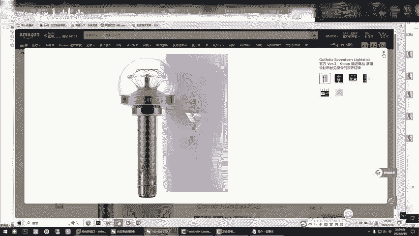

分类嘛，就这个来，我给你随便点开一个啊。是吧你去找跟他长得像的，你像这些reating数啊，他是不是他是不是同类不同款，它是同类吧，他们的功效都是一样的吧，对吧？是是不是都是干那个事情的对吧？好。对。

那你看这个reing数是不是最多的，你不用看别的，你只看reing数啊啊，你只看这个。知道了吧？哦，行了，后面完后写文案的时候，我再跟你讲这个东西怎么去玩。嗯，好嗯，所以说。今天晚上是吧，刚才教了。

你是去去那个小类排名里去找小类排名，找完了以后，你再去搜它的主关键词。主关键词出来词还有60个品，看到了吗？他有60个商品，就是你我是不是应验了，他们用的词都是一样的，但长得不一样。

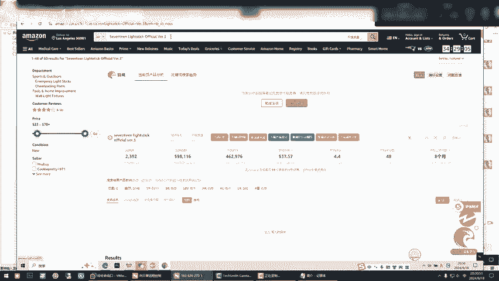

呃，我用他的图片时候也是一样也可以是吧？呃，你别管他就记住我一个句话，他是不是用的词都一样的，它长得不一样，你看它有60个品，就用这个关键词的标题里面体现出这个关键词的，它有60个品，看没有？

是不是有的跟你长得不一样的，是吧？

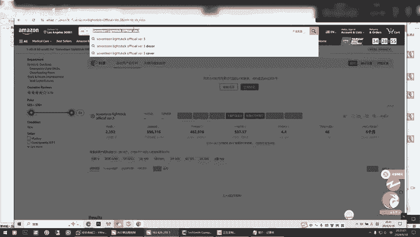

对不对？他有60个品，看明白，你不能说人家不是这个东西吧，是不是也是这种东西吧。是吧嗯嗯，这个还可以哈，你看是不是？😊，所以说。嗯，多多去下下节课。你不你不一定做这个品啊，把这个思路记住啊。

下节课教你怎怎么去收收集一些这，就是咱们长得就是叫叫叫的名字一样的东西的啊，我们再再进行把它拆分。是吧。录这个平台，一是为了帮助你记忆。2、你看顶哥每一次就远就远程一对一。

实实在在咱们是不是实实在在通过你的案例来告诉别人。你看很多有人就是你之前去的那个地方呀，他们教你的选品是这样子的吗？你觉得N年以前的技术N年以前的技术，你是不是是不是在忽悠人。

你不能说骗你是不是在他那个简单？对呀，你选品，你记住FBA是点对点，你要做自发货，就是一个市场，这是不是一个市场，是不是这么多商品都用了这个词，举例说他就王王某某是不是这么多品里面都包含了王某某。

你搜索王某某，他们都出来了，对吧？那换个角度讲呢，如果你把王某某干了这个事呢，这是广告。嗯，懂了吧。懂懂，但我们不能做王某某，我我们得我们有我们自己的玩法，我们不能赤裸裸的去说王某某，对吧？嗯。

所以说这个事儿。你你就想想，你看小段，咱们这事是不是简单了？嗯你你第一因为咱们中间过了个节，你得好好过节。比说顶哥清让你就抓数据，抓回来数据，你看你从你今天让你去给我复盘的时候，你在没抓数据之前。

你能搞出这么多东西来吗？你搞不出来，对呀，你再回想回想你之前的是每天去搞一天上100个屏，你觉得那个品有技术含量吗？是不是？没有什么那个就就是从阿里巴巴找品，然后上传他那个他和这个完全不一样的对吧？

啥你现在所做的事就叫精细化，你是不是刚才顶哥领着你是不是当你假设你确定做这个东西的时候，是不是你一步步的先从小类排名里找到他的同胞兄弟啊，长得一样的。另外我们用主关键词把他的同胞再找出来。

找出来你大概率你他们举例是有十几二十个A，你大概率就看到这帮人做这个事。如果说赚你综合评价他们的这个这个销量是吧？有的他也不行，有的也行，你大概率综合一考量。

是不是觉得这个是你到了到了你到了你手上的时候，你就清楚该怎么弄了。你心里就有补了，咱们不能说比人家强，但你用于得到了，你也不会比他差在哪里是吧？嗯。有的人你看到我为什么让你看那个数据。

有的人他们没有去做那个事儿，做那个事儿，他们没有去做。他们是那他们是纯粹的靠自己的那种。就是我跟你说，我们山西人他们这边去铺货，对吧啊？就就在那里等等知道了吗？就等着天上掉下去。

等着亚马逊给他什么叫新品流量扶持，知道了？他是等出来的，但你要是人为的去干预了，我咱们要干的事情是不是人为的干预一些事情是吧？对对，就是本来可能这个我知道他是一个月才能开花结果。我们人为的干预一下。

我们我们提前让他去，哎，可能半个月就开花结果了，是吧？是的是的，就是为啥说我在跟你，你看顶哥跟你讲，咱们在沟通的过程中，我让你自己去对比，原来你是怎么搞。现在你是不是你看基本上你今天晚上搞了一下。

你就很清晰了。其实选个品难不难，你就用这种思路去操盘任何一个品，你别管他卖的多好，你也别管他是谁谁谁，因为有些时候咱们做的东西不一定是别人明暗能看得出来的东西。所以说你能找到这个东西，别人能找到。

但你怎么玩，那就是你的事情了。对，是吧100个人玩可能他不一样都对，所以说弄明白这个原理。你看如果去假设我们要继续深深究它是不是第一，我们知道了亚马逊有多少人在做这个东西，大概率你心里面一共你就想把。

你搜这个主关键词，一共有6060个品，60个屏里面基本上包含了有个十五六个，有在做这个的，你只是你只是搜了他这个标题的主关键词嘛，对吧？但你看人家这个人用的是什么主关键词，你再用他的去搜一下。

你看是不是你看他他就这一个这个这个更简单，是不是这个标题，就这一个就这一个词，你看是不是一模一样的。你看我给你复制是不是一模一样。对对对，是吧？基本上一模一样。好，我们再把原来那个去掉。

我们就搜这个人的这个词啊。

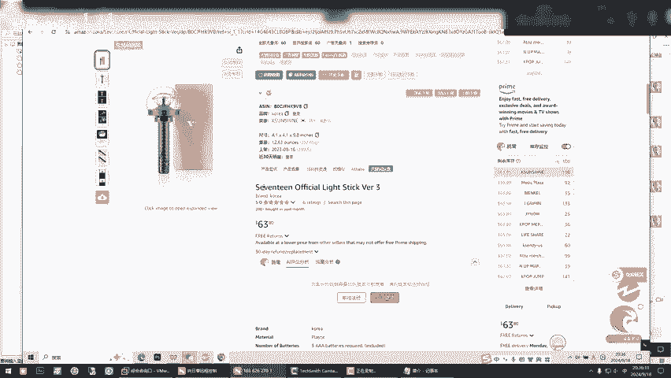

我们搜索他。

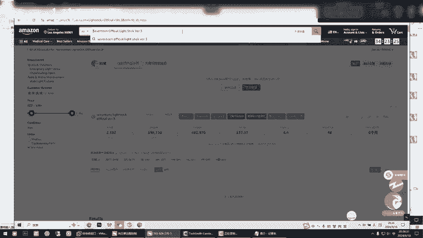

你看他出来多少品。31个品是不是？来，你看嗯是不是长得更一样的更多。你从小类排名里面找出来三个品是吧，找出来三个对标产品。那你找出来三个对标产品，把他们的主关键词拿来，是不是你要找出来N个品。

你这样的综合下来，你就不用做做记录，你就看你都知道大概率他们做的好与不好，是不是？你都不需要一个个记录他们，你就看他们销量，你永远记住销量销量是排第一的。这个市场。

如果你把他们所有的A审就是长得一模一样的都记录下来的销量，你做一个平均值，你大概率就知道了。为什么嗯我跟你讲，为什么举例说，他刚才我们是他60个品。

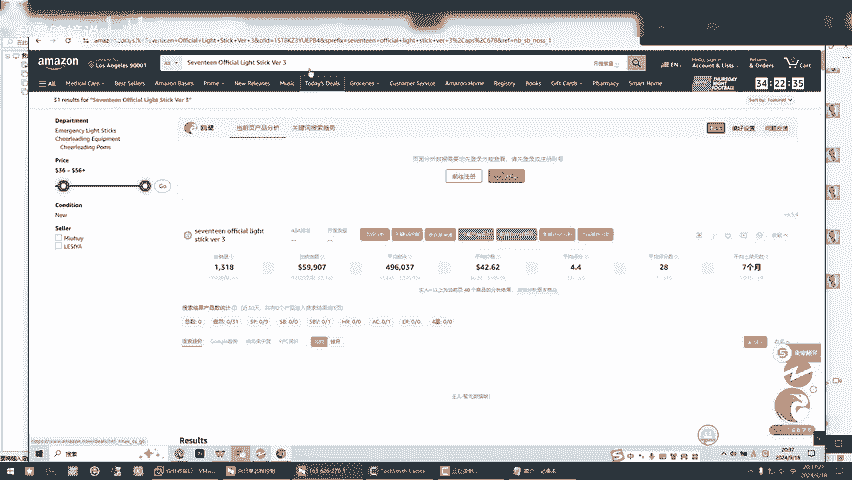

60个品，因为这个地方你看你们音乐搜索量。

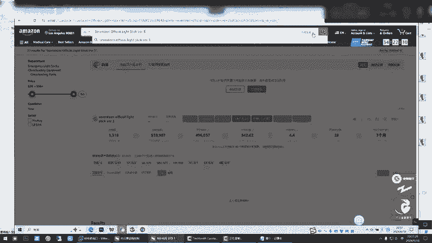

等于是60个品在瓜分这个流量，在瓜分这个流量，知道这意思吧？是31个品，不用么这个词，它在瓜分这个词的搜索量，在这个里面没出来，没出来不重要。有些时候。

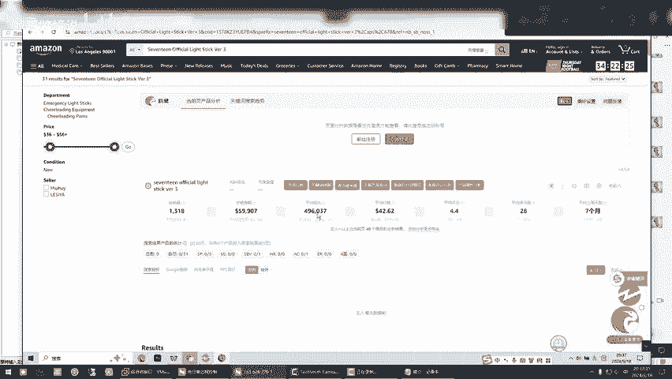

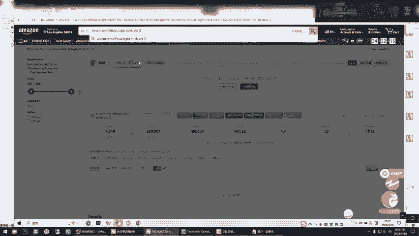

我们要用那的时候命不一定用这个词了，我们有可能用的是这个地方可能有20万的搜索，但那个品可能用这个词的就只有那么几百个是吧？嗯，他每每一你看包括前台开始到后台到他每一个都是有比例做比例对比的。

让你用这个这种方法是告诉你有多少人在跟在干和你干你想你想干的事，别人已经干了，你大概率就知道他们做的怎么样了，是吧？他们做的怎么样，你再上去的时候，行，咱比他差上一半。你看这个卖家经理告诉你总销量。

这这这个词的总销量有多少，是不是用的这个词的奢品的总销量是吧？对，他这是40个产品啊，所以说你在40个嘛，我们用这个，我们看他是人家给你这个提供的总销量，有些时候他总销量刚有这么多。

是因为它可能正好在那个人家趋势上，正好在那个旺季上，对吧？它是不是60个商品，你再看一下它的数据总销量。他一会儿就出来了。🎼是吧比那个要更多一些。对，这个是我跟你讲的这个东西啊。

就有有就已经其实和FBA知道有有些FBA的东西点对点都放进去了。其实自发货没有那么复杂，就是找到销量没完的市场。把这个类似于这种东西我们找出来是吧？

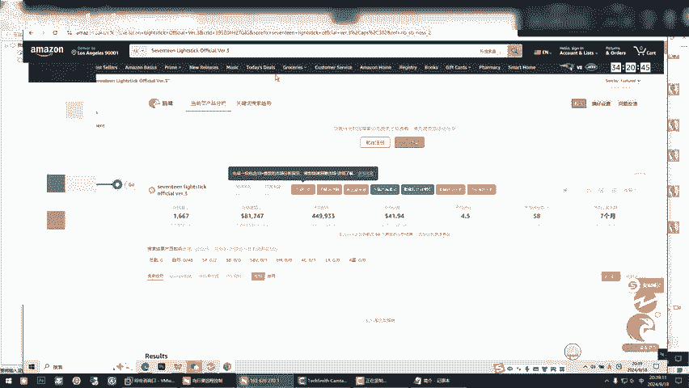

找出来以后，我们排列组合了以后，完后找见它这些同类也好，或者同类不同款的品也好，我们就把文案布局好，这布局好上就完事了。上去了完后我们给他一个加持，对吧？我们等结果就行了。你每天干的事就是每天计划好。

举例是我今天就就你这个表就不错啊，你不要贪多。举例是每天我这个里面就找10个10个里面过滤出来一两个，我就上106个里面过滤出来一两个就上。但这个时候你整个店铺里面，你进来的品就都是些优质品。

这是第一位你现在只有一个店铺，这个店铺等于是帮助你在测款，测完款了以后，你再拿自己的资料再搞一个再搞一个铺子，就把测管出来的优质产品转移到另一个铺子里再往下做垂直垂直啊，你现在做的是横向做垂直的时候。

精铺了，那才是真正的精细化，现在都扯那这是这叫什么？这叫横向测试。

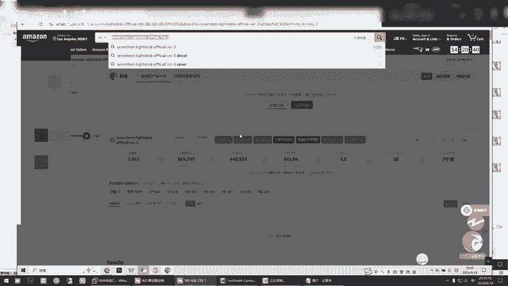

嗯。所以说你看。你看咱俩聊了40分钟了，你说是简单吗？小段，你就这琢磨琢磨你上是吧？你看一聊天的过程中，你你要把这个你你弄明白了，你才是学到东西了。你弄不明白，我讲半天没有用。你看我那天给你布置的作业。

我再给了你一个简单的表，你做的比我细多了，你是不是到今天给我拿结果的时候，你已经很详细了，很详细了。我在引领你下一步是不是就更简单了，你就明了了。这个事是该这么的干的。

因为没有人定性说谁你一上来就能选那不可能的事儿，你一定是撤款测出来的。知道了吧。嗯，知道然后他一节一节的推进。今天跟你分享这个。如果你确定做哪个的时候，我们就因为你已经计算了它大概率的利润成本。

你已经计算出来了。我们无非要做的就是把同类不同款的品，你找出来，我们写一个通用的文案模板，你只是图片不一样，你上就完事了。上的时候我们下一步就涉及到什么了？涉及到侵权了，我们要查侵权了。啊。

这一关你必须得过就和你那你的账户你报了吗？人家给了你个绩效涉嫌是吧？知道对吧嗯。就是他们他就和搭积木一样，你得会拆分组装。简单不简单？小段，你说其实你个这东西每一次咱们沟通都叫有效沟通。即便今天你听了。

你就拿到结果，你就照这么来就行。自发货没FBA复杂FBA那个维度太多。但是你也别别把它看的太神秘，他也也就那么简单。你到你自发货做的溜的时候啊，做的非常溜了。你选个鸡毛品啊，把自发货有的品不错。

直接转FBA不就完事了嘛，是不是就直接转运行，其他转了发货过去，对不对？所以说有些有些人他们新手一上来就学FB。第一FB资金成本比较大，资金成本真的很大。嗯，有些人真的不适合他里面。他涉计的也比较多。

对，一个新手上来，你坚持下去弄对了，关键你不熟啊。对，对关键你不熟。你把跟麦也好，或者说自发货金不玩的溜了的时候。你到时候就随便一个跟麦的屏，你都能把它变成FB1平，明白了吧？

你能看出来这玩意儿能不能去打FB。一样，你越到后面就是眼感和手感，眼感是看一眼就知道咋回事，手感是多去找找的找的，你就自由组合，就和举一反三，你随便拿个东西，你别管他们是大卖了啥了，我不跟你抢。

我不跟你做一样的，对不对？即使是跟你做一样的，我蹭点流量，可以吧？我不跟麦你，我上自建链接，我不跟麦你是不是？嗯。去年去年我们自己跟卖了一个品，就是那个座套，知道吧？

就那个汽车上那个卡通座套那个有点涉及到插边，就是跟那些迪士尼，知道吧？有些挂钩，但有带你图案什么的啊，一开始我们做跟卖，哎呀，一天出几十单，就一个品啊，后来我们就连我们上的自建链接啊，就我们我的办法。

自建链接。呃，加持了一下，照样也出单，你说这东西对不对？有些时候你弄对了，嗯，把一个东西弄对了，后面的事就越来越简单。就是不要去这左看右看你到最后就迷茫了，你也不知道你你到底要啥了。

就是今天咱们两个拿这个课件，就这东西不好意思，曝光人家产品来做。你随以后你就会达到什么水平，你随随便便，咱们从这个系统里面找一个品，你随随便便的你都能知道了吧，你你都能去拿捏了它，你都能去怎么练。嗯。

所以说他你说第一数据给咱们免费的，你不想要了，我直接批量删除，全再来一波新的嘛，是不是？对对，所以说一定把流程简化，简化了流程以后，你不就拿到你想要的结果了吗？现在都不是那个海量的，像你之前一样。

他们要求你一天上上百个屏，因为你上的屏没有一个是有质量的屏。是这种东西咱们上的量不多，有可能你一个小类就上了二三十个屏，对吧？二三十个精品嗯，完了我们再加持上，你就等就行了嘛，等结果就完事了。

你也不用操心他，他不可能给你带来什么负面作为是吧？你也不用担心被别人丢掉你。我就不咱们就不让他跑到这个当烈士的那个那个阵地上去，是吧？🎼嗯，咱就是分开打，不是不打一款是吧？对，一个时应该是控制好销量。

举例说他能卖十单，你也别让他卖1单，你最多卖2到3单一个品，你别搞的太多了，因为他的排名是跟你销量来走了，销量越多的，排名越靠前。别靠前了，你是不是就如咱们今天找到别人的平啊，别人是不是找到你了？

你现在还没有品牌，没有护城河。那我问你，你是不是会被盯上？到时候你会二难受，你你所有的努力和辛苦给别人做了嫁衣。是吧是不是这个道理？嗯。

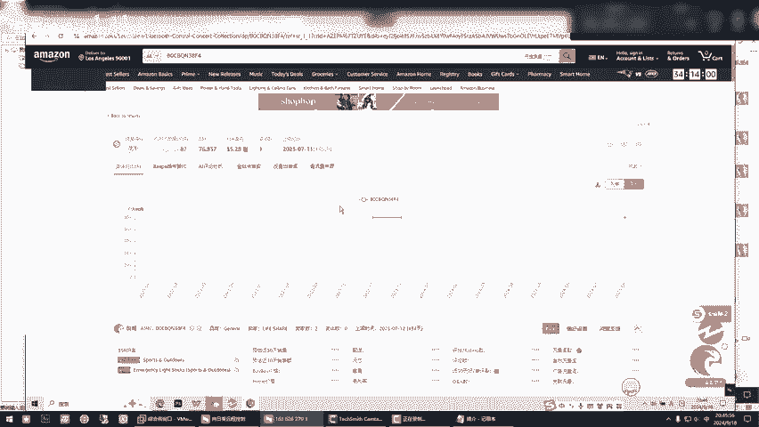

没毛病，接着弄吧，自己自己从这个里搞，别人别人也能搞。对对，一样的，你毛合洞的道理吗嗯。😡，所以说不要去相信什么什么，你就是毛河东的道理。你只不过说你闭气分盲嘛，人家那个那个毛过来了，你能动挡得住。

别人看不见你是谁，对不对？😡，嗯。继续吧，你就这样子来，你完了不需要做这么多，你挑那么一两个，开始先先把下一关，把文案这一关过了，知道了吧？哎，拿一个东西出来练练上一课嘛？对。

拿出来练手就试手一定要实操的去把文案也好，图片也好，弄好。他是一步一步推进的那这个你这个作业我挺满意，你这个表比我做的还好，我挺满意。🎼那，我我这两天因为我看你这个我就想着咱软件里边。

我就感觉可能还得需要软件里边，我要把软件里边的东西放进去是。任何东西它都是工具，都是预估，帮助你锁定一个框架范围预估的在这个框架范围内，我们能能不能做到游刃有余，是吧？嗯。好了，没别的了。

咱俩聊了46分钟。は。行行，我完后做成视频，你给你放上去就可以了。这个的怎么能放？因为其实核心的东西都在后面，亚马逊第一，你选对品，第二，你要会会加持。🎼嗯，核心的就在文案和后面的加持上。

🎼那咱咱是下节课做文案，他这个该做文案了。图片和文案。嗯，行，其实该让你找。我现在把这那也再优化优化。对，找辞了，你现在早也别急啊，就这样玩多选嘛，多选不合适了，删掉再来，不合适删掉再来，你随手就捏来。

这是产品选完放这里用不用的对吧？你想用的，你看好的，咱们就可以进行下一步了，就留着。对，就留着咱们开始下一个动作了。嗯。好啦，今天先这样吧。好嘞好嘞，好好，再见小丹啊，拜拜好，再见。😊。

