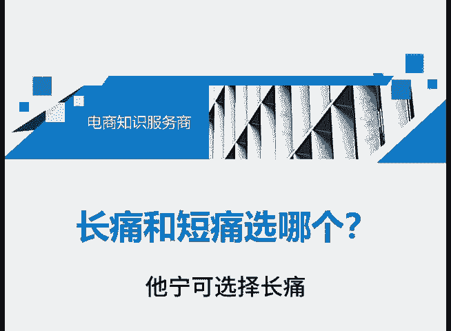
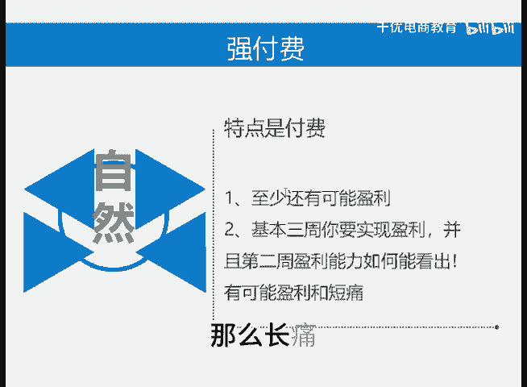

# 长痛和短痛你选择哪个 - P1 - 千优电商教育 - BV1UimPYDEDf

我们经常说长痛不如短痛，可是很多朋友的思路有问题，他宁可选择长痛。那什么是长痛呢？我们知道商品推广上线之后，整个拼多多的运营由原来的强付费将变成全付费，可是很多人要做自然流量，还有些人说我要做落付费。

其实这两个想法呢，一般都是刚入行的朋友，为什么因为做自然流量或者说落付费，它的特点就是价格低，那价格有多低呢？一到你不赚钱，或者说你出十单有一单的售后，你的利润也没了，整体就持续开店持续亏。

或者叫持续开店持续不盈利，我们可以把它称之为长痛。那再就是强付费，强付费特点是付费。但是呢如果你做强付费，他还有盈利的可能。而且呢如果你的链接三周不能实现盈利啊，那么你基本上可以把它放弃。

并且在第二周他就能够看出你链接的盈利能力如何。做强付费，他还有可能盈利，做落付费或者自然流是持续做持。😡。

不盈利，不强路费，我们可以称它为短痛，它还有可能盈利。那么长痛和短痛之间，你选择哪一个？我是讲师大牙，欢迎大家扫码添加我的微信，不方便扫码的朋友可以添加我的微信号，80221430。

在这里给大家准备到了一套新手运营入门的大礼包，希望能够帮助大家。😡。

