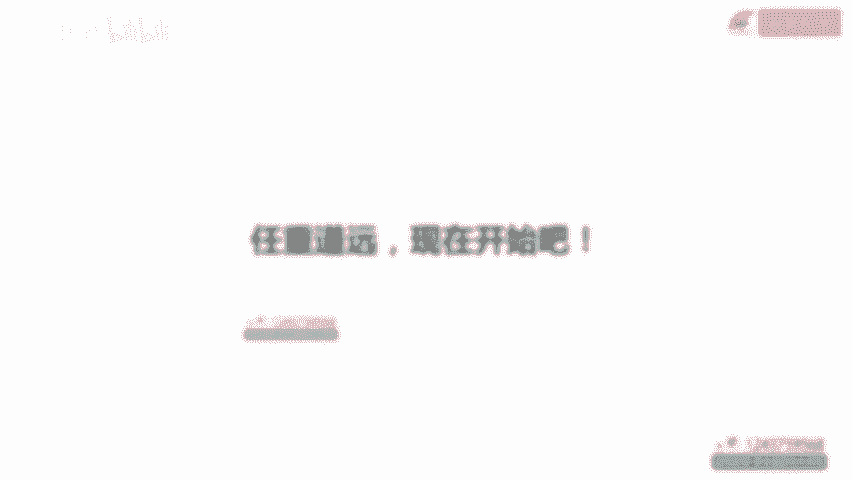

# 阿May·私域运营实操培训课 - P1：01.序言 - cc资料收集 - BV1vsbCe2Emd

大家好，我是阿梅，欢迎来到我的私域训练营。这是一套能帮你快速运作私域项目的课程。在开课之前呢，先简单做一下自我介绍。我一直在互联网公司工作，由十年的工作经验，曾经做过旅游行业跨境电商行业。

还有互联网金融行业。从2017年开始接触社群。那会还没有思域的概念，主要就是微信群。当时我们做出境游出国的时候，大部分人都会输一个wifi设备，就会邀请他进到旅游交流群，然后在群里提供目的地服务和产品。

这是我负责的第一个社群项目。后来2018年我去了互联网金融公司，最开始是手动拉微信群，一步步摸索。到后来切换到企业微信，开发运营后台实现自动化，形成一套完整的运营体系。那会呢带着20多个人的团队。

承接了上百万的用户，经历了从0到1从1到100的发展全过程。我的另外一个身份是知识。博主从2021年6月开始，陆续在小红书、B站知乎、抖音视频号这样的短视频平台分享4运营知识。

作为比较小众的垂类知识博主，目前在小红书呢有一万多粉丝，也非常感谢大家的支持，也正是因为开始了知识博主这条路和更多的人产生连接之后，发现有很多同学在做社群的时候会遇到各种各样的问题。

所以呢我把自己这几年运营社群的实操经验做了概括和总结，提炼出精华的部分录成这套课，希望可以帮到大家和其他课相比，这套课的特点就是落地性会更强一些。每个知识点除了讲基础的理论知识外。

更多的是落地实操经验案例拆解和一些底层的方法论，相信你在听后面课程的时候也会感受到。下面呢跟大家分享一些我曾经操盘过的项目。这个是互联网保险私域项目，项目背景是。

当时我们在一些短视频平台投放获客流量进来之后的目标呢是转化保险产品。但实际情况是引流过来的用户对保险的认可度比较低。把这样的用户直接给后端销售做转化，效率并不高，而且很消耗人力成本。

所以决定在给销售前增加社群环节，把用户先引到群里，对他们进行一波运营，提高保险认知水平，然后再给到销售做转化。那这样调整完之后呢，最明显的效果就是进过群的用户客单价比没进过群的用户高出了至少3倍。

那这就是社群的价值。整个项目做下来呢，累计运营了100多万的用户，产出了几千万的保费。右边这张图是我们这个项目的机房一角，最多的时候有1000多部手机同时在线。

虽然互联网保险行业比其他行业做起来难度更大一些。但当时我们是在保险行业里做思域做的最少，并且规模最大的一家。我负责的另外一个项目是360数科集团内部孵化的金融课堂，主要做财商教育。

那这个项目背景是用户买完理财课之后，没有其他的转化场景，获客成本和收入比较难打平，希望通过增加保险群环节，挖掘存量用户价值延长用户的生命周期。所以我们当时的主要任务就是把用户从基金股票群引到保险群。

做二次转化，提高RN。因为当时项目是刚起步不久，跟大家分享一下前期跑模型阶段的数据。那会儿往思域导了1万多用户单个用户价值提升了43块钱。这是我做一VE咨询业务服务的学员情况。

他们大部分是公司的创始人或者企业高管，覆盖的行业有宠物行业、日用百货行业、鞋服行业、美妆行业、金融行业，有的是在电商行业做了17年，做到头部的卖家，现在想转型做私域，有的是传统的企业。

从来没有接触过互联网模式，但很看好思域，所以开始学习，其实可以看到，很多人都意识到了思域的重要性。思域已经成为今年各个公司商业模式里不可或缺的一环。2022年如果只做两件事，那就是短视频和思域。

大家一定要记住。介绍完我的情况之后，接下来咱们看一下整套课程内容。咱们这套课一共有5章。第一章是思域认知，主要讲思域的定义和价值，还有一个思域发展全貌，四个思域发展阶段和思域搭建七步曲。

先从全局了解一下思域模式。通过这一章，我希望你可以非常清楚的知道思域整体长什么样，有什么意义，能做到什么程度，然后再去落地执行具体细节。第二章是思域基础建设，会给大家介绍企业微信和个人微信的区别。

以及24个功能对比，以及做私域的时候怎样养号。如果遇到封号的情况，应该怎么处理。第三章是整套课最核心的部分，主要讲思域运营转化，包括从引流到转化，和大家都很关心的SOP标签系统和用户分层。

这一章会讲很多具体的落地执行方法，大部分都是上手就能用，可以帮你解决平时工作中遇到的问题，可以重点听一下这一章思域是重运营的工作，想要把规模做大，离不开工具和数据。

所以第四章会主要讲好用的社群运营工具和数据分析方法。第五章是思域团队管理，凡是想要做成人事最核心的因素。那这一章会给大家讲如何管理好社群团队，必须掌握的三个管理抓手是什么。如果你是管理者的话。

在带团队的时候，是不是完成。和角色转变应该注意哪些问题，都会在这章给你答案。整套课一共就是这5章，包含了28个核心知识点，覆盖了从业务到团队管理的所有内容。关于思域的干货内容已经准备好了。

但想要有快速的成长和收获，希望在学习的过程中，你可以做到这三点。第一点就是坚持学完，这个是一定要做到的对吧？既然已经花了钱就要听完，这是对自己负责的基础。第二点就是在听课的过程中多思考，多交流多分享。

我会把买过课的同学拉到一个学习群，大家在学习过程中有任何问题都可以在群里边学时交流。第三点就是认真完成实操练习。在后边的课程里，我会布置一些作业，希望你能够按时完成。做好之后呢，可以发到咱们的交流群。

或者说单独发给我都可以。我会帮你检查。那我一直相信的是输入的是知识，输出的才是技能，只有自己亲自做了，才是真正掌握了。一切努力呢都是为了更好的那个自己。以上就是咱们这套课的开营序言。

欢迎大家开启一段新的升级打怪。接下来的学习任重道远，大家一定要加油哦。那下节课呢正式开始第一节的学习，咱们下节课再见。

