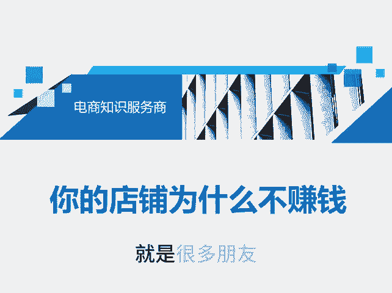
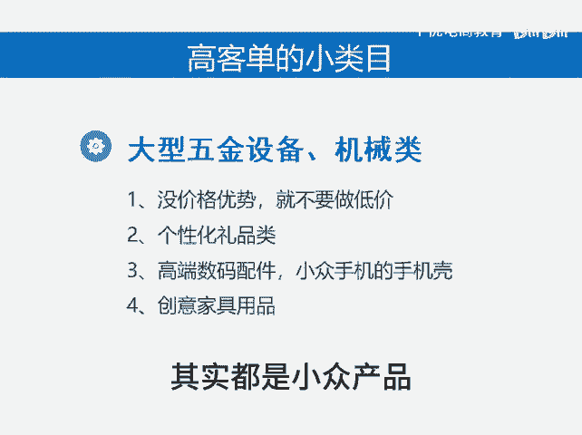
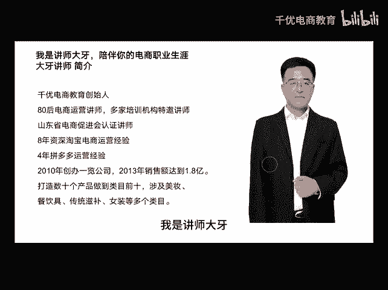

# 高客单的小众类目 - P1 - 千优电商教育 - BV1WExKeLERH

就是很多朋友，他的店铺不赚钱，为什么呢？因为他从始至终都没干赚钱的事，什么意思呢？就是很多人明明他没有价格优势，他本来也不是厂商，他却说呢我的产品为啥没价格优势。既然你没有价格优势，那你就不要做低价。

也不要考虑价格优势，那么你应该考虑的是避开价格战。那有些人说在拼多多上能避开价格战吗？能很多高客端的小众类目，它是可以避开价格战的，因为它竞争不是那么激烈。那有些朋友说，那什么是高客单的小众类目呢？

比如说像有些大型的五金机械，还有一些设备，再一个呢，像一些个性化的定制礼品，还有高端的数码配件，还有一些小众手机的什么手机壳，手机贴膜，一些创意的家居用品，其实这些品呢利润都相当不错。

竞争也没有这么激烈。另外还有很多产品其实都是小众产品，那怎么着呢？其实可以开动你聪明的脑筋，不是讲师大牙，欢迎大家扫码添加我的微信，不方便扫码的朋友可以添加我的微。😡。

号80221430，在这里给大家准备到了一套新手运营入门的大礼包，希望能够帮助大家。

