# 黑线技术终极版 抖音视频二次原创搭配工具和起号教程 一天涨粉6万，效果真的太暴利 - P1 - 沫尘创业网_顾北 - BV14F4m1P71V

墨城社群的兄弟们，今天给大家分享一个抖音黑线玩法，首先选择好你要搬运的视频，打开我们社区内部工具，这些该处理的都处理一下。

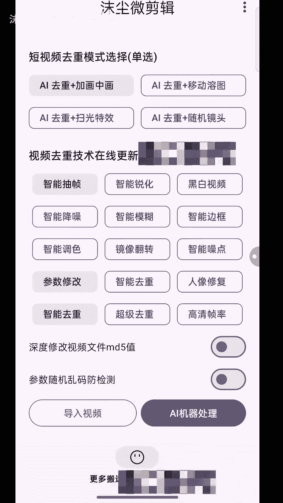

这边处理还要一段时间。

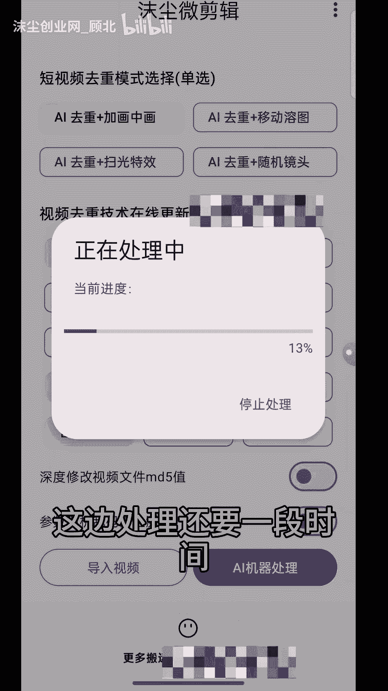

我们就先不处理了，我直接退出了，然后打开剪映，然后是最好是自己实拍一个视频。

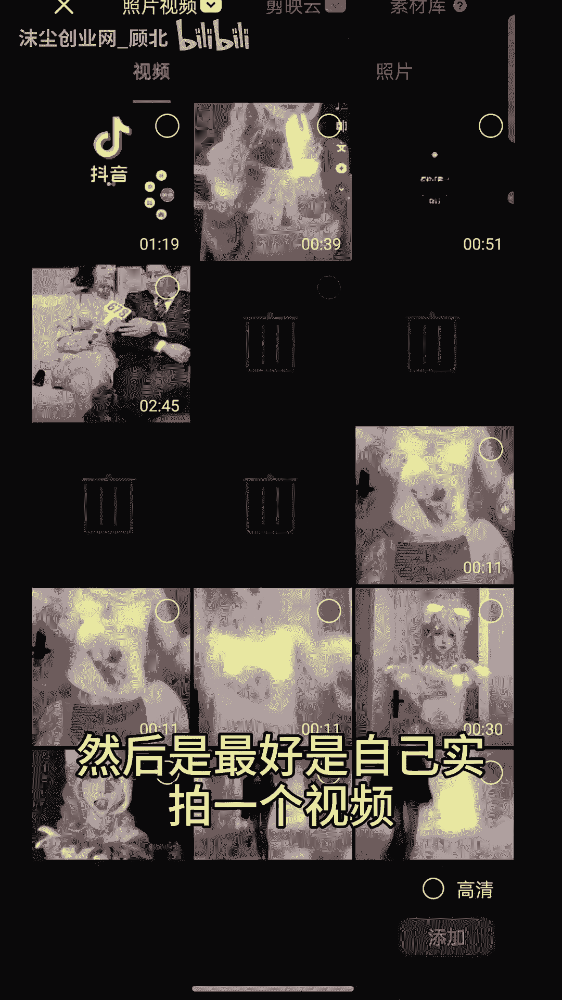

我直接在素材库导入一张照片做演示。

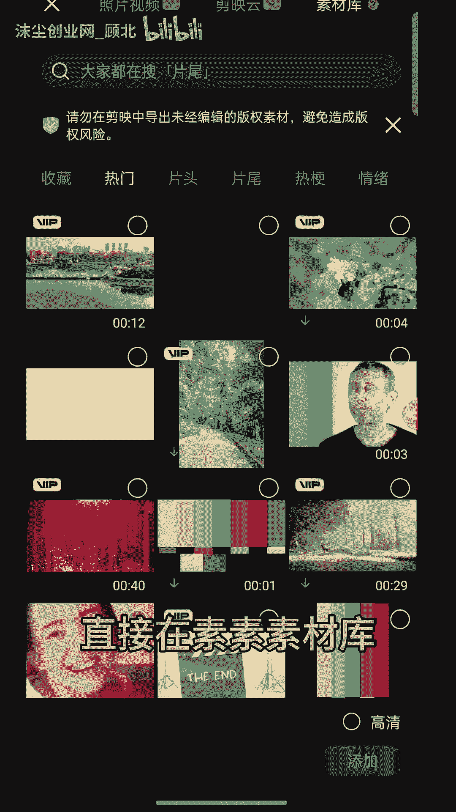

你们自己最好是实拍一张。

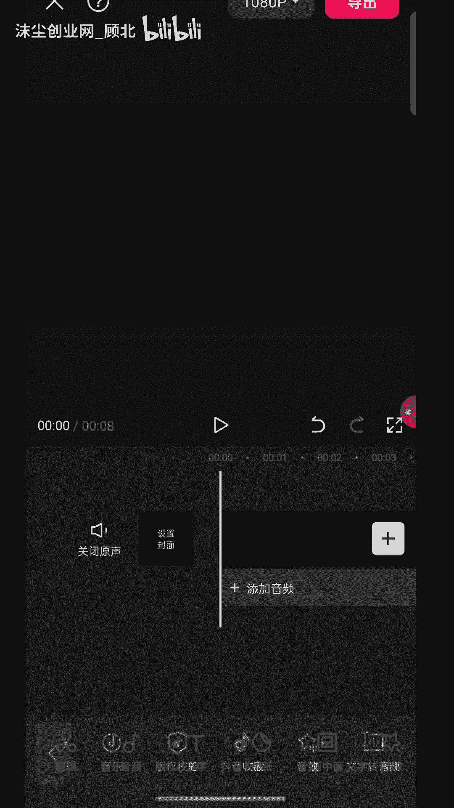

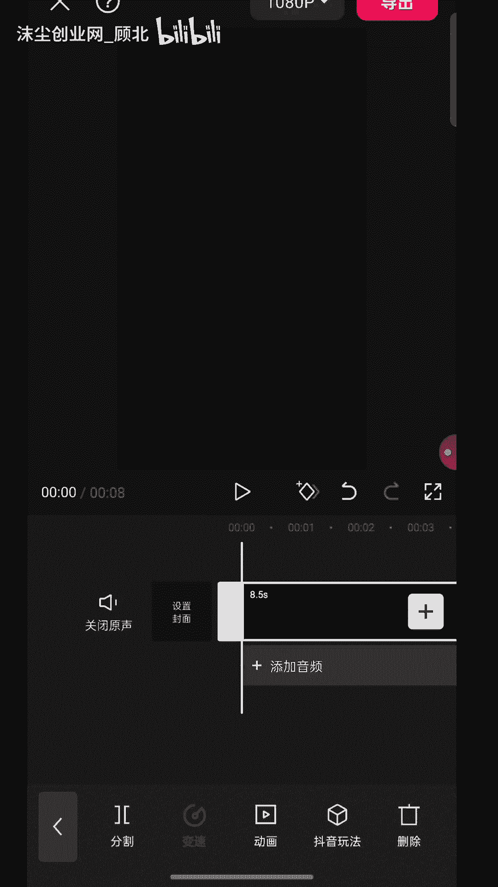

然后换种法选择你要搬运的视频。

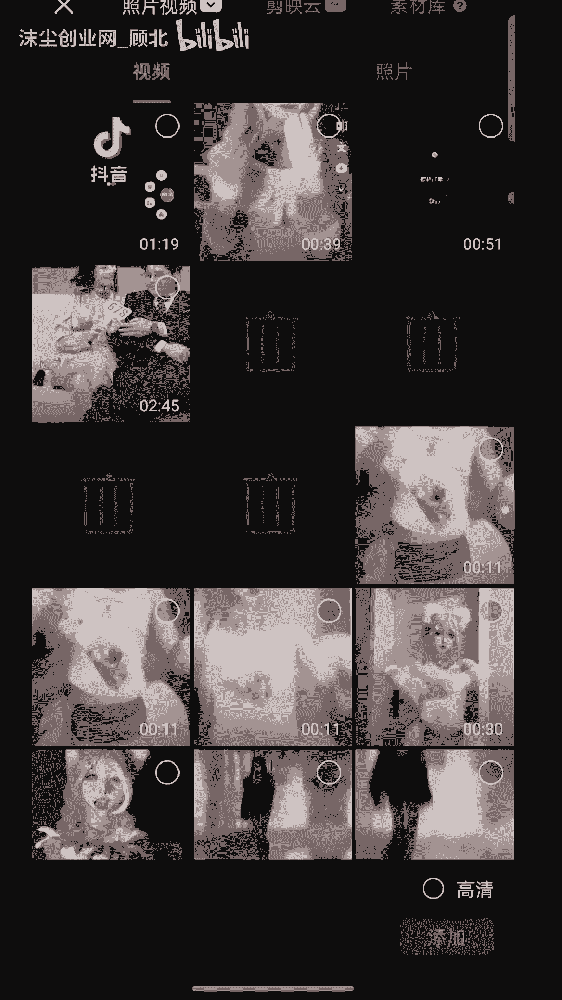

比如这个是你我们用工具处理好的视频，然后添加进来放大。

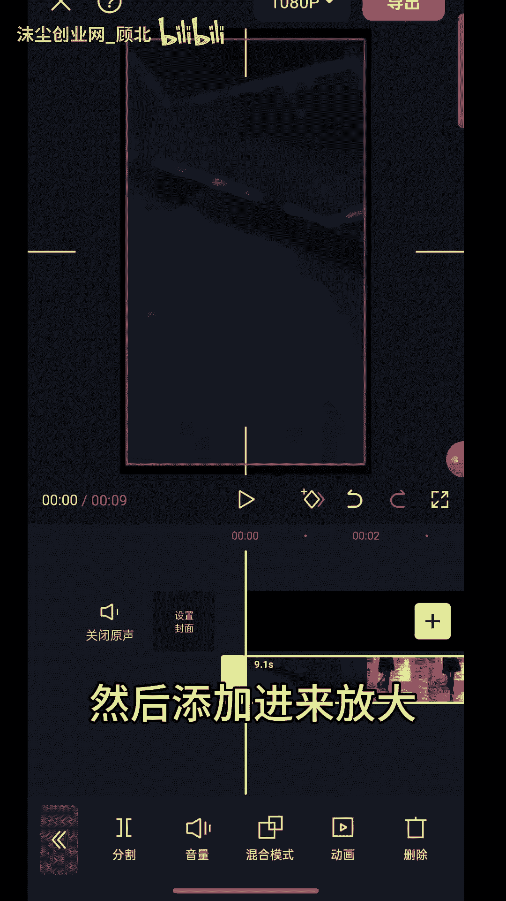

多余的删掉。

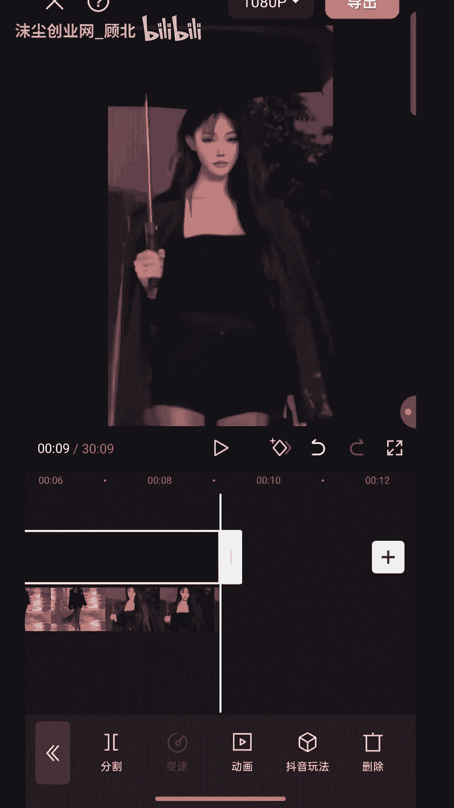

然后再复制一段。

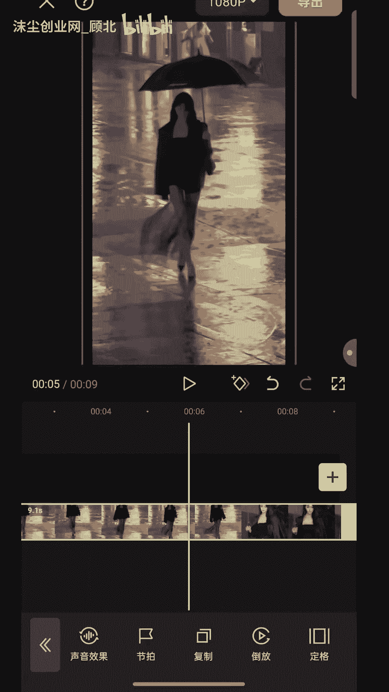

拖到下面来关闭其中一个原声就可以了，然后我们，选择蒙版，选择线性调整参数，Y轴调到，九吧不超过十就行，一点对好键翻转对勾，下一个也是蒙版先行，也是调到九。

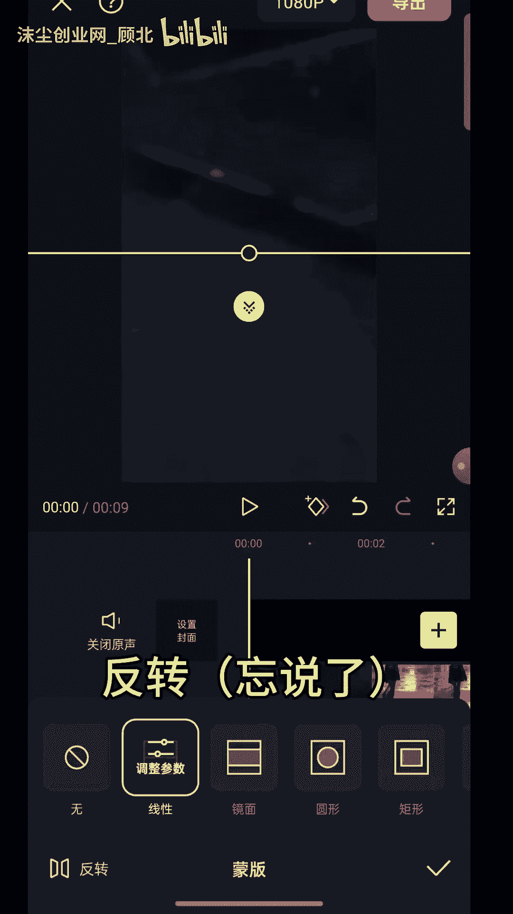

点对号，这个时候我们就会发现视频。

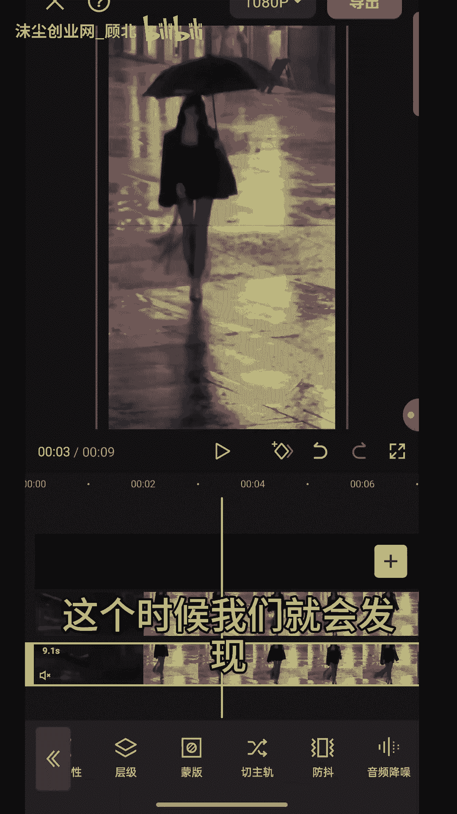

他这中间有一条黑线。

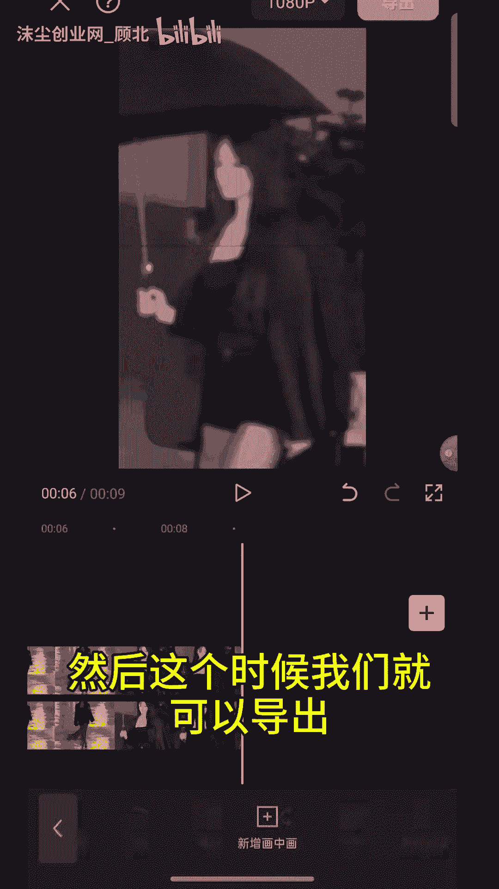