# （2024亚马逊电商运营教程）从零到精通！全网最细的亚马逊零基础开店注册选品运营变现全流程实操教程！ - P19：标题公式（上） - 滴滴别姬 - BV1BH21YEEkW

好，首先呢是讲这个标题。好，比如说比如说你首先比如说你分析的时候，首先我跟大家讲了，你要分析同行该怎么做。好，首先如果你作为一个买家，你假如说你搜索好，比如说你要会亚马逊，你要会常用这个网址啊。

叫IMZE23点comM这个网址。

好，然后比如说这个网址里面有美国站，还有全球开店，还有你像FBR的些单位换算了等等等等。这里面东西都比较多啊，这个网站的话，到时候我也给发给大家看一眼吧。好，先发给大家吧。好，但是你你自己先保存一下。

具体怎么用的的，我先给你讲哈。首先比如说你点开美国站，这个时候比如说你搜索一个产品好，那这个时候它默认的基本上是中文界面嘛。好，比如说哎那比如说我搜索一个什么类，搜索一个，比如说围巾好。😊。

有说时间收一个搜一个围巾。好，就是好，那首先咱们看什么？首先咱们看一下这个围巾，别人家是怎么做的。好，比如说我点击一下。

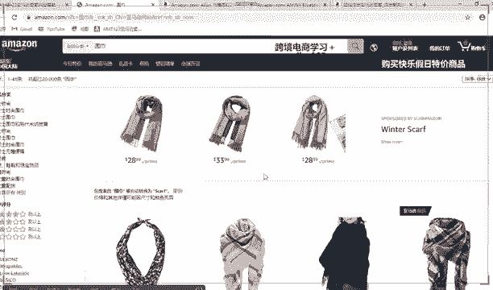

好，看到没有？你看你这个围巾是属于汉语版的围巾，对不对？汉语版的，首先这个是标题。好，这个是SKU这个是5点描述。好好，这个呢好，首先咱们先看中文版了吗，等会再看英文版的。好，下面它的一个详情页介绍。

好，然后呢这个地方呢是它的1个ISN好，给大家这放。好，叫ISN好，ISN是相当于每个每个产品的1个ID吧，相当于它每个产品的1个ID都不一样。好，这里面是排名多少位尺寸，然后发货重量等等等等这些信息。

还有上架时间好。还上架时间16年还有一些星级，就是客户给他进行的一个评论。好，你如果是做亚马逊，我建议大家一定要熟悉英文版的界面。好，那中文版你看完之后再翻译成英文版好，怎么翻译？

首先点击这个地方看到没有？

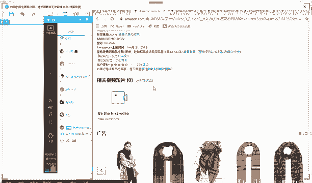

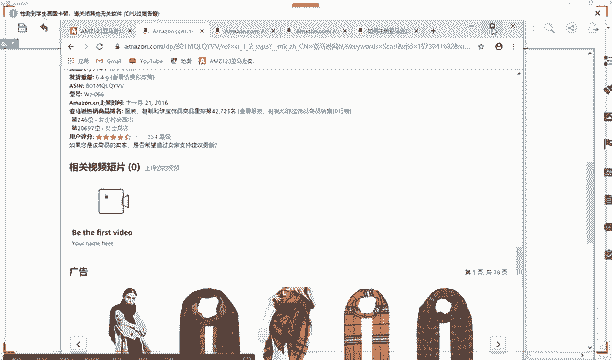

仔细看啊，这个地方，然后点击它有一个英文选项。第一个。然后点击更改就可以了，然后这就变成英文英语版的界面了。那你首先要看的话，你主要要看英语英语版的界面嘛。好，那比如说老师我不太清楚怎么办？好。

不太清楚，不要紧。那你因为你刚接触这个东西。比如说有些名词呢，有些什么关键词啦，你接触多了，你就知道它是什么意思了。😊。

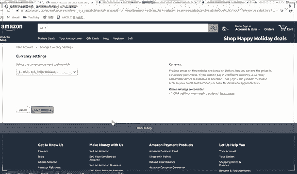

你为拿和中国的淘宝啊，基乎上呃大同小异。好，比如说好首先这个是标题，对不对？好，标题我上节课讲了，一般是110字到120字之间。好，你看这个标题有什么特点。好，来大家总结一下标题上有什么特点。首先第一。

每个关键词是不是都是空格，它不像中国汉字一样，呃，你每个个字每个词对不对？你可都可以挨着，它不是它是每个单词中间有一个空格，对不对？好，那比如说120个字到120到120个字符，就是标题啊。

一般写120个字符，这个字符里面不光包括字母，比如说CIR是代代表一个字符，一个字母代有一个字符，对不对？这个这个很简单，那一个逗号和一个空格，哎。

你看这个是空格是代表不代表一个占用不占用一个字符里来回答我。😊，明白老师什么意思吧？就是它一个字母肯定是代表一个字符嘛。那如果是一个空格，还有一个逗号，代不代代表一个字符嘞？😊，好，可以回答一下。

你不管回答的是否正确都可以啊，按照你的想法啊回答一下。😊，代表是吧？对，代表一个字符。好，那这是一个特点啊，给大家写出来吧。😊，好，空格。空格和标点符号。都代表一个字符。

等后面的客户给教教大家实操上架产品。因为前面的准备工作里面都有很多细节。好好，那这是一个特点。好，首先再给大家分析一个特点。好，首先大家再看一个，你看一下，你看一下你发现它这个产品。

它每个单词看这是一个单词，每个单词的首字母是不是都是大写的。看到没有？你看这个for它也是大写的，woman也是大写的。😊。

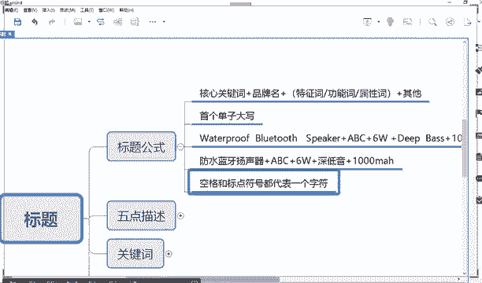

看到没有？你看但是有些是全拼，比如说像这种什么什么什么重要的一个词。啊，比如说看百度翻译。你说你不知道，你就。百度翻译一下。好。

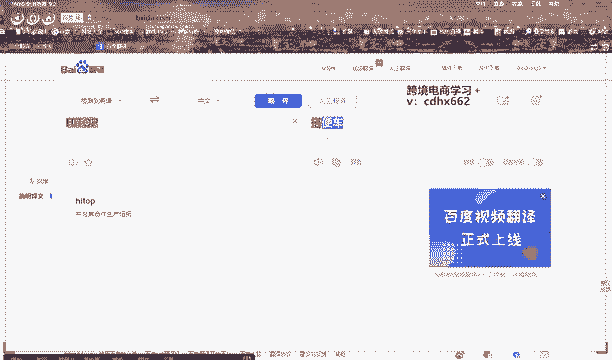

看到没有？这个是全拼。好，这个是那个首字母大写。好，所以说你在你哎比如说你分析这个产品，那在于你来讲，对于你来讲，那我就知道哦，那我写标题，首先字符。哎，那我要120个字符左右，对不对？

第二个我首字母一定要大写。好，那那比如说那这些字符字母应该有什么构成呢？好，再给大家举例。好，首先第一个好，你字母基本上可以用这一个万能公式，就是你写标题的时候，第一核心关键词。第二个品牌词。

第三个功能产品属性词，第四个加其他好，比如说咱们举例，假如说就以毛巾来举例。😊。

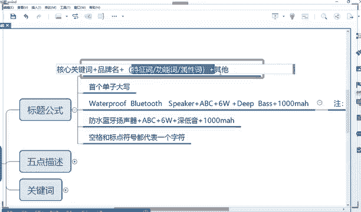

啊，不是围巾啊，比如说以围巾来举例，你看他这个写的就是什么什么ses for woman啊，应该是女士围巾的意思。这个ca肯定是违禁的意思嘛啊，虽然老师不懂英语，一看。😊，呃，不太懂音啊。

但是一看这个词肯定是围巾的意思，啊好？围巾。😊，好，围巾好。好，咱咱们先直接翻翻译出来吧。😡，好啊，围巾。top经典。格子软毛围巾，你看女士潮流披肩围巾，你看这里面就和大家买买淘宝。

淘宝上买东西的是基本上是差不多了啊，翻译的是差不多。因为它是单英语的单词和中国的汉字不一样嘛，可能英语的一个单词顶在汉语的单词好几好几个字，对不对？好，首先比如说看它包含的这些信息能不能全部都包含啊。

比如说放缩小一点。😊。

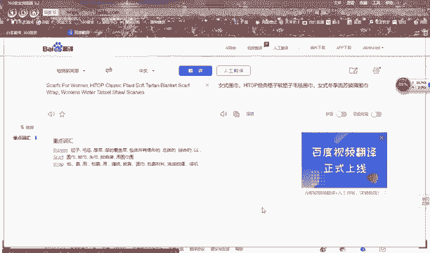

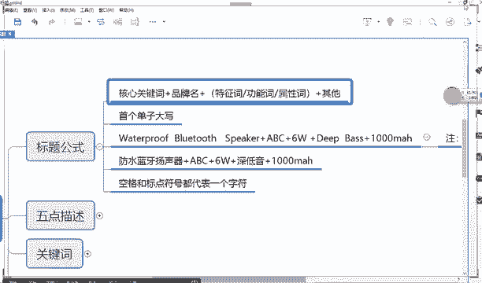

首先跟大家讲的第一就是你产品的一个。核心关键词核心关键什么是核心关键词？就是我上节课也跟你们讲了，就是你这个产品的主词。什么叫产品的主词？好，我给大家写到后面吧。主词。就是这个产品叫什么？😡，好。

能理解吗？就是产品叫什么。好，但是这个叫什么一定是一个比较。😡，比较准确的比较精相对比较精准的词。好，什么意思？比如说比如说我举个例子，比如说我卖的东西叫家具，那这个家具叫不叫主词？😡，哎。

比如说我卖的是衣服，衣服叫不要主词，比如说我卖的是什么是什么什么什么什么这种。😡，数码产品，那这个调叫不要主词？😡，叫不叫？😡，来回答我。😡，不叫是不是？因为因为你不知道你说家具。

那家具有很多种桌子板凳椅子都是旧叫家具。😡，对不对？那哪一个叫是我的主词理？你比如说那怎么叫，比如说我卖的是沙发。😡，哎，那这个肯定是主词嘛，对不对？就是精准的词。那比如说我卖的是办公桌。😡。

那这肯定要主词，比如我卖的是。比如我卖的是牛仔裤，对不对？这个肯定要主词，所以说这个是精准词，能理解吗？所以说不要写一些宽泛的词，写一些宽泛词是没有意义的是后面的客户教大家怎么翻译成英文啊。

你不懂英文的话，你是可以进行翻译，你先写汉语，他们来写出来。好，首先比如说比如说咱给大家举举个例子。比如说好，比如说咱们现场给大家讲一个。比如说这个围巾。好。😊，好，比如说咱们不按照他这个标题来写。

咱们重新写一个标题。好，比如说第一个。😊，好，首先咱们先按汉语的来写。

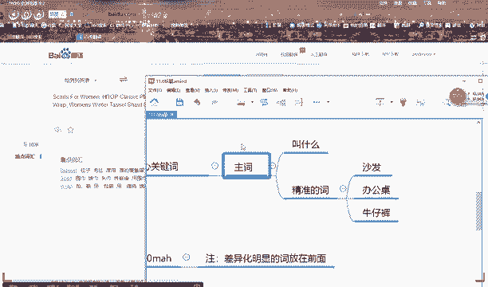

啊，我大放大吧。好，比如比如比如比如好，比如说先写女士围巾好，女士。好，围巾女吧。😡，好，围巾女标题先写这几个先写这个核心词写上去了。好，第二个加品牌名。这个品牌的话是这样，等你发布宝贝的时候啊。

它一般情况下都会让你填一个品牌。那有可肯定有同学问他说老师，我是个没有品牌啊。对，好，是这样，所谓的一个品牌是这样。😊，好，我现在先给大家讲吧，其实这个课是上家宝贝的课。比如说哎老师我没有品牌怎么办呢？

😊，你没有品牌是这样，当你这个品牌里，你可以自创一个品牌。😡，自创一个品牌。这个品牌如果是在美国官网上没有被注册过的，你写任何品牌都可以。比如说哎美国官网上有有有那个耐克，对不对？

那你肯定不能写耐克这几个字啊，不能写阿迪这几个字啊，能理解吧？这个关键词。那比如说我自己小是个小工厂，然后自己随便编一个品牌，对这个品牌谁都谁都不知道，或者说很少有人知道呃，就我自己然后和身边的人知道。

对不对？那这个就是你自创的品牌，那你就可以写上去，能理解吗？还有一种呢，一般情况下就建议大家直接写品牌，直接写自己的店铺名字拼。😊，你编个名字肯定是拼音嘛。比如说你店个名字一般是你的一个。😊。

姓名对不对？或者说你的一个什么姓氏，还，什么是你你写你店铺名字拼音就可以了。😊，知道吗？这个肯定是独一无二嘛，或者你名字肯定是基本上是不会不会有什么重复的嘛。😊，能理解吗？

所以说这这个是是后后话要讲的啊，如果你有品牌，一般都会有写。如果但是有一个点，如果你这个品牌没有什么没有什么没有什么没有什么那种呃什么什么就是那种。😡，知名度，那你可以不用写在标题里，但是也可以写。

但是看类目的词的大小和和和嗯是大还是小。比如说你的类目非常大，你要写的词比较多，那你什么不知名的牌子，你就不用写。因为你要把尽可能的关键词写到标题上。如果你本来是一个非常小的类目。

然后我写写完发现还凑不到这个120个字符，那我可以把自己的品牌名写上去。对这个。😊，对于外国的人来说，他基本上看到你这个啊就知道你是个牌子。对，不管那个牌子认识不认识，但他知道你是个牌子呀，对不对？😡。

好。好，等会儿我给你讲，好吧，这个你的关心的问题都会给你讲。😊。

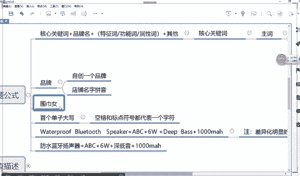

对，大写好吧，品牌一般都大写，因为别人一看就知道。