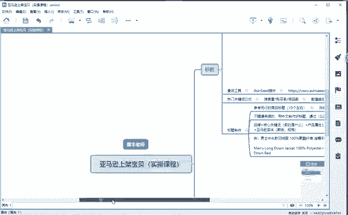
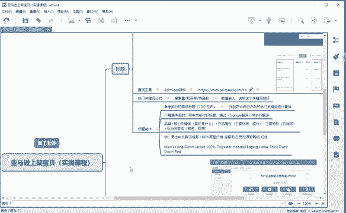
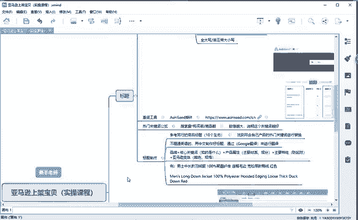
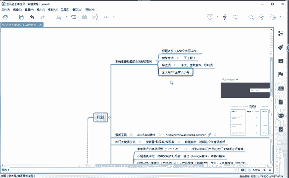

# （2024亚马逊电商运营教程）从零到精通！全网最细的亚马逊零基础开店注册选品运营变现全流程实操教程！ - P21：标题简要了解 - 滴滴别姬 - BV1BH21YEEkW

其实最简单的就是他们最大的一个区别的话在于亚马逊的话，它是做了一个精品化的一个路线。重产品轻店铺。而我们国内淘宝的话，它做的是一个重店铺轻产品。对不对？所以说我们现在的话，既然学习亚马逊的话。

有很多同学可能在学习的过程中哎会遇到哎，老师啊，我这个页面的话全是英文，对不对？那我怎么去解决这个问题，有没有同学遇到这个问题？😡，来在公屏上说一下啊。有对吧。其实现在现在科技这么发达。

已经有了翻译软件啊，对不对？😡，我们可以通过翻译软件啊来实现。把英文转换成中文，对吧？那今天的话我也会给大家带来一个啊插件。然后你们在发布产品的时候，包括你在啊操作店铺的时候，你们可以通过这个软件。

就可以把你页面上所有的英文全部转化成中文，好吧。那我们接下来的话就开始今天的一个课程啊，就是教大家如何去上架一个宝贝啊，我会带着大家一起去实操。

首先的话，在上架宝贝之前，我们肯定会要做一些准备，包括我们的标题啊，我们的产品图片啊。包括我们的一个啊。描述啊等等等等。这些我们肯定要提前准备，不然的话，你上架的时候，你什么东西都没有你怎么去上架。

对吧？那接下来的话。

呃，先给大家介绍一下标题啊，我相信的话之前海空老师的话也有给大家讲解过。那今天的话我就简单的给大家带过一下啊。😊。

这里面的话我给大家讲到了一个标题，就是我们要注意的四个问题啊，就是容易出现违规的。第一个呢就是我们的。😡，标题太长。标题太长的话，在亚马逊上的话，他给客户带来了一个啊。效果的话不是很好。

就是说客户他不知道你到底是卖的什么产品，而且比较啰嗦，对吧？所以说我们在发布产品的时候。😡，只要把我们的产品表达清楚。第二个的话就是重复性的词。那什么意思呢？我举个很简单的例子啊。😡。

打比方说我是卖衬衫，那我的标题里面。😡，出现重复的衬衫衬衫衬衫啊，那这个。其实给搜索带来的话，没有一个很大的一个效果，对吧？而且给客户给我们的客户的话带来很大的一个反感。第三个就是我们的一个夸大宣传啊。

虚假宣传，包括我们的一些极限词，对不对？像啊什么全网第一、全国第一，全球第一啊，夸大这些产品。这个是违规的啊，这我我讲的这几几点的话都是一个违规的。第四个的话就是我们的标题全是大写或者非正常的大小写。

大家要知道我们的淘呃我们的亚马逊标题的话，它的首字母大写就可以了啊，首字母大写就可以了。

