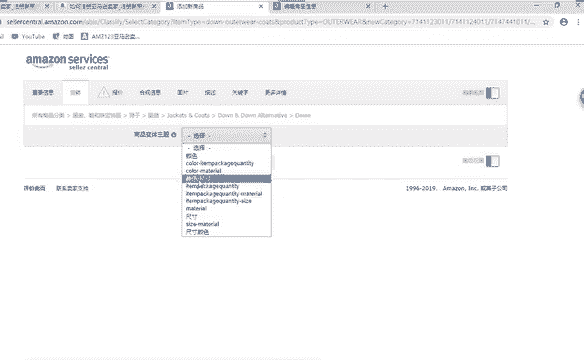
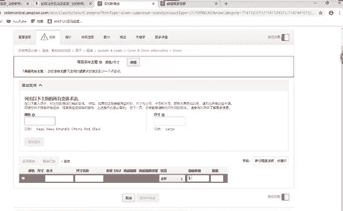
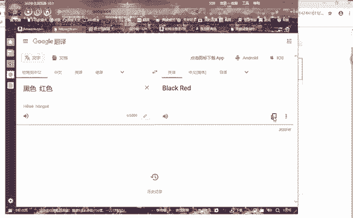
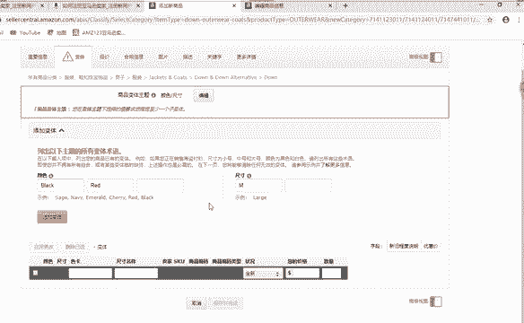
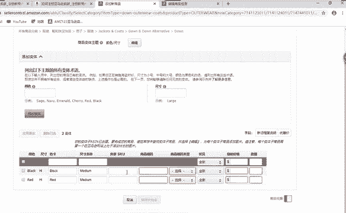
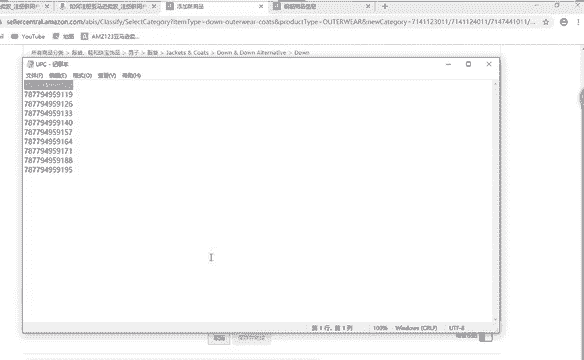
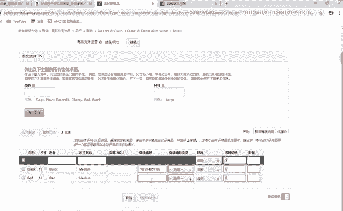
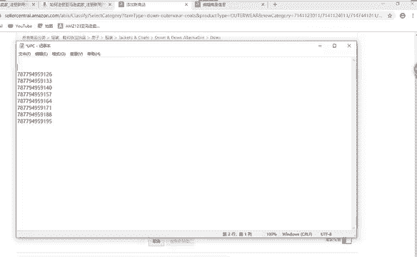
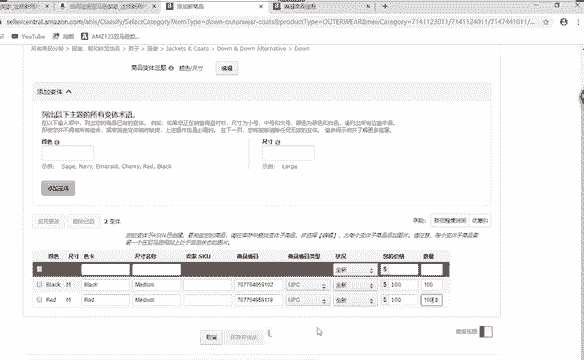

# （2024亚马逊电商运营教程）从零到精通！全网最细的亚马逊零基础开店注册选品运营变现全流程实操教程！ - P23：创建新商品：变体 - 滴滴别姬 - BV1BH21YEEkW

然后这里面的话我我这个产品我只我刚刚添加了两个颜色，对吧？那么我这下来接下来的话，这个变体就需要添加。如果我只有一个颜色，这个变体你就不用去啊不用去添加了。那么现在有颜色尺寸，我选择颜色尺寸。好。

把我要的颜色把它啊选过拿过来。😡。

把它复制过来啊，复制。🤧嗯。然后尺寸啊我就我就添加一个，好吧，添加一个。

添加越多的话，你要的编码就越多，看到没有啊？商品编码的话就是我们的I。😡，刚刚我们要购买的啊。好，色卡。就按照我们前面的颜色来选择色卡啊。一个。

🤧嗯。尺寸啊，我是按照前面选择一个尺寸来选择啊。如果你不知道的话，需要翻译一下啊，可以通过360在后台翻译一下。

把编码把它复制过来啊，放在这边选择UPC啊UPC。好，这个就是我们现在啊这个产品所要卖的一个价格。这个价格的话，你们在卖的时候，你们最好要在要看一下同行那个价格啊，证明的话我就随便标注一个啊。

我就随便标注一个啊吧。

