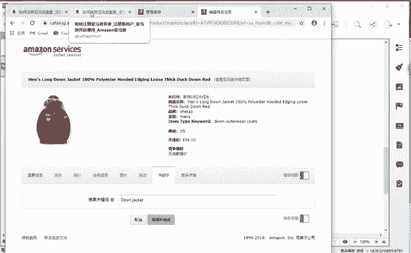
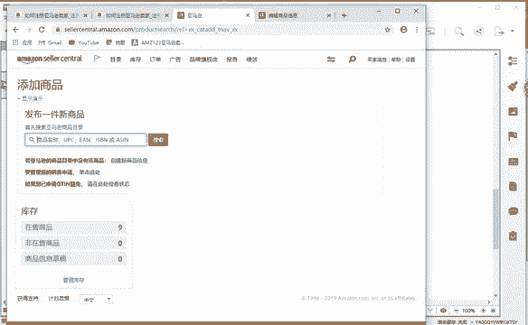
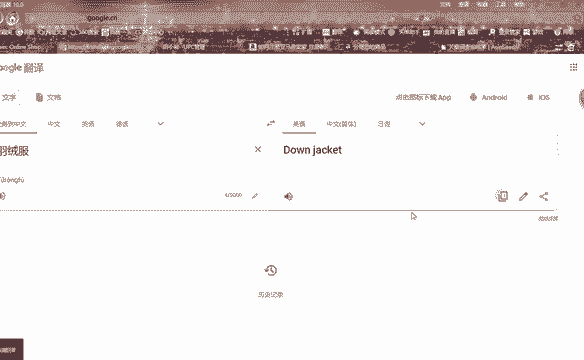
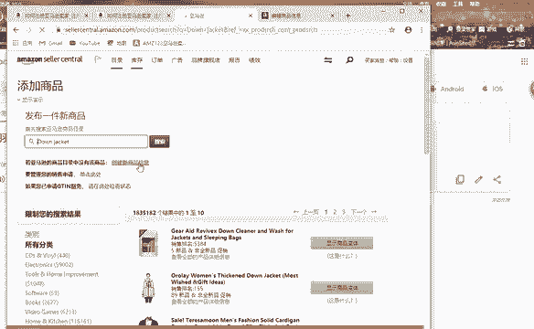
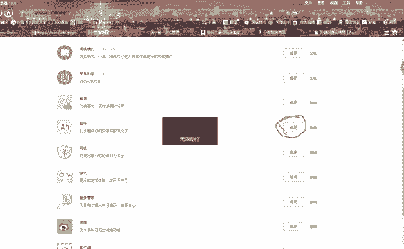
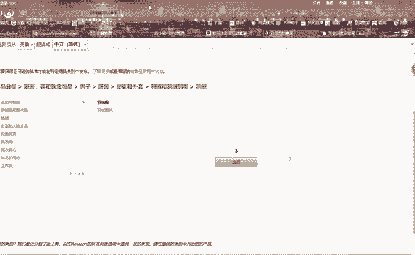
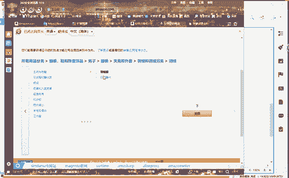
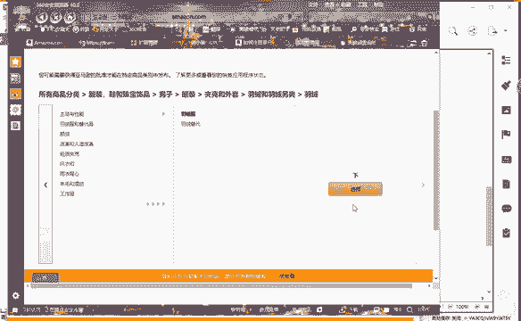
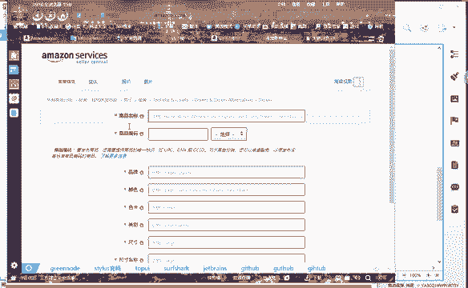
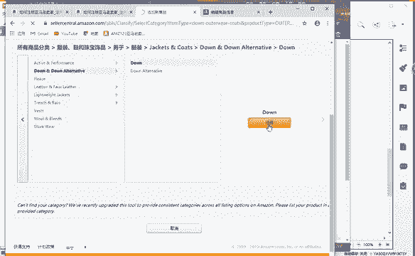

# （2024亚马逊电商运营教程）从零到精通！全网最细的亚马逊零基础开店注册选品运营变现全流程实操教程！ - P24：创建新商品：分类 - 滴滴别姬 - BV1BH21YEEkW

有没有。

我拿这个羽绒服来说啊，拿这个羽绒服啊。

流程绘板，我们点击这个目录啊，点击亚马逊前台有个目录，目录下面的话，你放到一目录上面，它有个添加商品，然后我们点击添加商品啊，点击添加商品。次。然后它会出现一个创建新新商品信息。

我们点击这个啊新商品信息就会到这个页面。到这个页面的话。这时个时候就像我们在做淘宝的时候，它会有一个类目去选择。这里面的话。和淘宝是类似的啊，它也有一个分类，就说我们要选择我们产品它所在的一个类目。

你不能说我这个羽绒服，我把它放在卫衣啊，把它放在衬衫这个类目下面啊，那这个就是属于错放类目，它是属于违规的啊，属于违规的。所以说我们卖的产品你选择的类目一定要和你的产品是符合的。好，在亚马逊上查找。

我们点击。哎。点错了啊。哦，他还没刷新出来啊，稍等一会儿。然后这下面的话它有很多的啊所有商品分类，这个类目的话，它就属于我们的产品的一级类目啊，一级类目这个框的话就属于我们的一个二级类目。

那么我现在要发布的一个产品是我们的一个羽绒服，那羽绒服的话，它在服装鞋啊，珠宝首饰，我们点击这个一级类目，然后它会跳转一个二级类目。然后我卖的是一个。男士的一个羽绒服，然后点击啊男士。

然后这里面的话有辐饰啊、配件、鞋啊、手表。那羽绒服的话，它肯定属于服装。我们点击这个服装。然后点击啊。夹克羽绒服啊羽绒服。然后羽绒服有很多同学哎，老师这个全是英文，我看不懂，对吧？没关系啊。

这里面的话给你们看一个东西，你们下载1个360安全浏览器。😡。

你们下载1个360安全浏览器。如果不知道你在哪个类目，对吧？等会我跟你讲啊，等会我跟你讲，不用着急，好吧。😡，那么。下载1个360安全浏览器，它这里面的话有个扩展啊，我们点击这个扩展。扩展里面的话。

它这个下方有一个自带的一个翻译，我们把这开启就可以了啊。我这个是属于开启过的。

把它开启之后，然后我们进入到亚马逊的页面，然后点击这个翻译，你们就可以看到啊，可以看到我这个页面有什么变化。😡。

它上面显示已将此页面从英语翻译成中文，对吧？看到了没有？看到了没有啊，我这是个人店铺啊，个人的啊。😡，来看到的同学在公屏敲个一。😊，看到的同学在公屏上敲个一。好吧，知道怎么操作吧。😡。

就是啊360安全浏览器它自带的一个插件，我们把它开启之后就可以使用。点击我们进入这个页面，点击一下就可以使用。那么我们就可以看到啊，刚刚那个些英文全部转换成中文了啊。羽绒服啊羽绒服，然后选择就可以了。

我们就可以发布啊。

就可以去添加我们那个产品信息了啊，产品信息了，对吧？这就到了我们产品发布的一个页面，是不是？

那么在搜狗上啊。同样的。它的位置顺序不变的是一样的啊。

