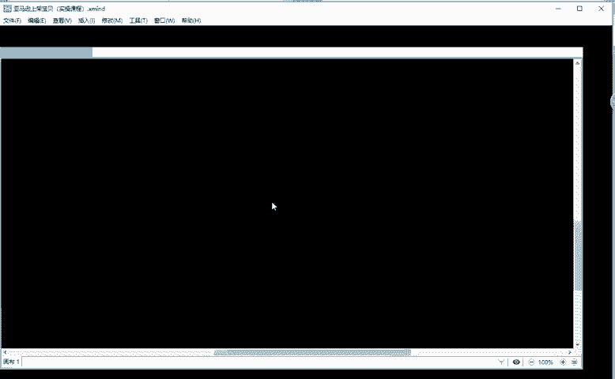
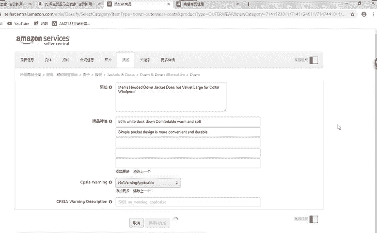

# （2024亚马逊电商运营教程）从零到精通！全网最细的亚马逊零基础开店注册选品运营变现全流程实操教程！ - P25：创建新商品：描述 - 滴滴别姬 - BV1BH21YEEkW

好，这里面的话就到了描述这一环节了啊，到描述这一环节描述的话。商比特性我们可以啊有5条描述，对吧？5条描述。那么这个描述的话，我们怎么去弄啊？应该写些什么东西？😡，那其实很简单。

就说我们参啊商品的一个特性啊，商品的一个特性。描述的话就是把我们的商品特性的话，把它啊。综综合在一起，然后特性的话就是每有5条，我们可以选择5个特性啊，发布在这个商品特性这里面啊，那么这个商品特性的话。

我应该写什么东西呢？啊，那么我们回归到这个页面啊，回归到我们的产品。我们来看一下这个产品啊，它有什么样的一个特性。来，你们看一下啊看一下啊。🤧。我。对，7元钱一个啊7元钱一个。0毛钱一个的话。

是很便宜了啊很便宜了。大毛岭。对，还有呢。我电绍谁。还有哪些特性？在哪里买？我刚刚把链接发给你们了，谁谁分享一下哪位同学给他分享一下，好吧。😊，这个logo没影响啊没影响没影响。不锁水。不缩水吧。

是不是打错字了？其实这个。这个1688这个商家的话，已经把这个啊特性的话，他已经展示出来了啊，已经展示出来了，看到没有？它已经展示出来了，那么我们就可以把这个啊都写上去啊，都写上去，好吧。

所以说这里面的话我就。就不用去问大家了啊不用去问大家了。那么。我们现在要写这个的话，怎么去写，对吧？如果只写只写这个不缩水，手感好，不进电啊，不专容。不褪色。就是这个感觉这个写的非常简单啊非常简单。

对吧？那么我们是不是要把我们我们可以看一下这个产品，它的一个详情啊，可以看一下它的详情。它的详情在我们刚刚发布宝贝的时候，有哪些没有介绍的东西，我们是不是可以把它。把它发布上去，对不对？

是不是可以把它发布上去，这样的话是不是也可以给我们宝贝啊增加一些搜索关键词啊，增加一些搜索关键词。这里面的话我给大家看一下啊，发布之后的话产品是什么样的。你看一下。算了算了。

啊等我这个这个发布完了再看吧啊，发布完了再看。😊，那么接下来的话我们把这个描述啊，描述的话就相当于我们淘宝做像做个淘宝电商的同学的话，都知道他可以啊当做一个副标题来写啊，当做我们产品的一个副标题来写。

把这个产品详细的介绍一下，把这个产品详细介绍一下。然后这个商品特性的话，就把每一个这个产品它的一些。特性把它介绍一下。那这个产品特性的话需要注意到一个问题就是。我们可以看到这里面有5有5条啊有5条。

但是在手机端的话，它只显示前三条，只显示前三条。那我给大家讲的讲的这个是什么意思呢？😡，啊。我没有把你屏蔽啊。😡，链接可以发啊链接可以发，谁帮他发一下啊，谁帮他发一下。然后。商品特性啊商品特性的话。

我们可以把这个最重要的三个特性把它放在前面啊，把它放在前面。因为手机端它只会展示前三条。能不能明白啊，手机端只位展示前三条，所以说我们把重要的东西放在前面啊，我们可以介绍看一下我们这个产品。

他羽绒服对吧？羽绒服的话，那我肯定要关注这个羽绒服的话，它的一个含绒量是什么样的，对不对？那么我们看一下。46%到50%的一个白鸭绒填充，对不对？好，那么这个是不是我们的一个特性啊？

刚刚还有一个同学说啊，大毛领对吧？这也是我们的一个特性。好，我们把这个。把它弄下来啊。🤧嗯。弄一个文本。对对对，五点描述啊，就是5点描述。我们看一下这个产品。蓝色连帽羽绒服啊。男式连帽羽绒服。

我们来看一下啊，把它的一个描述，我们把它描述一下。好吧，来，我们一起来看一下，好吧，看一下这个产品，我们把这个产品描述一下。嗯。男士连帽羽绒服啊，大毛领。按。再看一下。螺纹袖口啊，防风口袋。好。

那么我们这个描述的时候，我们把这个啊。5个。5条5点描述的话，我们可以可以放在下面。这个描述的话，我们把这个5点描述它放不进去的东西，我们把它放在啊这个描述里面啊。大毛领啊，防风口袋防风。没啥到。你。

不专容啊。嗯。不钻容啊。好，我就简单这样写啊，你们自己后面的话。整理一下好吧，因为我发布的话是给你们演示，你们也不卖这个产，也不是这个产品啊。把它添加过来啊，把它添加过来。

添加过来的话，刚刚我我在课程课前的话给大家讲过啊。

全大写非正常大小写。标题描述我们的首字母啊要进行大写。这个要改啊要改。不要直接复制过来就直接用好吧。重复的不要啊重复的不要，上面有个结。有个啦好。这是我们的描述，对吧？那特性的话。同样的把它翻译一下。

那这里面的话我们就不一个不一一翻译了。好吧，我就不一一翻译了，我就直接找一个。找一个来用一下啊。看看之前的啊。我就先发布两条啊。

