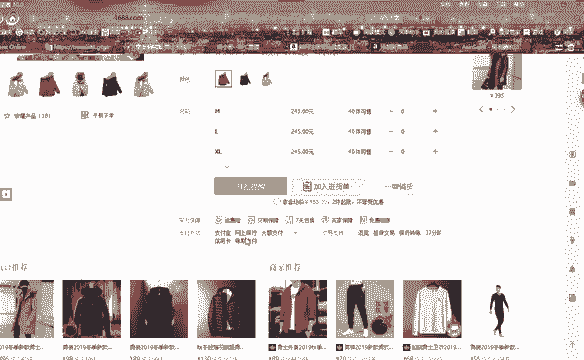
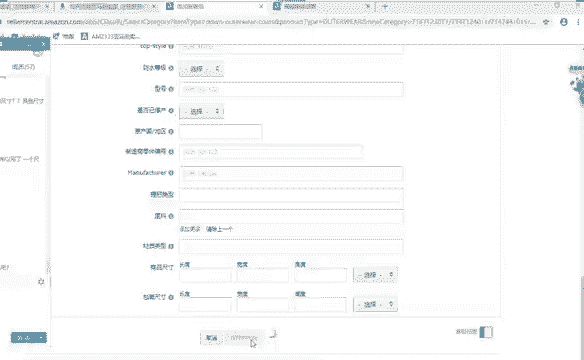

# （2024亚马逊电商运营教程）从零到精通！全网最细的亚马逊零基础开店注册选品运营变现全流程实操教程！ - P26：创建新商品：完成并保存 - 滴滴别姬 - BV1BH21YEEkW

好，关键字这里面的关键字的话，也就是说我们可以添加进来的话，搜索关键词。搜索关键词的话就可以把我们刚刚通过这个软件啊，通过这个软件查。喂。好了，打开打不开了。原告方。我是在。等一会啊，稍等一会儿。

有点卡。嗯。

就可以把我们刚刚通过这个查词软件啊查出来的热门关键词，把它添加到啊这里面，把它添加到这里面。

好吧，那这里面的话我就随便找一个了啊。😊，时间。有点紧。国外的网站的话，他它的反应就是慢啊。因为服务器不一样。好，发货重量。那么我们看一下这个产品，它的发货重量是多少。

0。7啊0。7000克。我们把它。添加进来0。7。单位千克啊千克。这好像是。我看一下翻译一下。如果通过360软件的话，它是自动可以翻译。我就不麻烦了。胸围好。那么胸围的话，我们就找一下这个产品。

它的胸围。好险。他是。好，胸围最小的是112，112厘米啊，单位是0米。那么我们把这个把它复制过来啊，112。厘米。这是警围啊颈围。颈围的话可以跟我们肩宽啊放在一起啊，我们肩宽的话跟我们颈围是一样的。

45。喂。3我钱。嗯。我就随便选一个了啊，随便选一个了，要翻译软件翻译啊，我这边没有我没有用360啊，我就不一个去翻译了。好吧，然后你们自己知道就可以了，好吧。袖长那都在这里，然后你们自己看啊。

我这边的话就随便填一个。然后这里面要需要刚刚我们讲到一个变体，对吧？变体的话，这里面要注意到一个就是我们的一个啊主题。主题，那也就是说。😡，变体的话，它是这个产品它有多个颜色或者多种多种规格。

但是大体上它是不变的啊，就是说其他东西是不变的那也就是说如果我们添加了变体这个主题的话，你两个颜色的，后面再添加图片的时候。😡，你这个主题啊要是一样的，不要去变更啊，不要去两个不同的主题的产品，好吧。

然后你就选择啊一样的就可以了，好吧。那这里面的话没有没有必填效，我就不填了啊。但是你们发布的时候啊，最好是把它填满，最好把它填满。当然有些东西它是不符合的。像什么合规信息，这个我们就没必要填。

因为你本身卖的就不是一个电子产品，你就没必要去填这个东西好吧。😡，然后保存发布，我看一下，检查一下。好，保存并完成啊，我们把这个所有的都完成了之后，然后点击这个保存并完成。好。😊，谷歌的话它可以翻译啊。

谷歌它翻译的话比较麻烦，要一个个去翻译啊，要一个个去翻译。然后360的话，它是直接把这个页面的话，全部给你直直接翻译好了啊，直接给你翻译好了。😊，好吧，所以说你们在你们在添加商品的时候。

你可以两边的同步啊，两边的同步。到时候你在你选的时候，你看啊我把它放在这边。我把这个谷歌点一下，翻译点一下。然后正在将网页啊，我把它改了一下中英文。英语啊翻译成中文。你点击到这个更多更多详情这里面啊。

等会啊。🤧嗯。好，看到没有？全部给你翻译过来了，看到没有啊，全部给你翻译过来了。那么你在发布的时候，你可以通过这个360安全浏览器来进行翻译，然后你就可以在这边来填写，你就可以对的对的上了。

你就知道哎哪个哪个英文它是什么样的意思。然后你这边的话就可以进行去填写。😊，能不能明白？尺码里面的话，它只能就是说它只有一只有一个一个呃一个空格。所以说我们选择这。填写最小码的就可以了啊。

填写最小码的尺寸就可以了。好吧，填写最小码的尺寸就可以了。嗯。对，360也可以直接发布。但是360的话，它。呃，亚马逊运用的话。就是反应比较慢啊反应比较慢，没有没有谷歌的话，反应快啊。

所以说建议的话用谷歌啊，360的话只用来翻译啊只用来翻译，好吧。🤧嗯。我靠还没发布出去。

