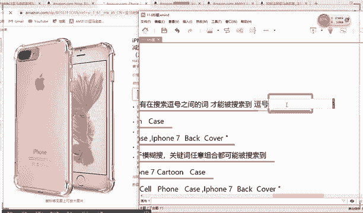
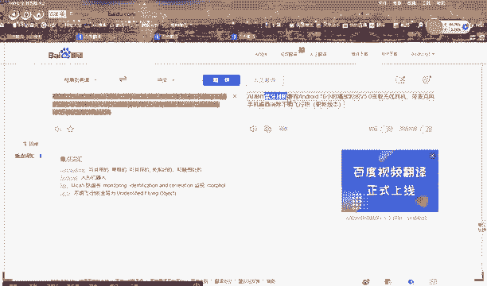
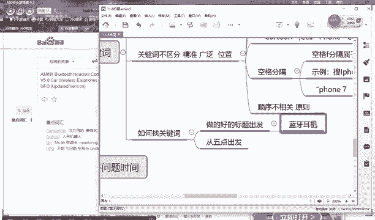
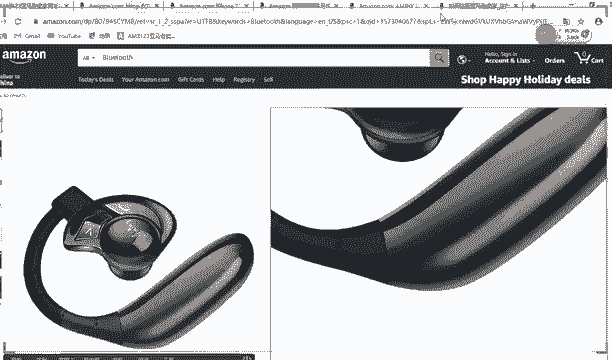
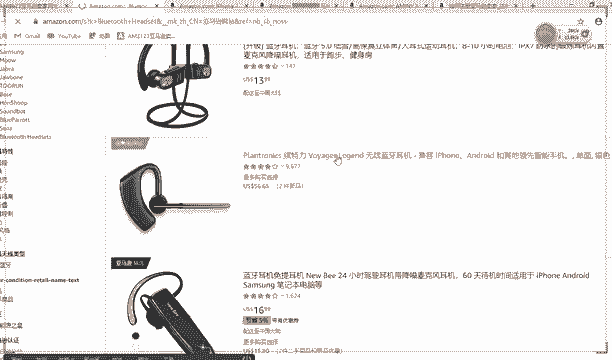
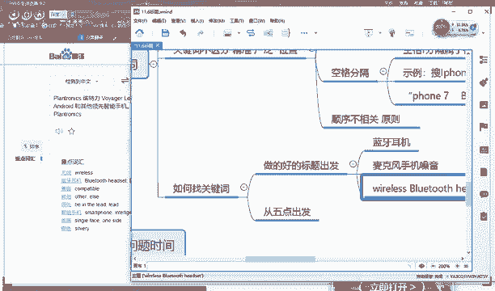

# （2024亚马逊电商运营教程）从零到精通！全网最细的亚马逊零基础开店注册选品运营变现全流程实操教程！ - P28：关键词 - 滴滴别姬 - BV1BH21YEEkW

。下面一个就是你产品的关键词，这个关键词是这意思，说老师关键词不是写标题上吗？是标题上是写了一部分关键词，但还有一个地方需要写关键词。呃，这个后期为给你讲。

但是这个是对你产品的一个一个关键词写的不够对的地方的一个描述。好，基本上你关键词写五行，每行和200个字符，空格和逗逗号都算。好，那比如说你写关键词的时候，有一个特点，就是你不要写滥用品牌词。

比如说你这个不是耐克的，千万不要写耐克是吧？否则系统会检索到，检索到，它会对你的店铺基本上是分店处理嘛。好，这个比较简单，剩下来就是你的产品有几个写关键词的有几个原则，第一个原则呢，就是它一个叫。

关键词。叫。逗号分格属于精准定位，只用于客户搜索之间的词才能被搜索到。好，那比如说什么这句话什么意思？叫逗号原则？好，我给大家举例子，我给大家举个例子你就懂了。

好，逗号拆分原则，你这四点也可以，但是最好是能多写点就好。逗号拆分原则什么意思？假说我标题中对不对？假说我标题是这样写的好，什么。😡，🎼count啊。

叫什么什么什么iphonecastiphone7plus好，如果我这三个词三个三个词啊，三个词语通分别如果用逗号隔开，那客户想要搜索了我这个产品，那必须他要搜索这个逗号之间的里面。

比如说大要搜索他必须要搜索这个东西。他才能找到我的产品的几率更大。你懂我意思吗？还要搜索。😡，逗号和这个逗号里面的东西，他找到我的产品的几率更大。他要搜索这个词，哎，他找到过产品几率更大，否则的话。

你的排名就会很低。🎼这是一个逗号原则。对他老师他为什么会有这个原则？因为这是亚马逊，他们是英国的，不是，他认不为美国的东西嘛，美国的写产品的一个原则就是这样好，那比如说那老师逗号原则，他不是。😡。

🎼他这个有弊端啊，对不对？他万一比如说客户他就搜索什么苹果class或者iphone7什么什么classus，他没有搜到back。😡，那那这样他不就找到找不到我的机会了，那怎么办呢？好。

那还有一个原则就是看你不写逗号，但是这个地方留空格，你懂我意思吗？😡，好啊，比如说。好，我不写逗号，比如说我我不写逗号，哎，我只是把它空格给区分出来，那这个时候就产生一个效果就是。搜索无论你搜索。😡。

count还是什么什么iphone7，只要它在你标题中包含，你基本上都能够搜索机会。换句话说，就是它是一个。😡，空格就相当于。没有任何影响，就是只要你标题中写了这关键词，你被搜索出来的概率就很大。

你懂我意思吗？😡，好，这点能懂的给他打6。好，还有一个点。还有一个点，就是他一个顺序。😡，顺序不相关原则。不相关原则。什么叫顺序不相关原则？😡，就是假如说老师啊，你看我这个关键词，对不对？

比如说我这个什么countt ciphone什么iphone7pl，那我这个这个顺序难道是一模一样的吗？我必须要他写在前面，他写在中间，它写在后面嘛，那我能不能调到位置。

我把iphone7这这个后面这几个词，我把它调到前面可不可以嘞？😡，对老师为要它写到他前面行不行呢？😡，可不可以？空一格啊，你空一格就行了。来，能理解老师的意思吧。😡，就是把某几个关键词调到前面可以吗？

😡，一不影响是不么搜索。😡，好，我告诉大家不影响，为什么这就是你亚马逊官方规则就是顺序不相关。就是无论你这个词写的前面还是写的后面都可以，他都会编得出来。但是前提有一个你对于美国人来讲，他要读的通顺。

知道吧？他明显看着你写的有语病，那有可能。😡，对不对他就是就觉得你不太专业嘛，你懂我意思吗？😡，但是顺序它是不相关的，你懂我意思吗？这是一样的。😡，哼。好。好，那比如说老师，那我这些关键词。

比如说关键词我应该从哪里找嘞？好，首先第一，你要从你这个里面的做的好的标题里面进行找。比如说老师那我关键词应该怎么找哈，你首先从做的好的同行的标题里面进行找。好，比如说这个是标题，对不对？

那我用百度先翻译一下。好，就比如说老师关键词那些词我应该怎么找，就从这里面找好。在呢翻译一下。你翻译出来。好。好，你说看这个吧，这个就不用翻译了。😡，好。好，比如说你首先看这个这个叫什么。

这前面肯定是个品牌嘛，这全部大写的一定是牌子啊，bluetooth就是蓝牙耳机。好，蓝牙耳机好，蓝牙耳机什么has就是戴耳耳朵这的蓝牙耳机。你看这个黑是应该是耳朵的意思。😊，好，给大家翻译一下吧，算了。

先给大家翻译一下吧。好，这怎么变成。好，什么安你蓝牙耳机兼容，好安卓的看到没？安卓的就是安卓手机嘛。安卓手机兼容16个小时播放无载蓝牙耳机。好，那你找关键词的时候，你首先第一个蓝牙耳耳机。

哎，这个是关键词，对不对？好，就是你要集百家之长嘛？好，还有一个哪些关键词，麦克风。手机消音降噪。

好，然后这个时候你再换一个。

好，比如说。

好。好，这边有。好，你看。这个应该是它产品的一个重要的一个词哈，无线。蓝牙耳机哈无线蓝牙耳机。好，无线蓝牙耳机。能理解吧？从这里面好，从这里面找。还有一个呢就是从5点出发，就是你看别人家的5点描述。

这个地方。好，能理解吗？五点描述这个地方。来找关键词。换句话说，就是几百家之长。