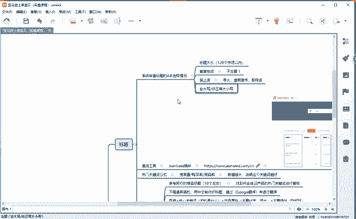
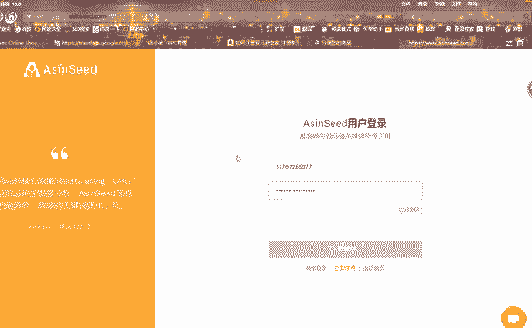
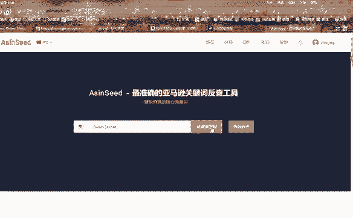
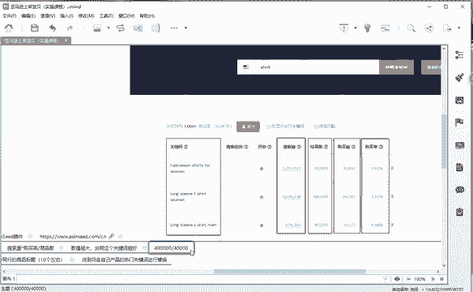

# （2024亚马逊电商运营教程）从零到精通！全网最细的亚马逊零基础开店注册选品运营变现全流程实操教程！ - P29：关键字查询工具 - 滴滴别姬 - BV1BH21YEEkW

那接下来的话，那么既然我们要做标题，我们肯定要。哎，老师，我在做这个标题的时候，我用什么样的一个关键词？能够让买家哎更容易搜索到，对不对？这是很多学员在做标题的时候会遇到这样一个问题。

亚马逊关键词反查工具啊，这个就是一个查我们核心关键词的一个啊工具查词工具。那么我们通过这个查值工具的话，来制作我们的标题，能够让买家更容易搜索到我们的产品。啊。那接下来的话我就举个例子啊，我通过这个。

😡，诶。举个例子，例如我现在的话，我要去做一款羽绒服啊，做一款羽绒服。我想。找到羽绒服，它的一个热门的一个关键词。那么我们把这个羽绒服啊把它翻译过来啊，把它复制。放到这个查词工具里面，点击获取流量词。

啊，我登录一下啊。这个你们注册一个就可以了，它是免费的啊。稍等一会啊，有点卡。

好，我们登录了啊，登录进来。然后你们没有没有登录或者没有注册的，在这个右上角啊，它有个注册，你注册一下就可以了啊。注册以后这个软这个工具的话就可以免费使用。然后我们点击获取流量词。有点慢啊。这个。

好好稍稍等一会啊，那我就直接把这个课件的话给大家演示一下啊，我给大家截了个图。等他的话特别慢啊。我给大家截了个图。这个这个就是通过我们的关键词，然后来搜来获取流量词。

它就会给我们出现啊1000多个关于我们搜索这个关键词的一个流量词。现在出现在这里，关键词看到没有？我们可以看到关键词可以看到它的一个搜索量，可以看到它的一个结果数，可以看到它的一个购买量，购买率，对吧？

那么我们通过这几个数据。我们通过这几个数据。呃，能够得到什么？😡，首先的话啊我举个给大家一个公式啊，然后你们也记一下啊也记一下。这个公式的话就是通过我们的一个搜索量去乘以我们的一个。购买率。😡。

我想问一下同学。😡，搜索量乘以我们的一个购买率的话，它能够得到什么？😡，来，你们算一下啊。😡，你们来算一下。是不是得到我们这个购买量，对吧？😡，是不是得到我们这个购买量？😡，你们自己计算一下啊。

根据这个数据，你们自己来计算一下。😡，好吧。是不是得到我们这个购买量？😡，我这个其实这个购买量的话，它已经出来了啊，我是把这个公司的话给你们讲解一下，得到我们的购买量。

那我们的购买量的话去除以我们这个结果数。😡，这个结果数它是什么意思？是不是我们通过亚马逊去搜索这个关键词而得到的一个。😡，结果页的一个商品数对不对？那也就是说这个关键词它的一个产品只有4万个。😡。

那么我们通过这个购买量去除以它的一个结果数能够得到什么？能够得到什么？😡，是不是就能够找到我们的一个热门的一个关键词？😡，那这个得到这个数值的话，它是越大越好啊，我给大家举个例子啊举个例子。😡。

我在这个。结果数不变的情况下，我的购买量它如果是啊。😡，我为了好算，我就拿个40万啊，40万去除以4万。他等于他等于1，对不对？好。那是不是购买的人多？😡，商品少，数值越大就越好，对不对？

那如果购买的人少，商品多的话。😡，那这个数值是不是越小？😡。

能不能明白？