# （2024亚马逊电商运营教程）从零到精通！全网最细的亚马逊零基础开店注册选品运营变现全流程实操教程！ - P30：关键字数据分析 - 滴滴别姬 - BV1BH21YEEkW

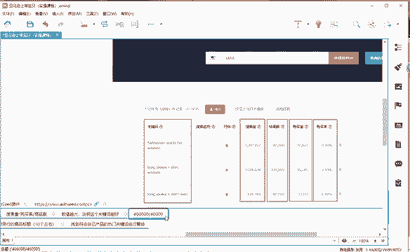

好，那么通过这个公式的话，我们就可以把这个它这个不是可以导出吗？可以看到吗？可以导出，我们可以把它导出到表格里面，就把这个购买数去除以这个结果数，它就会得到一个结果，对不对？结果这个数值越大。

那说明这个关键词它就越好。

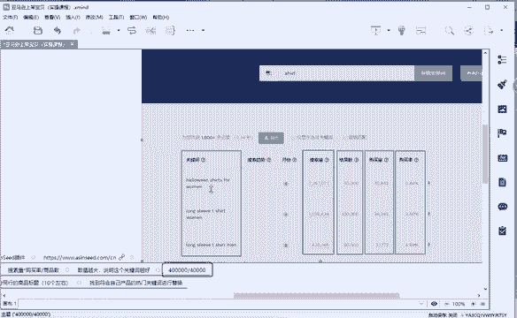

那么我们就把肯定是把。不明白吗？呃。

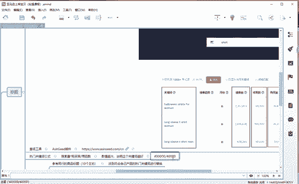

好，那我再我再重新说一遍啊，我再重新说一遍。既然有同学说不明白，好吧。

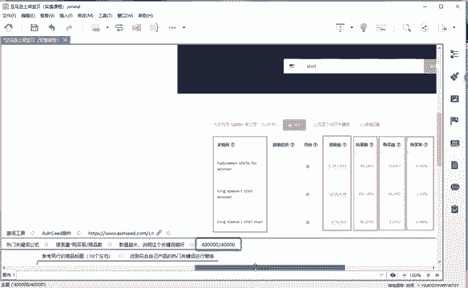

那这个结果数是4万，对不对？是4万。😡，你们好，不明白的话，我重新说一遍，你认真听好吧。😡，这个结果数是4万。也就说我们那个商品数。啊，也就是说我们的商品数。

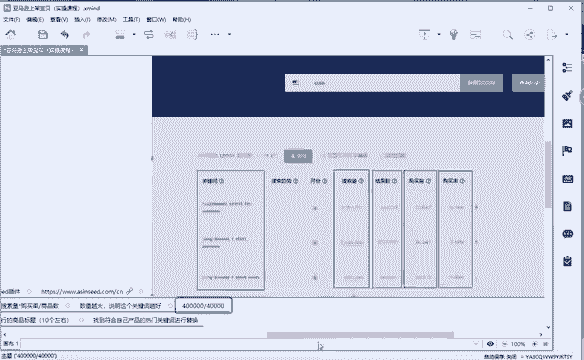

那么我们的商品数是4万啊，400好了，我把数字弄小一点啊。我给你们打出来。商品数400。购买量。4000。那这个是不是就表明购买的人多，商品少，对吧？购买的人多，商品少。那么我们4000除以400。

它是不是等于10，对不对？等于10。好，那么我再举个例子啊，在这个。😡，呃，购买量不变的情况下。购买量不变的情况下。😡，我们的商品数。他有4000，那我们得到的数值是不是一？那你说这两个产品。通过。

通过这个数呃，通过商品数400购买量44000，那我们得到一个数值是4呃，得到数值是10。那么就说我们的一个数值，它1。也就说我们每一个呃每一个产品它可以分到10个购买量，对吧？可以分到10个购买量。

那么我们这个产品呢，它只能分到一个购买量，那是不是数值越大越好？😡，好，三个硬币同学听明白了吗？来，听明白了，在公屏上敲个一。好吧，那我们就继续往下讲啊。

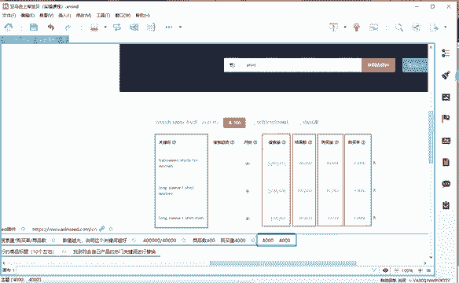

好。那么我们通过这个公式找到我们的一个热门关键词之后。

那怎么把它应用到我们的标题上面，对不对？😡。

好。我们找到这个关键词之后。

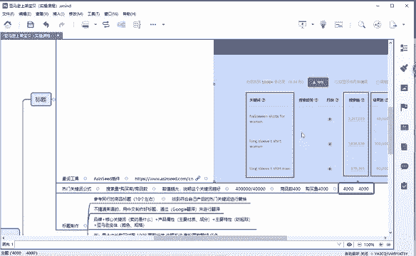

我们把它复制出来啊复制出来，放到我们那个表格里面，放到我们表格里面，然后去。结果诉剩什么意思啊？

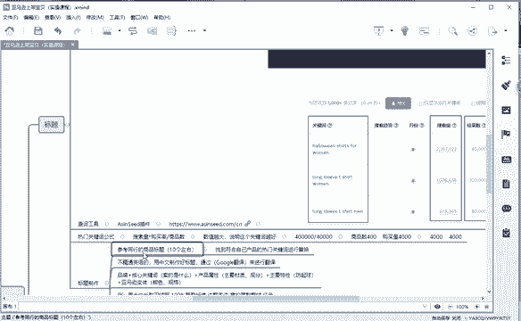

你还没听明白吗？😡，还没听明听明白的话，我就这节课。就没办法讲嘞啊，课后再问我好吧，课后我再单独跟你去讲解啊，免得耽误大家的时间，好吧。然后我们继续往下讲啊。😊，我们把热门的关键词把它复制出来啊。

都会因为我们要用啊。这个热门关键词的话，首先它必须要符合我们的产品，对不对？我举个很简单的例子啊，如果我这个产品。😡。

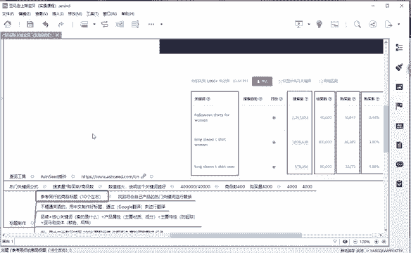

它明明是一个长袖的这个关键词，它的数值很高。他这个短袖它跟我们的产品是不匹配的对吧？跟我们的产品是不匹配的。所以说那这样的一个数字的话，这样的一个关键词我们也是不能用的啊。

我们必须要找到符合我们自己产品的一个热门关键词啊进行替换。😡。

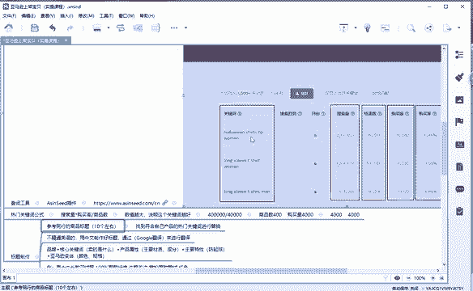

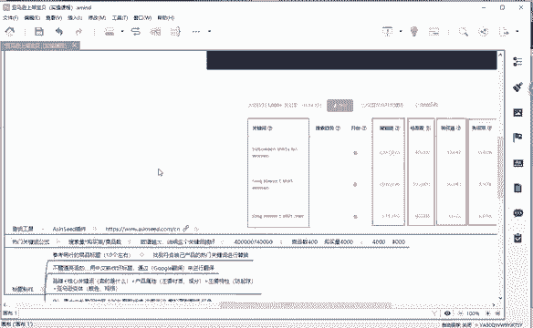

那么我们通过亚马逊搜索我们这个羽绒服。去统计啊同行的一个标题，统计10个左右。然后。把我们。刚刚找出来的热门关键词啊，替换进去。有很多同学还说哎。😡，我直接把它用中文的啊用中文把它写出来。

然后用谷歌翻译来进行翻译不就行了吗？其实这里面会遇到一个问题啊，谷歌翻译的话，它可能啊语法会发生改变。所以说最好的话我们可以通过这个谷歌翻译来来使用。但是不要直接使用啊，不要直接使用。

所以说我们参考同行的。😡，标题把我们。呃，需刚刚找到的一个热门关键词，把它替换进去就可以了啊，把它替换进去就可以了。其实我们做标题的话很简单，你只要遵循啊这个一个公式就可以。品牌核心关键词。

核心关键词的话，也就是说我们卖的是什么产品，对吧？卖的是什么？😡，产品属性。我们的材质，我们的成分啊主要特性。😡，像我们服装的话啊，起球啊、防水呀啊等等都是那一个特性，对吧？变体亚马逊变体。

那也就是说我们那个颜色规格，也就说我们淘宝经常说的SKU对吧？SKU好，那么我们这个标题的话。😡。

通过这个组合之后就可以啊。做出一个标题出来啊，做出一个标题出来。这个标题的话，我们就可以把它啊等会在上架宝贝的时候，把它应用上去啊，把它应用上去。

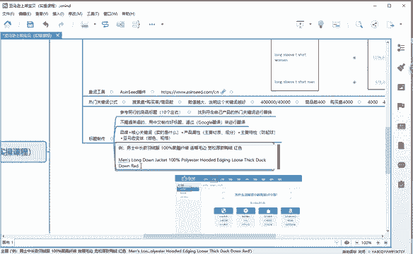