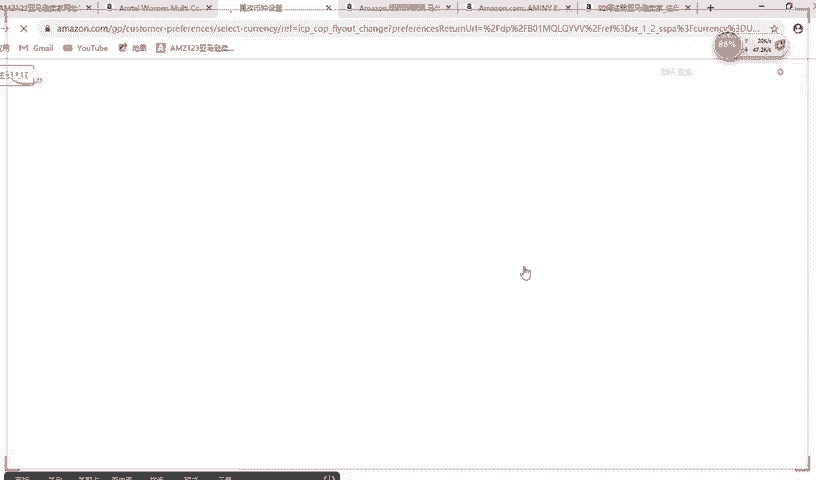
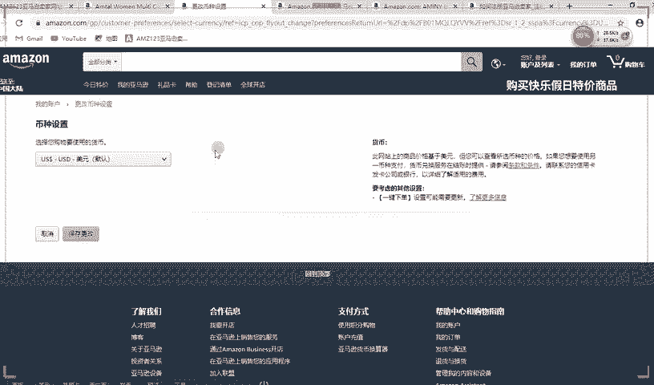
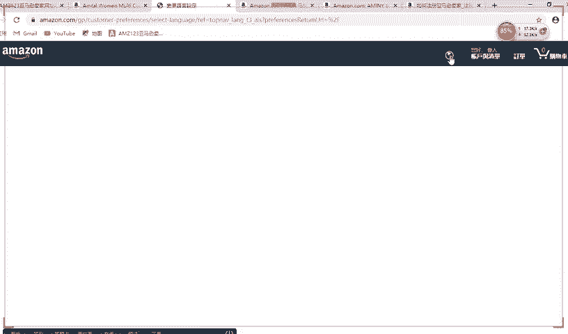
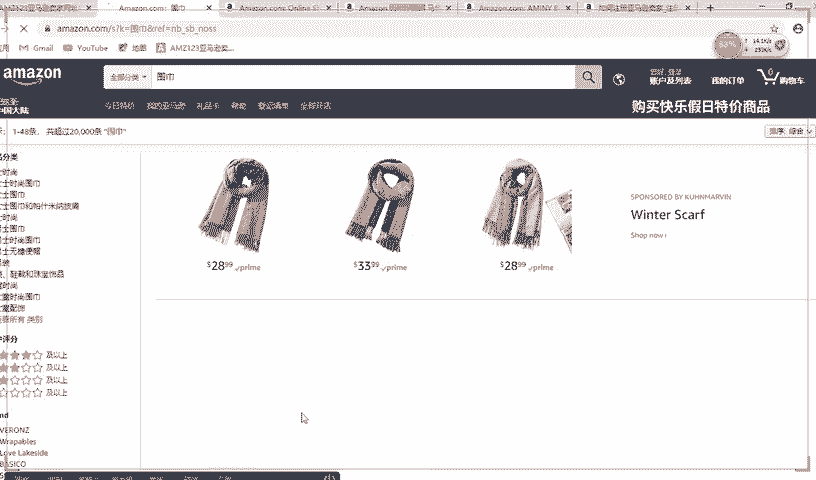
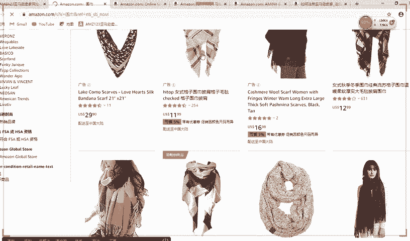
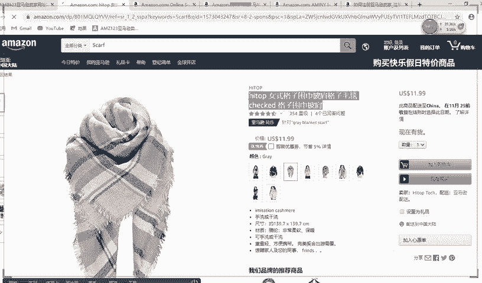
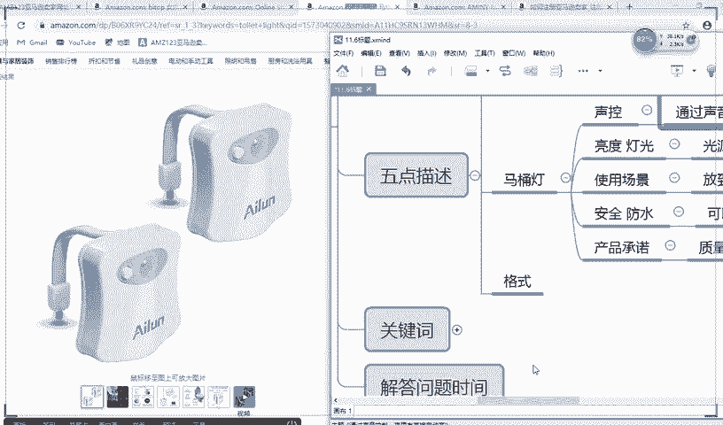
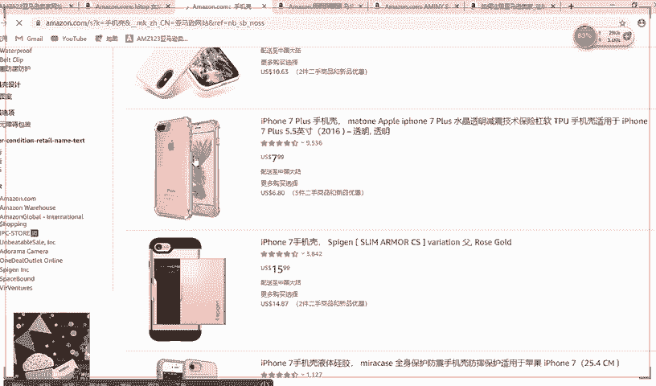
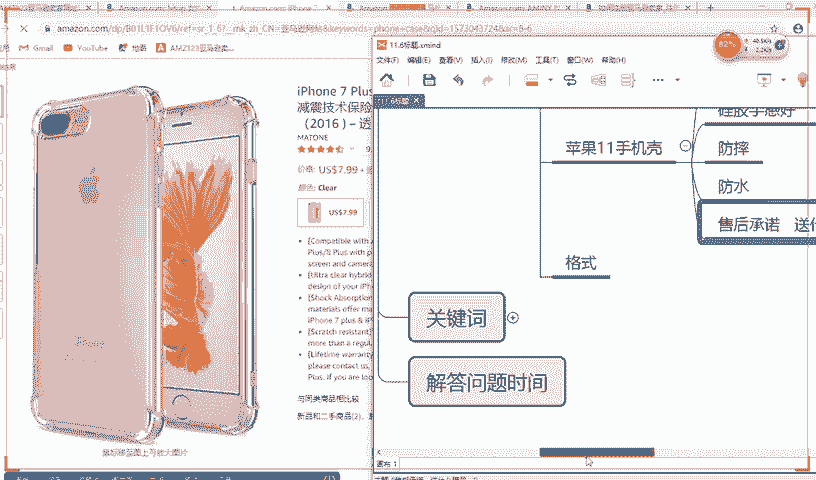

# （2024亚马逊电商运营教程）从零到精通！全网最细的亚马逊零基础开店注册选品运营变现全流程实操教程！ - P31：五点描述 - 滴滴别姬 - BV1BH21YEEkW

你你要改的话，肯定要多找几个卖家的来改，然后再进行弄啊。不能说一个的话进行改，能理解吗？好好，那这个时候哎，那比如说还有一些还有一种情况，他说老师，那你这个标题他其实写不了多少字啊，那我还有很多属性。

那剩下的属性该怎么办呢？剩下的属性你就可以写到这边里。好，这边五点描述，还有关键词好。😊，好，我给大家讲好，比如说你标题里里面一般有这几种原则。好，等会儿我给你讲啊。好，首先先写五点描述。

什么是五点描述，就是它类似于对你标题的一个补充。好，在这个地方看五点描述就在这个地方5。看到没有？5点描述啊，比如说咱们翻译成汉语吧，咱先看一下汉语版的。

好，选错了，应该选简体中文。

好，应该是就是这一款。

O k 。

好，看到没有？好，首先无点描述是在这个地方。好，你看你首先第一个点，就是有同学肯定会讲说老师我这个五点描述，我不知道应该写什么呀。好，不知道该写什么。我给大家举个例子哈，比如说呃给大家举个例子哈。

比如说给大家举这个例子。那这个就是那个叫马桶灯，呃，马桶灯呢，它就是你在呃就是那个呃就是你比如说你晚上去上厕所的时候，还有灯会自动亮嘛，就是这种东西好，这种东西咱不先不看他英语英语是表达什么意思？

如果你想表达这个东西，它的一个细节，它的一个产品，你觉得五点描述应该写哪些东西。好，比如说咱们重新来看。好，你觉得应该先哪些东西？你觉得还有哪些东西需要再再次表达？😡，你觉得哪些？😡，好。

首先第一个我想描述他这个产品的一个，比如说一个一个叫什么是不是声控的，对不对？是否是声控？假说啊，就是声控。对对？那这是这有一个5点描述，实然生物是两个字，但是你描述的时候可以描述多一点。好。

比如说第二个就是你这个产品的一个什么呃，就是这个产品的，比如说一个亮度。对，或者说一个量。灯光亮度啊，灯光。对不对？好，还有一个呢，你可以使使用这一个产品的一个好。这个产品的一个使用场景。哎。

比如说在哪个地方使用，它不一定非要在马桶旁边使用啊，对不对？它有可能在外面的一个阳台上也可以使用。所阳台上我不需要开灯了，哎，我比如说或者说什么书架上啊之类的。哎，我晚上去或者在在电脑旁边也可以用啊。

对不对？我去开开电脑的时候，我不需要把整体的灯给弄开，可以弄一个小灯，懂我意思吗？它不一定非得要在这个地方，你要使用场景。当然了，最重要是在。马桶旁边用啊，对不对？晚上的时候用嘛。好，还有一个呢。

比如说5点标钟，还有一点使用什么呢？就使用这个产品的一个。这个产品的一个比如说叫。安全防水。对不对？对你在厕所里可能会遇到一些水啊，还有一个呢就是产品的一个，比如说一个承诺啦，售后承诺或者说产品承诺。

哎，比如说我是不是呃我这个产品是不是质量可以啊，我这个产品什么品牌啊，然后出现什么问题，我该呃会不会及时处理呀，回复啊，对不对？好评率比较高啊，什么之类的。好，比如说声控。

那这个时候你描述的时候就可以描述多一点嘛。因为这个无点描述的话，它字体。他一般情况下。他一般情况下是写的字体是比较多。好，一般情况下，你这个地方写的是比较多。好，比如说第一，比如说声控好。

你这个时候你可以先把汉字给写出来。比如说第一。好，就是通过声音控制。控制，然后夜里有声响就自动亮。自动量对不对？好，那这就是一个描述了嘛。好，下面一个你这个亮度里好，你说光。缘柔和不刺眼。对不对？

不刺眼，然后呢呃不刺眼，然后呢也。好，不刺眼，基本上是好，你可以这句话就可以写上去了。你说小孩儿。可以不会伤害小孩眼睛，特别是不会伤害小孩眼睛，对不对？能理解吗？好，这是一个点。好。好。

下面一个就是使用场景。使用场景就是在厕所放到厕所里。厕所马桶边。电好。再也不用担心。再也不用担心，然后我夜里上厕所开灯，夜里上厕所开灯，然后吵到家人了，可可能把家人给唤醒。把家人吵醒，对不对？

把家人吵醒。能理解吗？好，比如说安安全防水。安全防水的话就是它。防水好。可以防水防雾。好，安全不漏电。好，产品承诺呢就是你这个产品。好，这个产品。质量保证。好。遇到问题可以免费更换，对不对？

遇到质量问题。免费更换。懂我意思吗？你看这5点都可以有了。好，比能力讲，然后你再用百度翻译翻译一下，然后写上去。好，比如说咱们再举个例子。好，比如说来大家再说一个产品，咱们再举个例子啊。

随便说一个产品好，给大家举例。😡，就是你首先你要你要知道我要从哪些东西，我要地方来找。😡，不是外套啊，你要说具体的东西。😡，具体的东西。

啊，比如说手机壳是吗？啊，有人说手机壳。好，手机壳。好，手机壳比如说咱们要说一个具体的是哪一个种类的手机壳啊，是iphone几。你说M7吧。好，咱们现在点一个。

iphone11是吧？好，你看iphone class。iphone class就是手机壳的意思，能理解吗？好，这是手机壳的意思。😊，好，那比如说咱们这个时候5点描述好，描述什么嘞？好，首先第一个。

首先第一个五点描述好，比如说这个5点描述描述什么？好，假如说啊咱们咱们就认为他是苹果十一，好吧。😡，好，假如说咱们就认为这个是苹果1一，当然还是苹果七啊。首先你要第一个5点描述写什么呢？

第一个你要告诉他应用是哪个手机，比如说。😡，苹果十1。什么什么什么型号专用。对不对？好，那这是一个。第二个，你要告诉他什么材质，比如说你这是硅胶的。😡，硅胶防摔。硅胶。手感强。对。

第二个第三个点就是他这个安全。安全。就他防帅啊。😡，能理解吗？好，下面一个点就是它什么嘞？就是它这个产品的一个，比如说一个叫。比如说防水吧，一般情况下，这种基本上都是防水吗。好。

剩下的一个就是还有一个这个产品的一个，比如说呃就是一个最后的话，如果你没有什么可写的，你就写你的售后承诺啊。对你什么我或者说送什么赠品呀。送什么赠品啊，或者我送卖手机壳，送的手机膜。对不对？能理解吗？

就是这些东西。😡，送单身狗啊。懂我意思吗？好，无非就是这些东西，你挖掘它的一个产品的一个特性就可以写的出来了。😡，好。好，那这是5点描述，然后你翻译百度翻译一下就可以写上去了。好。

到后来我会给据大家演示该怎么样上架，该怎么填这些东西，填的时候该注意哪些点？

好。