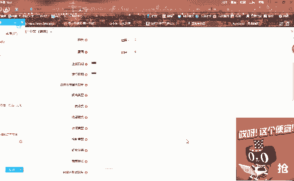
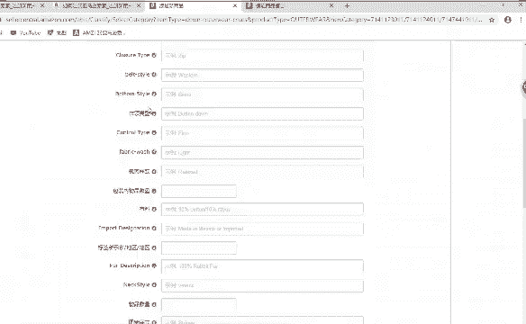
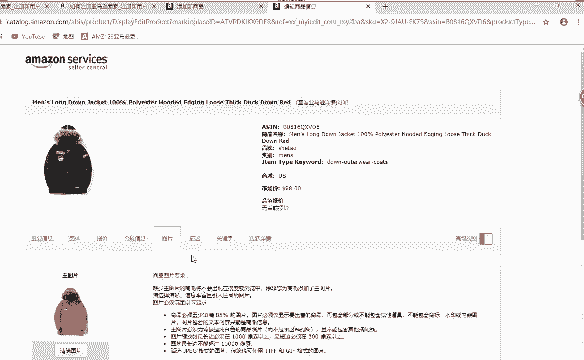
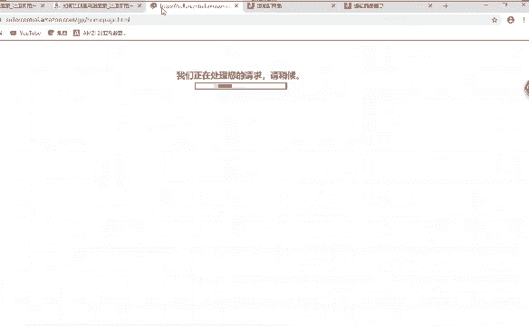
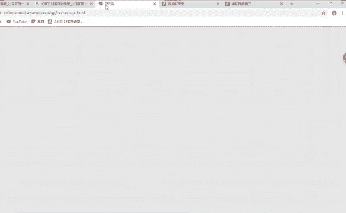
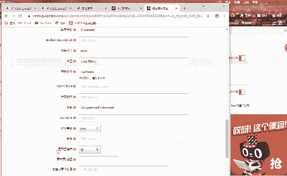
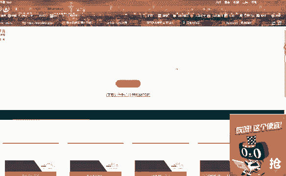
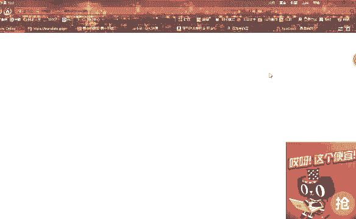
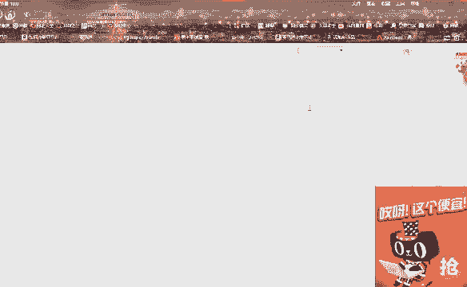

# （2024亚马逊电商运营教程）从零到精通！全网最细的亚马逊零基础开店注册选品运营变现全流程实操教程！ - P32：新商品上传后的编辑 - 滴滴别姬 - BV1BH21YEEkW

好，看到没有？也就是说如果我们的这个主题的话，就是我们产品的一个啊。图片素材。他是。通话了动画片的一个人物，还是吉祥物的一个人物啊，还是恐怖的一个一个画面。那么我们在选择这个主题的时候。

也就是说你这个变体如果有有添加变体，你两个啊主题都选择一样的啊，都选择一样的。好吧，因为等会我这个发布完了之后，你就知道了，为什么我会在这里面讲这个东西。因为这个我添加了变体之后，发布了。

我去后台还要去添加它的图片，去还要去修改这个。你的一个发布的一个信息。所以说你一定要把这个设置一样啊，设置成一样。你自己要记得我选的是哪一个，而不是说我自己随便选了一个，等会我在发布的时候。

我忘了我之前选的是什么，好吧，所以说这里面的话大家注意一下就可以了啊，没什么特别的一个要求，好吧。😡，下面要填写的啊要填写，我是没有填写啊。这个数量。数量、植物衣领类型啊，这些的话都可以填写的啊。

都可以填写，越完整越好。变体那里填的数量是指库存吗？

等会啊。

编题那里写的一个是价格，一个是我们的库存啊，数量就是我们的库存啊。对，就是我们的库存。啊。哎，什么情况？还没发布出去。没发布出去的话，那我在后台找一个产品啊，找一个产品。

也就是说如果我们这个产品发布出去之后，我这个添加了变体的，他还要去后台。也就说。😡，来到我们的后台的话，他有一个图片编辑。图片编辑这里面的话，我们往下往下拉，它会有一个颜色啊。

就是需要我们去添加颜色的一个图。

一个图片，我们在这里把颜色啊把这个产品的颜色的图片添加上去。我重新找一个好了啊。找一个我之前发布过的。因为这个你看半天没反应啊。还在转，这里面还在转动。那么。高诉。用了这用了这么多年，亚马逊的话。

发现亚马逊他到晚上的时候就感觉。

进他的页面很难很慢很慢。

然后我们。在各个库存这里面啊，我找一个，如果我在发布了之后，他就在这个库存管理啊，管理库存这里面。我们点击进来。然这。太慢了。万一发布不上去，不是白忙活了啊，他肯定会上去的啊。他肯定会上去的。

你这个页面有没又没有丢失，你还在这个页面，看到没有？我还在这个页面，我添加的东西还在这里啊，所有的信息都在这里。啊，看到没有？都在这里啊。也就是说我这里面的话保存并呃保存并完成完成之后。

在我们亚马逊后台在这个库存管理库存这个地方啊，我们点击进去，它需要添加。他需要添加我们变体，就是我们刚刚添加的不是有两个颜色吗？要把这两个颜色的图片把它添加上去啊。如果我们这边发布成功之后。

它这边的话会显示一个。😡，呃。等会太慢了。看到吗？添加变体，它这里面的话有两个变体，这里面有6个变体，看到了吗？😊，然后还有个。如果我们添加了变体的话，我们在这个后台管理库存这里面看到的它。

是没有发布成功的，它是不显示图片的，就是不显示图片。所以说我们需要进入到这个库存管理库存，点击这个变体。然后这个这下方的话，它有个编辑，我们点击这个编辑，然后就会跳转到这个商品这里面。商品这里面的话。

它有个图片，它会有个感叹号啊，它有个感叹号，我们点击这个图片。他在这个最下方，在这个地方，它需要我们添加一张颜色的啊图片。那也就是说我刚刚发布的红色的产品，那我们在这个添加一个红色的啊产品的个图片。

把它添加上来。然后他会这里面的话它还会有个更多详情，对吧？有更多详情，你要注意看一下这个主题它有没有变化。如果有变化的话，我们要把它改成我们刚刚发布的时候选择的同一个主题这样说能不能明白啊，能明白的话。

我就不演示了。因为半天的话进不去。你看哪一直进不去啊，一直在转圈啊？

对，如果只有一个颜色，就不用填变体，你就点击这个刚刚在在这里面点击发布的话，它已经保存。😡，并完成他就已经发布成功了啊，他就已经发布成功了，就不需要在后台去去添加颜色了，好吧。😡。

亚马逊有亚马大亚马逊大学啊，有啊。给你们看一下啊。我看一下能不能进，能进的话，我就给你们看一下。看到没有？它这里面有个学习中心啊，我们点击。北美开店学习资料，这里面的话它就有很多学习的东西，看到没有啊？

看到没有？卖卖方大学介绍，他就是一个亚马逊大学。我们可以在这里面学习，我们想要啊就说。不了解的东西可以到通过这里啊可以去学习。如果你。不知道的话，还可以在我们的亚马逊的一个后台，它有一个搜索啊。

我看一下看一下能不能进啊。

嗯。AMZ。嗯。太慢了。

看到没有？这里面有个搜索啊。😡，有个搜索变体。我搜索一个啊搜索一个事项。感觉这个电脑都不听我使唤。😡，点击不了。你们知道在这里面搜索就可以了啊，有什么问题的话，可以在这里面搜索，好吧，我就不打开了。😊。

在这边的话，这个电脑卡死了。好吧，你知道在哪里就可以了，可以看到在哪里吗？这个地方啊这个地方。😡，来看到的同学在公屏上敲个一，好吧，看到的同学在公屏上敲个一。😊，对，360的话肯定会卡啊。300的话。

我们主要的话就用来用来做翻译啊，用来做翻译。好好好好好好。😊，就是你们想要学习什么，就说或者有什么变体啊，对变体不明白呀，你可以在这里面搜索变体啊。好吧。我看一下这边的话有没有发布好啊。我靠还在转圈。

还在转圈。好好，那今天的课程的话，我就讲到这里了啊，然后后面的话。😊。