# （2024亚马逊电商运营教程）从零到精通！全网最细的亚马逊零基础开店注册选品运营变现全流程实操教程！ - P33：注册店铺遇到的问题 - 滴滴别姬 - BV1BH21YEEkW

首先第一个，如果你要是注册个人店铺，那你所有的信息都要是一个人的，知道吗？😡，你无论是个人的还是企业的，所有的信息都要是一个人的。😡，能理解吗？如果是你是企业的店铺，你要注册企业店铺。

你定要去加招商经理微信。

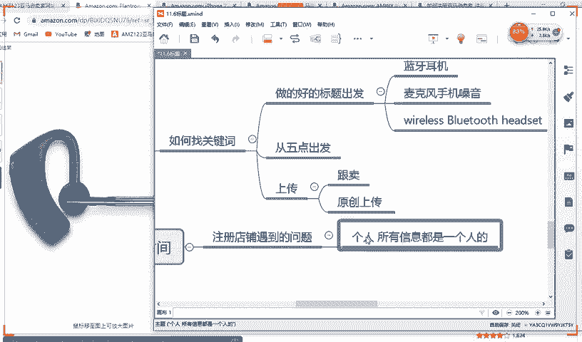

通过招商经理。经理，然后给你邮件发的链接，他会发你一个表格，让你填好，然后你再发给他邮箱里，他再通过他再发邮箱给你，发邮箱给你注册链接，注册链接。你你要通过他给你的注册链接，你再去注册，知道啊？

不是你自己在百度上找的哎，亚马逊注册网址，不是从那个地方找的，知道吗？你再搞错了，那你后面的事情你都麻烦了。

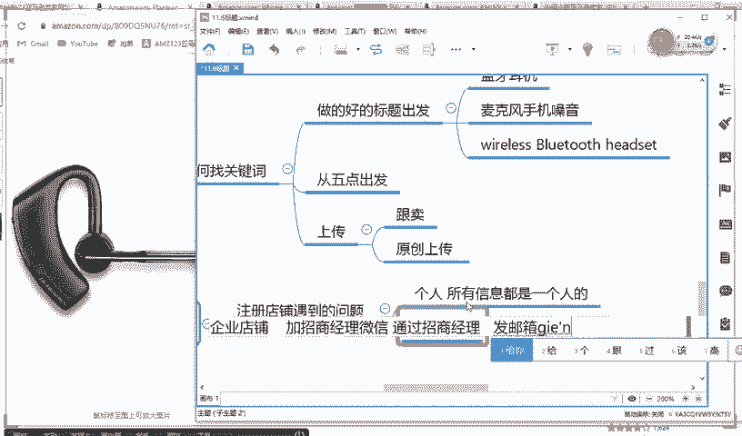

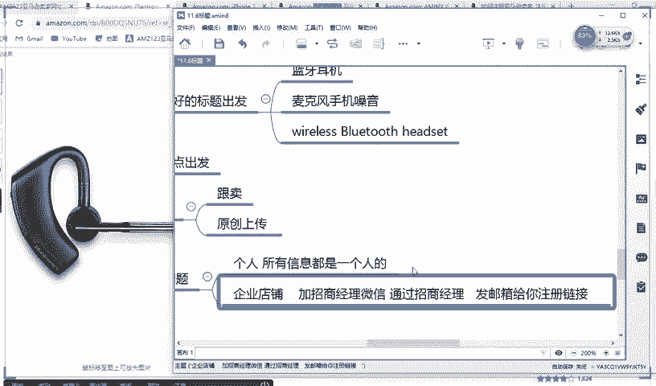

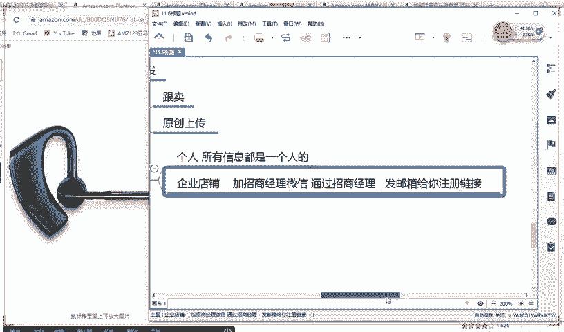

张小杰，你不要签的，好吧。😡，照项经理不要钱的。好。你知道吗？你你比如说有同学还问他说老师我加招央经理，他不理我。😡，我跟你说，只要你你加上去之后，你说你的亚马逊，你备注的时候是亚马逊那个开店。😡。

招商经理的微信是在给你们发的网盘链接里面，第一节课啊，那个课件里面就有那个课件里面第一节课是10月多少号来着？那第一节课就是注册店铺的那个呃插麦的文档，就是这个思维导图的文档里面就有啊，你加他的时候。

你备注亚马逊开店的，或者说开亚马逊店的。备注好之后，他基本上会发你呃一些资料。比如说像你填的表格啊，他的邮箱啊等等发给他就可以了。你懂我意思吗？只要他通过你他基本上他都会发你的。😡。

除非你问他一些店铺的问题，他可能。不太愿意理你嘛，因为人家是工作，他们可能忙，知道吗？那人家不理你也也也很正常。但是他工作他你要是申请店铺，他基本上都会理你的。如果他今天没回复你，那你就明天再找他一次。

能理解吗？千万不要。动不动就就给人家一直狂发消息，那别人就不会愿意理你了，你懂我意思吧？好，如果他这个号不理你，我建议你再找一个微信，然后再加他一次，对不对？😡。

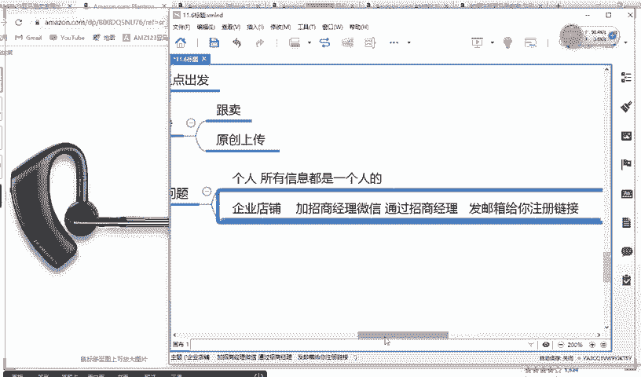

他因为有可能家上人比较多，有可能他工作比较忙，他有些东西他可能心情不好的，有些东西他不愿意回，这些能正常，对不对？你因为你是有求别人嘛，所以说你千万不要把别人给搞火了，是吧？否则他就不想理你了好。😊。

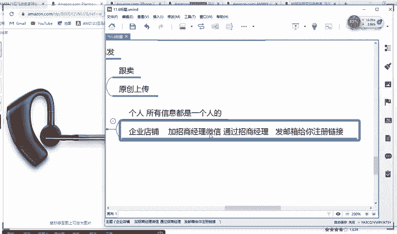

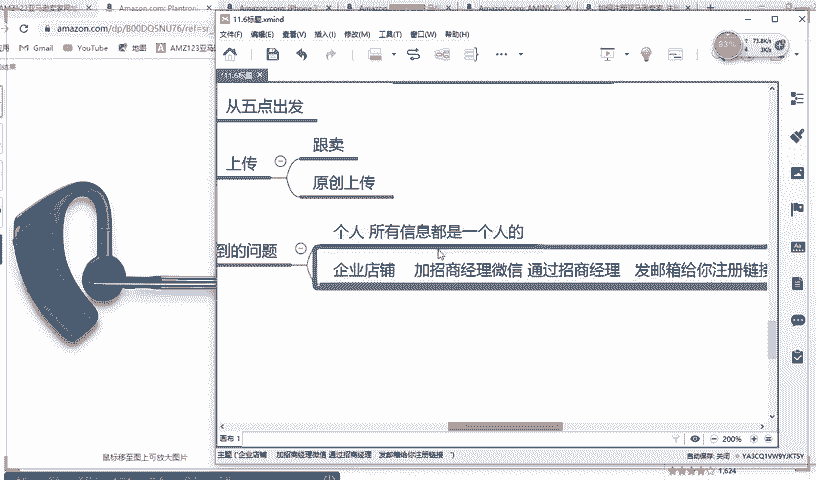

好。没有上架，最后一步要填公司地址，公司地址就是你营业执照上的地址啊。如果你注册企业店铺，能理解吗？😡，如果你注册企业店铺，你就写你营业执照的地址。好，比如说还有一个啊注册营业执照的时候。

你要还有这几个细节，比如说老师地址。😡。

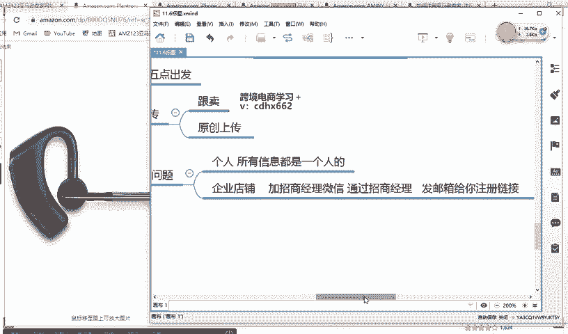

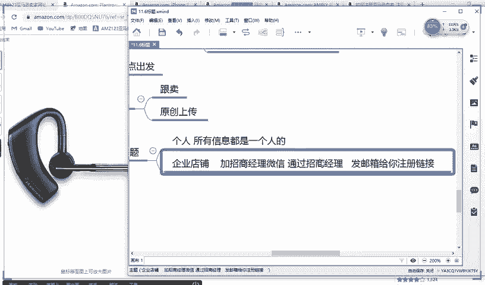

地址一定是营业执照上的。第二个就是一定是法人的身份证。还有法人的一个办的微信，法人办的。办理的vis啥卡。能理解吗？就是所有的都要法人的信息，知道吗？法人的信息。还有同学问这个问题。

他说老师你注册的时候不是中那个163邮箱吗？那163邮箱，那我如果是我朋友的手机号办理的163邮箱，可不可以，那是可以的。你朋友的名下的手机号也是可以的，知道吗？这个不重要。

你比如说老师我我想办一个个人店铺，但是我的手机号是我爸妈是身份证办的，应该信不信？这个是可以，这个没啥影响，你懂我意思吧？邮箱和手机号没啥影响，但一定是最好是新办的。这个手机号。

你之前没有注册过亚马逊店铺，163邮箱也没有注册过亚亚马逊店铺，你新注册一个，建议大家新注册一个。比如说163邮箱。😡，好，再给大家写出来吧，就防止你为出错哈。😊，新注册的。知道吗？

因为你注册就用手机号绑定一下就可以了嘛？

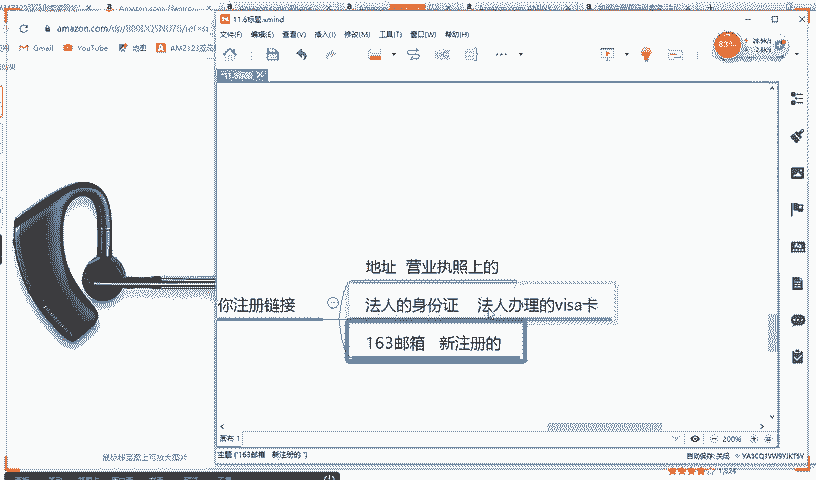

要不行点可以转让，可以转让的，你把账号信息给别人不就可以了吗？好啊，手机号最好也是手机号，你要你要确认这个没有注册过是可以的。如果你确认不了，你最好是办个再办个卡吗？

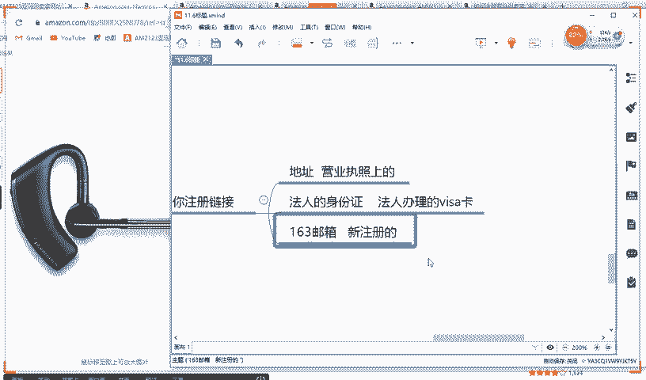

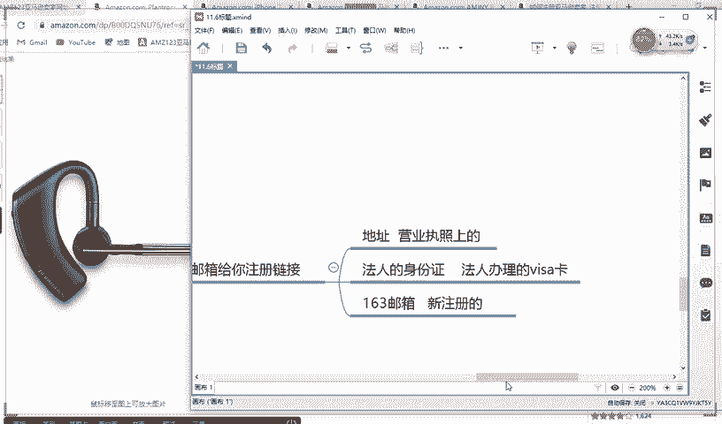

好，这是一个重要的点，能理解吧？还有一个，比如说老师，他有些人他要你比如说要填填写那个visa卡的时候，不要填写收款地址吗？填写visa卡的时不是或者说填写什么visa卡账单的时候，visa卡的时候。

要填写地址吗？对不对？那填写地址，那个地址的时候。

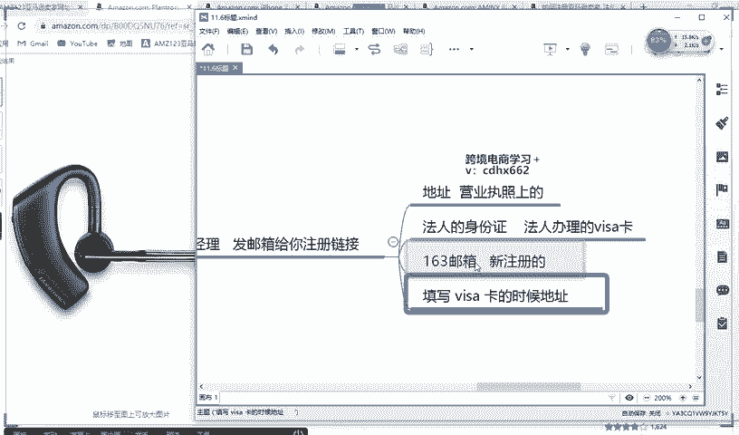

地址的时候，我建议大家是是这样，它有很多可以写地址，它又分为两种，一个是英文版的地址。

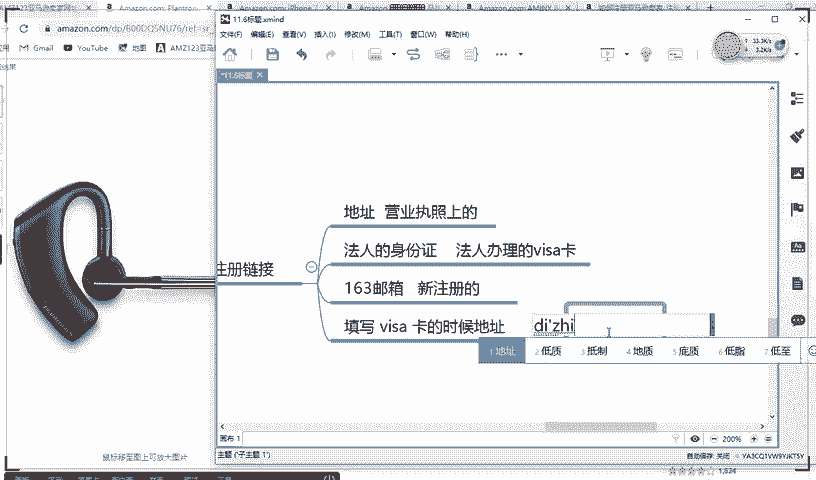

有些是写拼音，有些地址要写拼音，有些地址要写中文。比如说你你是注册企业店铺，企业店铺他要写你的一个，比如说你的注册地，你这这就是你河南省郑州市，他要你写汉语。因为它会在那个搜索框里会提示啊。

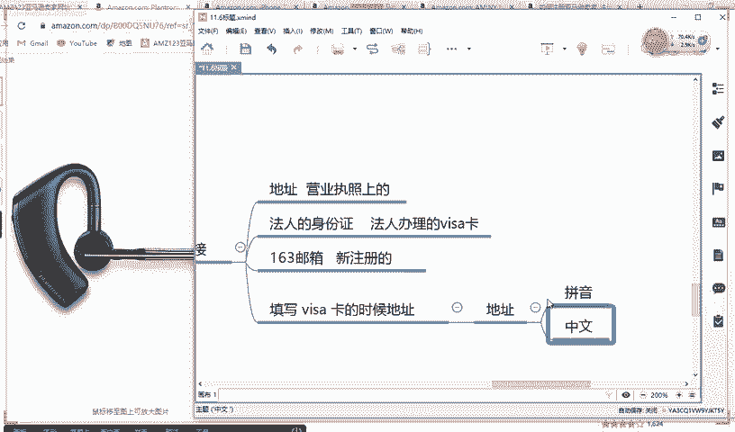

他那个填写框里会提示。他会提示它会提示写的哎，比如说中文什么地址，中文什么呃，地址，然后填什么，或者说你填姓名的时候，他不写姓名、姓姓名或者说冒号，然后写个中文或者说姓名离举例离。

他写的比较比较那种颜色比较淡的字啊，那你代表这个写汉字，你懂我意思吗？他给你提示的，他会给你提示的。

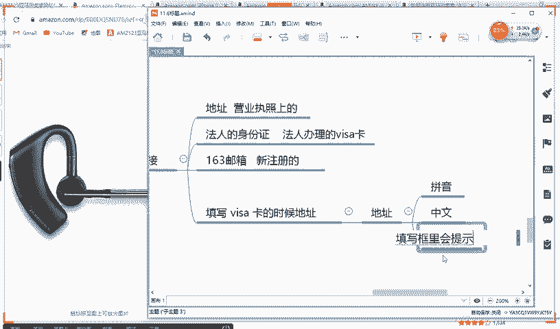

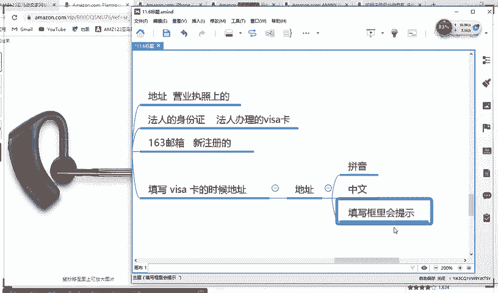

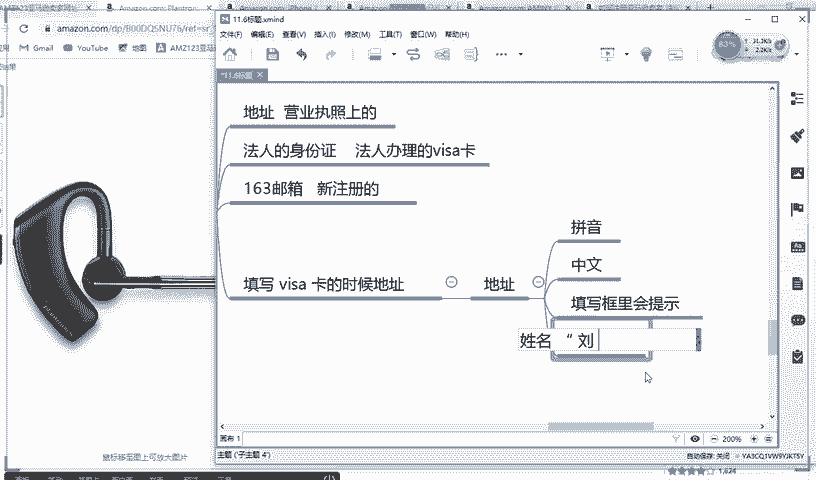

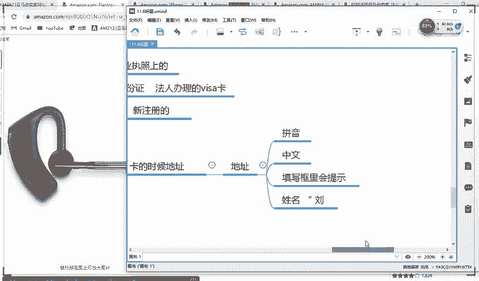

知道吗？还有一个，比如说写着账单地址的时候，最上面不是有账单地址一地址2吗？

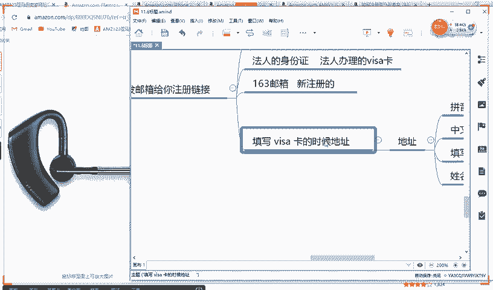

好，比如说给大家举例子吧，好，地址一啊，比如有一个地址2，比如说你们注册的时候啊，会遇到这类情况。没有公司地址怎么办？个人店铺你就写身份证，个人店铺你写地址的话，就写身份证上的地址就可以了。😡。

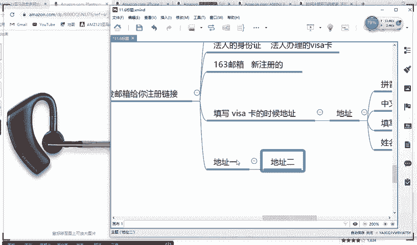

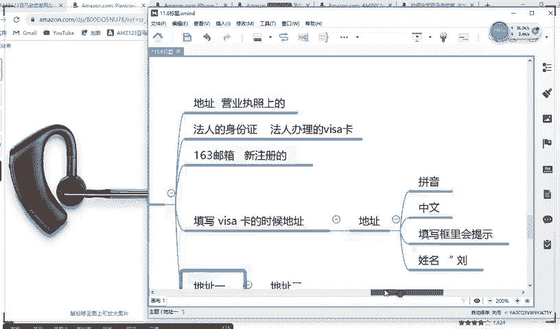

好，在哪里？个人的话，你就写你身份证上的地址。😡，那比如说肯定有同学问啊，他老师我不住在这个地方了，老师我身份证呢是我老家，我不住在地方怎么办？你不住这也不要紧。😡。

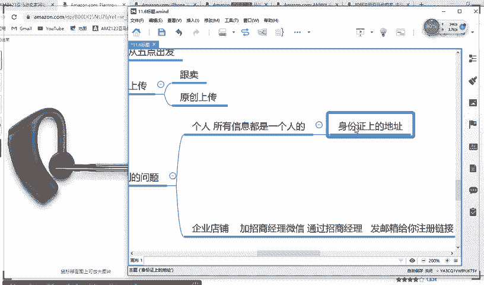

那你也可以写啊，但是比如说老师，那如果后期我二审的时候需要填写，比如说水电费账单怎么办呢？水电源账牌肯定是我名下的，对不对？是我用的一个。那我不在老家住了，那。😡，那肯定没账单啊，那怎么办呢？

这种情况下，你一般情况下，你要么是。😡。

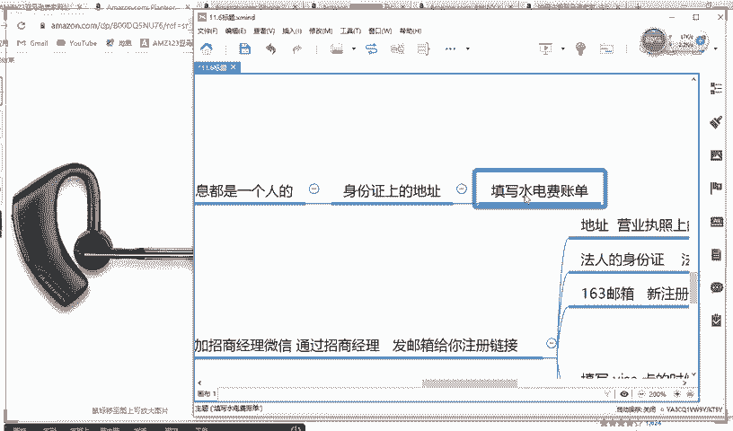

租的房对不对？要么是你住你爸妈名下，要么你新买的房。好，但是你这样一个重要的点。但是你这边注了一个点。是什么呢？你这样重要一个点就是。你比如说你是租房子的。😡，你是租别人的房子的那你就要找正规的合同。

你要这物业做正规的租房合同。合同如果如果你做，然后拍照。

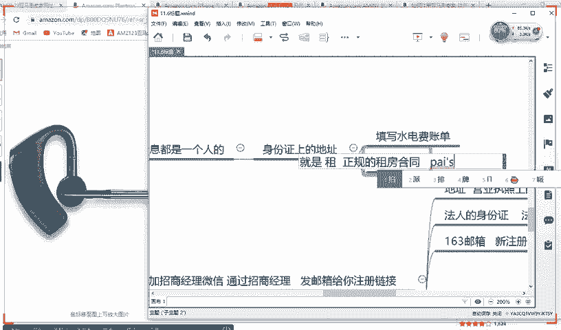

连同那个水电费1一块上传。目的就是证明这个水电费确实是你用的。😡，什么账单啊，一经一块上传。

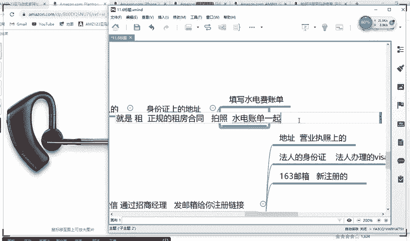

你懂我意思吗？是这个意思。😡，你比如说有些同学还会问，他说老师，他我住这个房子是我爸妈的呀，对不对？不是我名下的那这很简单，你们去物业去去去去做一个租房合同不就行了吗？你懂我意思吗？😡。

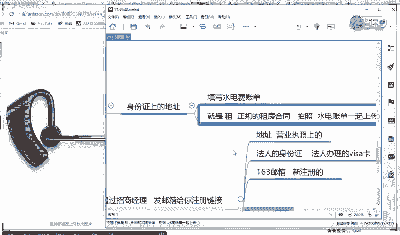

一定是正规的租房合同，不是说你哪一个白纸手写的，那个不是还有有正规的模板，基本上物业都有这种东西。😡，银行信用卡信用卡只要你成年，基本上银行都会给你批的，好吧。😡，你懂我意思吧？只要你是正常的。

只要你没有什么欠钱不还，你信用正常都会给你批的。左手在防东，右手是防护是吧？😊，对自己打人一下。😊。

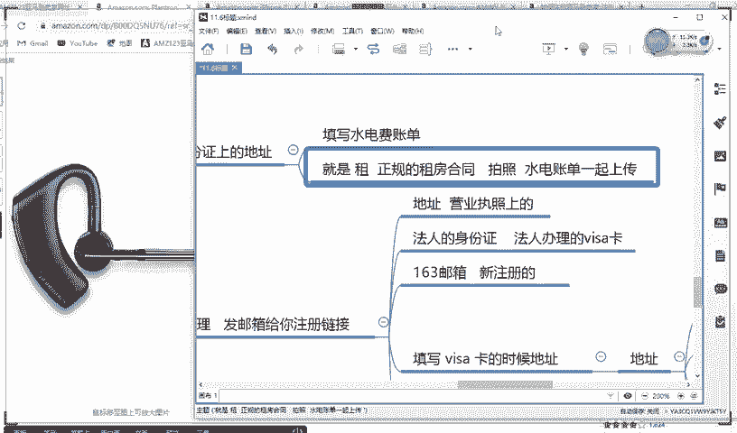

哎，你注册的流程，你的老师应该发过你啊，你要准备哪些资料，应该发过你啊。但是有些细节你要重要，知道吗？😡。

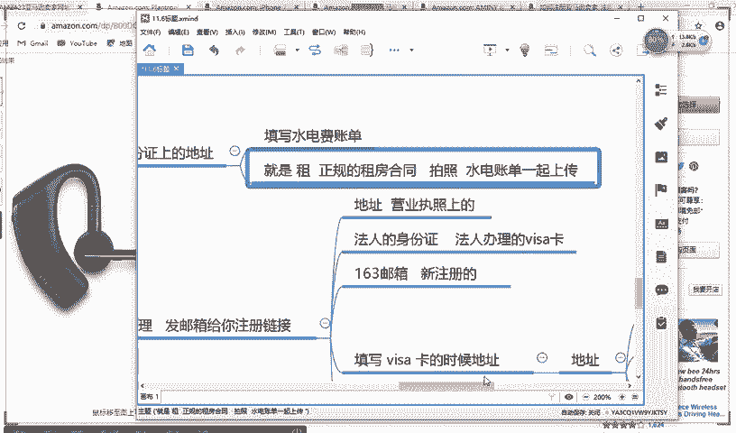

剩下时间没有限制。但是你如果长久时间不上架，那肯定是不太行的吧。

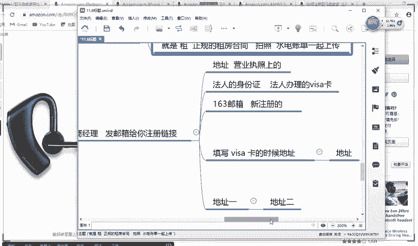

例方好，比如还讲这个啊，这个最近我听说老师讲有不少同学在问。好，比如说。

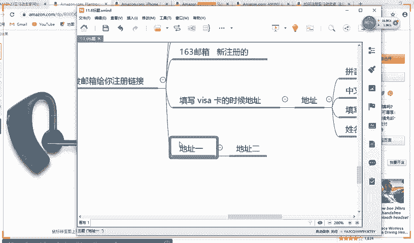

比如说有比如说哎好在哪里？好，比如说这个地方。

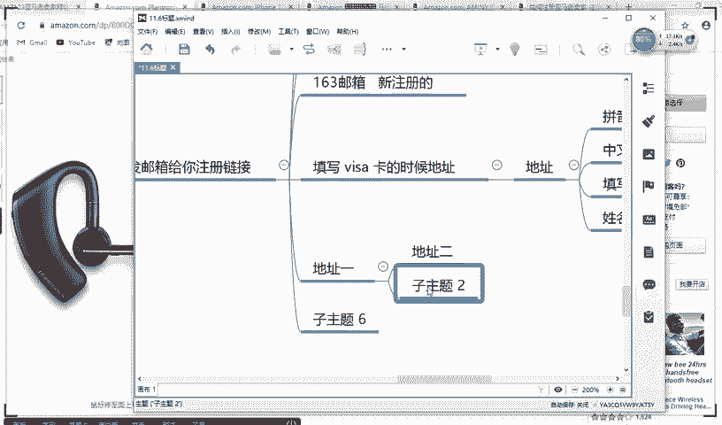

比如说你会有这个格式，比如说这样一天省。他会打个周，对不对？这个地方会写什么什么哪个县啦或者市。他会给你这个提示。

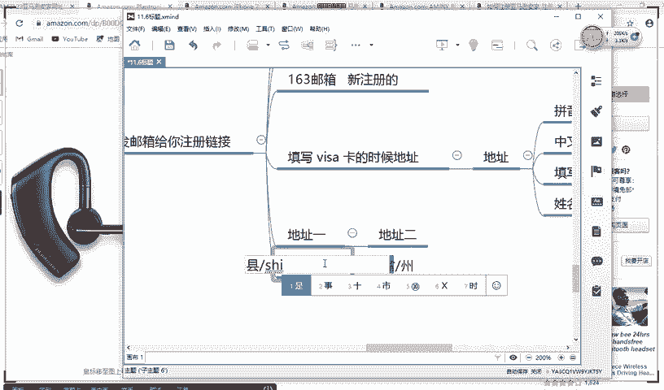

好，那这个时候该怎么写？我告诉大家，我给大家举例啊，我给大家举例，好吧，我随便编一个地址，假如说我编个地址啊，我就山东省。😡。

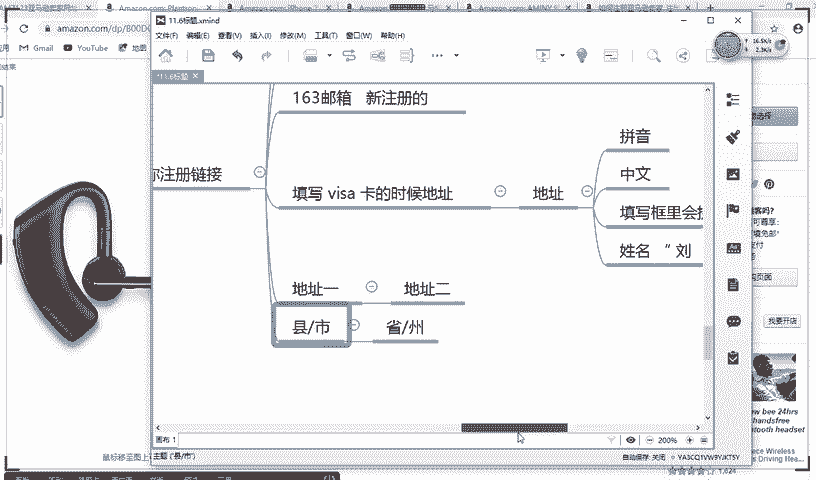

济南市。然后那个区嘞。哪个区我就写，比如说是呃，比如说我随便编个区啊。比如江浙区。然后什么什么荷花小园，好吧，荷花小区。

小区，然后一栋。1089室好吧，假设我就修写这个地址，给大家演示该怎么写。仔细听啊，你不要搞错了。

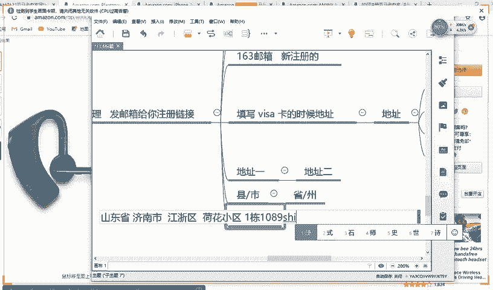

好，比如说哪个省，那这个时候你又写拼音，知道我意思吗？拼音，比如说叫山东。诶。山东。省好评音对，写错了。山东省好，然后这个是这个写济南市写拼音啊。好，这个地址一你就写哪个区就行了。地址一写哪个区知道吗？

你这个时候你不就知道地址二该写什么了吗？😡，江浙区。地址二写什么？写比如说一栋一栋。

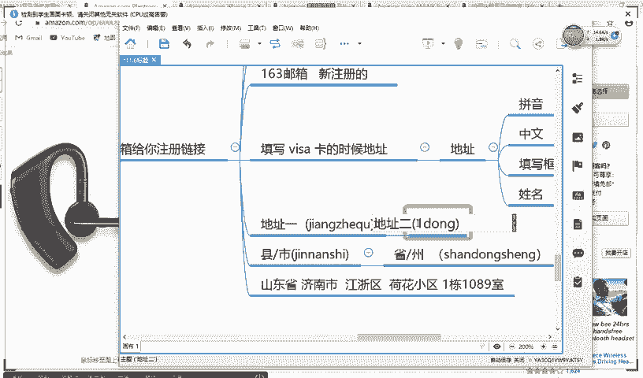

1089室。

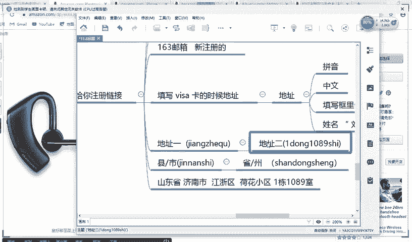

懂我意思吗？你就这样写就可以了。😡，知道吗？如果你是个人的，比如说老师我的身份证上，你身份证上写什么，你就这个地方就写什么，知道吧？这样的话，你四个地方不都有地方写了吗？😡。

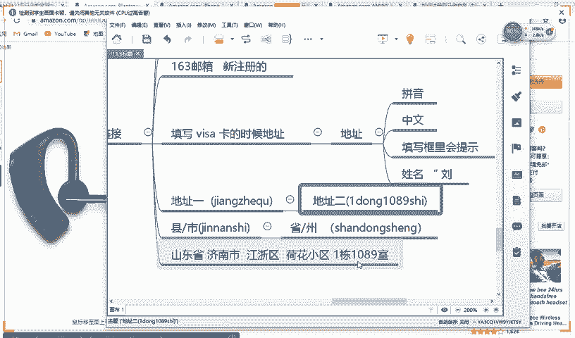

都有地方写了，知道吗？如果你是企业的那这个地方你就写你企业的一个地址啊。😡。

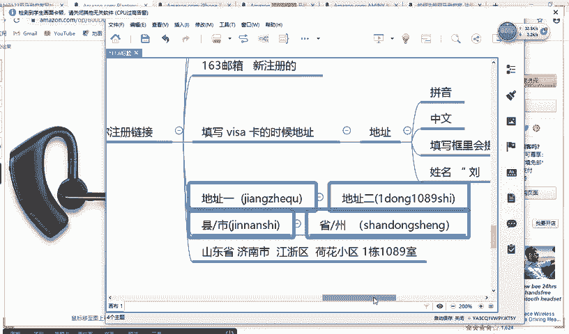

协议营业执照上一个地址。你懂我意思吗？

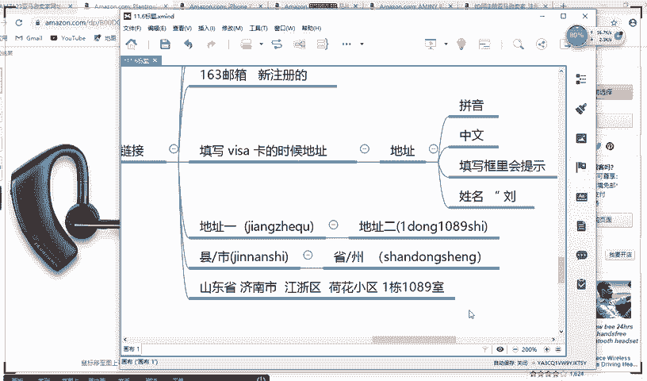

好。好，还有什么问题？😡，呃水电费要几个月的呃，3个月。三个月一般就行，一般是一张纸吗？你你如果你用的话，基本上一张纸就盖满了吗？😡，你还有些同学问，他说老师，那我如果在水电费，我用支付宝交的水电费。

那我是支付宝账单截图行不行呢？我不行，你最好是去那个水电费账单里面去打印。😡，问我是什么类目，我跟他说将以后可以卖别的产品吗？可以的，因为它只是审核用的，你以后卖其他产品也是可以。

但是只不要卖亚马逊违规的产品。企业需要备案吗？不需要，你只要注册好就可以了。水和电都要打印吗？我建议你水和电都要打印。呃，你注册美国站就是。个人店铺和企业店铺都是需要39。99美元。如果是美国站。

如果是欧洲站的话，他一般是需要2420多英镑吗？还是30多英镑，反正折合人民币也也是一样的，价格，也是200多块钱嘛。对你去哪打印就去哪打印。

没你把这些细节都告诉你了。😡，好，所以说你你。😡。

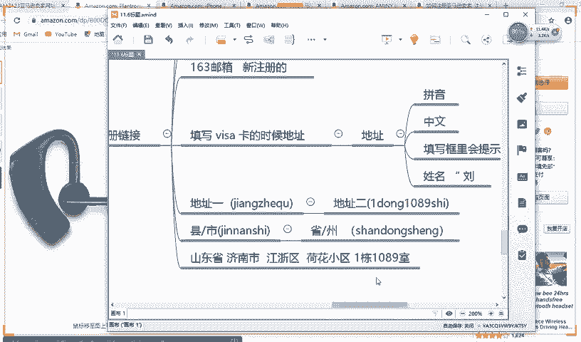

我给大家讲，就是你你们比如说啊你们做做事的时候啊，一定要细心。

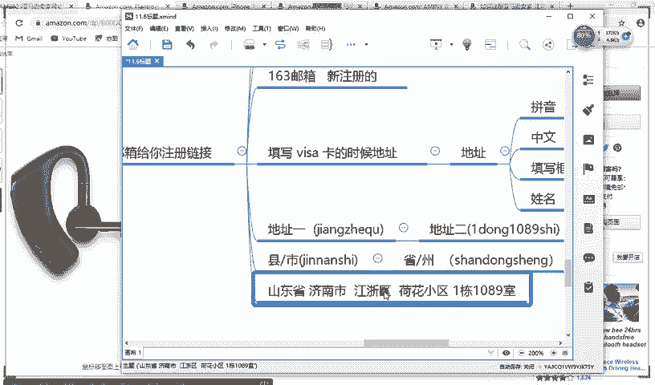

比如说当你注册审核的时候，你一定要问自己，我准没准备好。比如说啊当他还还有一个事情啊，比如说你注册店铺之前。😡，开始正式注册啊。你定要把那个第三方收款。收款账号注册好。这个注册好，然后注册好之后。

因为你注册的时候需要填那个9位数的银行码吗？在这个第三方收款账号里面有。

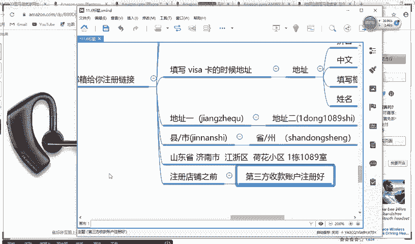

能理解吗？好，那还有一个还有一个就是你的一个产品的一个。好，还有一个呢，就是你这个产品的一个，比如说这个产品好，第三方收付款账号。比如说比如说那这个时候会有人问他说老师那个类目啊，我应该选择什么类目。

类目的话，你选择其中一个类目就可以。后面它只是审核用。还有比如说那个销售额，销售额你一般选择比如说100到500万之间就可以了。因为它只是一个审核的一个标准。

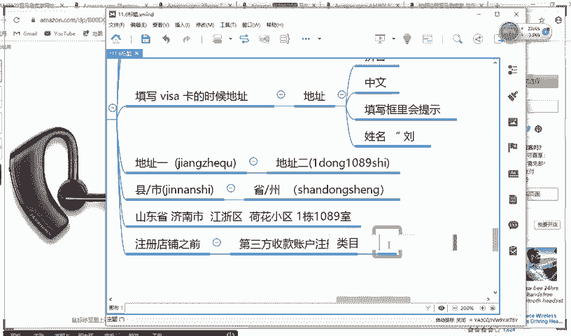

🎼你随便选择一个就行，能理解吗？