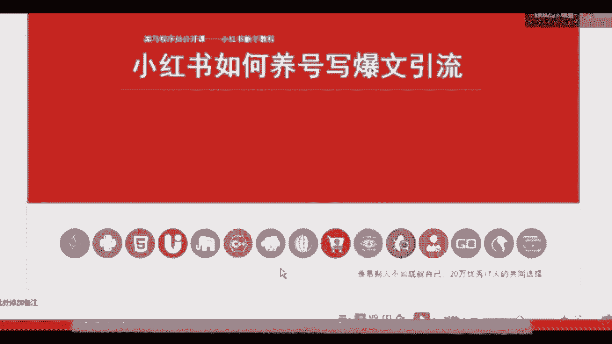

# （2024新版）强推！零基础保姆级自学小红书运营教程（方法+实操），小红书开店必学全套运营逻辑和流程，小红书起号／小红书开店／小红书运营 - P11：1.变现思路-小白入局新媒体 靠自己实现创作变现的基本盘思路 - 红书含苞待放 - BV1jAxWeJEE6

好今天呢咱们就来讲一下这个小红书如何养号，写报文引流的这个课程啊，刚刚给大家讲了，新媒体现在主要功能，新媒体行业目前来讲呢市场饱和度还不够哦，到时候会发出来，对新媒体这个行业目前的市场饱和度还不够。

可能市场现在需要1200万以上的，这个从业人员，但是真正能够进入到新媒体行业，从业的只有650万人，所以说新媒体行业目前还有很大的缺口，那么在整个新媒体的板块当中，小红书也占了一个很重要的一个位置。

所以今天咱们就讲一下如何去运营小红书好。

我们来看一下今天的课程内容主要有五个板块，咱们今天的课程内容主要有五个板块，第一个呢是账号定位，账号定位是什么意思呢，就是像咱们打游戏之前，我们把所有的这个新媒体运营过程中的，这种软件都当做游戏一样。

那么在咱们打游戏之前，就首先要给自己一个角色，选择角色就是选择定位，然后呢第二个板块呢是推荐流程加机制，推荐流程跟机制是什么意思呢，就是平台的一个规则，我们只有了解了规则以后。

才能在这个规则体体制下玩得更好，那么三四就是咱们今天的核心内容，就是如何去玩小红书，如何把这个东西能玩得更出彩，最后一个我要简单的给大家讲一下，为什么要讲引流啊，咱们在营销当中呢。

会给大家讲到一个营销的本质，营销的本质是与用户建立链接，那么我们通过账户，通过小红书账户与我的粉丝建立的链接，相对来讲是一种弱关系，咱们通过弱关系的话，对于粉丝的影响力，或者对于你的用户群体。

他的影响力是有限的，那么现在相对来讲影响力更深入的，或者关系更强一点的就是微信，所以很多的企业或者品牌，包括大家去淘宝，天猫京京东去买东西的时候，企业都会要求啊员工去添加到消费者的微信。

因为可以对消费者进行强关系的影响，促使他产生下一次的购买行为，所以第五个，如果是做企业账户的小小伙伴。

