# （2024新版）强推！零基础保姆级自学小红书运营教程（方法+实操），小红书开店必学全套运营逻辑和流程，小红书起号／小红书开店／小红书运营 - P14：4.小红书的养号策略 - 红书含苞待放 - BV1jAxWeJEE6

了解了小红书的基础玩法以后，那么我们就要进行最最关键的，两个板块的学习了，第一个板块小红书的养号策略，如果我现在要做一个新号，我怎么养号呢。

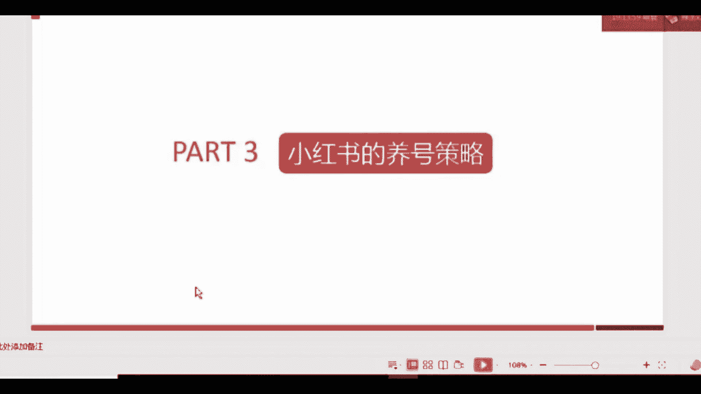

我们来看一下，我们的养号策略呢分为三个大的步骤，其中第一个叫完善注册资料，这个相信大家都知道，如果你们平时做一些别的平台运营，别的平台，或者说你在微信上或者抖音上，你有过一一点运营经验的话。

就能了解到每一个平台，它对于资料就这个账户主体，他的资料是否完善是有考核的，如果你的资料越完善，他就觉得你这个账户主体啊，这个相对来讲留存度留存率会更高一点，那他就会给你更多的这种推荐量。

第二个是什么呢，叫定时定向的浏览，什么意思呢，就是我们要在啊固定的时间。

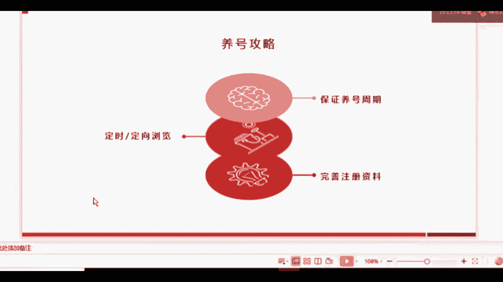

定向的去找一些信息。

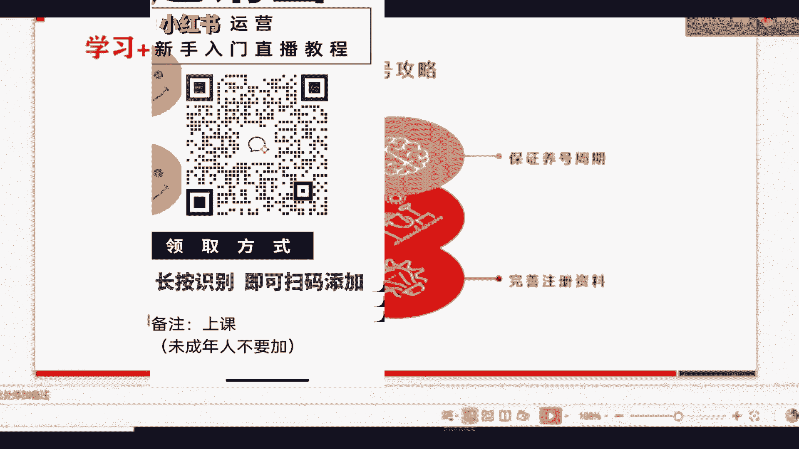

咱们一会会讲到第三个是什么呢，叫保证养号周期。

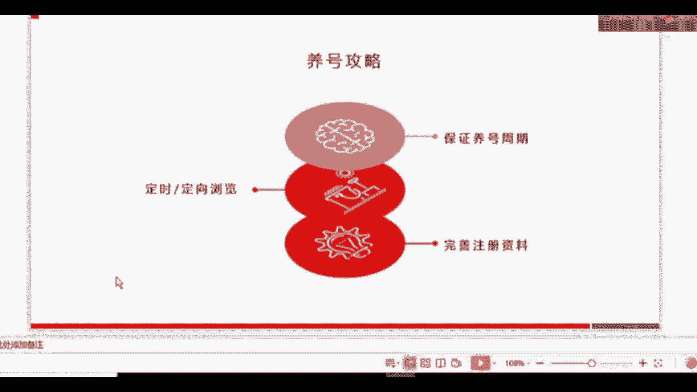

这三个关键步骤大家要记住，首先我们来看第一个啊，注册信息都有哪些呢，这些小红书号昵称签名，头像啊，常驻地等等，这些都有啊，这大家点到自己的小红书设置上，就能看到你要填哪些信息。

那么我要跟大家强调最关键的一点是什么呢，咱们的小红书号跟微信号是一模一样的，只能修改一次，只能修改一次，这个要记住哦，小红书号很关键的原因是，你可以把你的小红书号放在，你要推广的一些素材当中。

比如说你要做一张海报去推广你的小红书账号，那小红书账号就很关键，咱们只能修改一次，所以改之前一定要慎重的考虑，能理解吗，那么完善注册信息有什么用处，刚刚我已经讲了，对于平台来说。

它会根据这个去判断你是不是做的还不错，如果你完善了以后，平台就会觉得啊这个账户做得还行啊，资料也填得很完整，那么它留存下来，就他在这个账户上进行，后续的一系列动作的可能性就会很大。

好那就给他更多的一些流量，就会给你分配更多的一些流量，对平台来说是这个样子，那么对于用户来讲呢，如果说你现在发了一篇比较好的文章，吸引来了很多用户，那这些用户点进去一看，发现你只有一个头像。

其他东西都没填，他可能就觉得这个是不是到别人的文章呀，就会对你的专业性产生质疑，那么我们完善这个资料，也是为了给用户展示你的相关信息，完善你的人设，展现你的专业度。

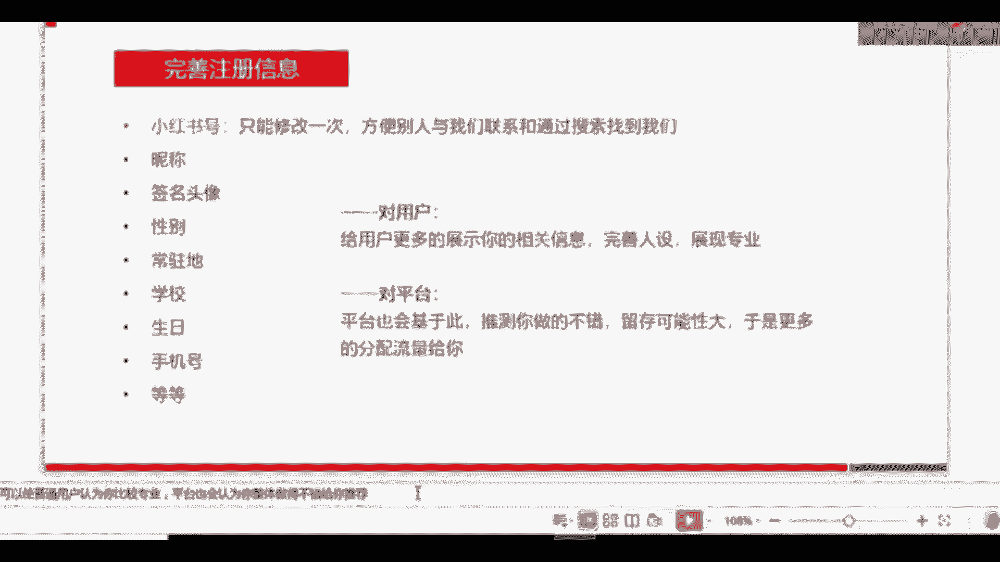

好第二个咱们刚才说过了，定时定向浏览，我入驻了小红书以后好，我先把资料填完了，然后怎么办呢，然后开始发文章吗，不千万不要，千万不要完善了资料后就开始发文章，因为这个时候的权重还比较低。

这个是大家能学过别的运营，应该知道，或者说你单单纯单纯的，从这个平台的后台人员想，如果我刚注册了一个账号，就开始发文章，那后台账户对你的，这这个账号还不了解的情况下，他不知道你的账号目前是什么情况。

他可能就分配比较少的流量给你，所以大家千万不要一上来刚注册就开始发，小红书，能理解吗，第二步咱们要进行的就是定时定向的浏览，什么意思呢，不管是你要做个人号，因为个人号现在也能变现，不管是你要做个人号。

还是要帮企业去养号，企业养号是做什么，做营销嘛，这两种情况下你都需要像正常的用户一样。

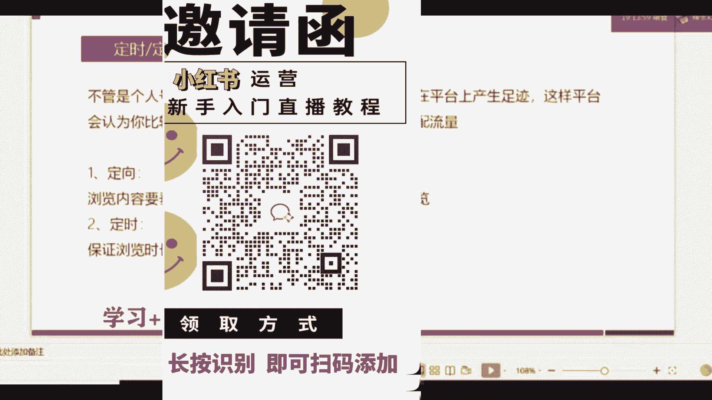

但是个人号就不用说了，我们本来就是正常用户，如果是企业养号，一次要做几十个账号的情况下，怎么办呢，一定要像正常的用户一样在平台上产生足迹，就是你一定要向正常用户去刷一下小红书，每一个账号都要刷一下。

这样平台才会认为你的那个账号比较活跃，然后就判断你的这个账号应该是真实的用户，就会给你正常的分配流量，如果说你什么都不做的情况下，就去发小红书平台任务，就会有可能认为你的账号是啊这个刷号啊。

这个大规模的这种注册啊，这种假号，那他就不会给你正常分配流量了，那么你的曝光量就会低，那咱们刚才说的定向和定时是什么意思，定向就是你的浏览内容一定要垂直，比如说你是做护肤的，你想做一个护肤类的账号。

你想告诉别人怎么去护肤，那么你去浏览的内容就一定要是跟护肤相关的，你可以搜跟护肤相关的一些关键词，然后去在他的这个信息流界面，每一个都点进去看一下，定时是什么意思呢，就是一定要保证浏览时长。

你不能看5分钟你就跳出来了啊，后台也是会记录到你的用户行为的，所以我们一般推荐的是一到两个小时，上午跟下午都需要都需要去浏览，能理解吗，去保证用户的活跃度。

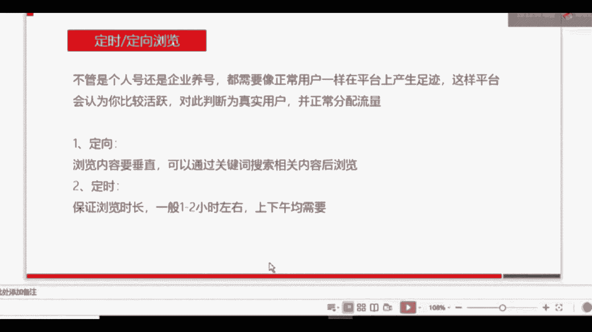

做完了第二步以后呢，我们接下来就要做第三步，什么意思呢，保证养号周期，我们可能在刚注册以后的5~7天之内，都不会有啊这个发图文，发笔记的这个行为，但我们在这5~7天就一定要一直啊去浏览，去养号。

去做前面的一些动作，我们的养号周期一般是5~7天，如果是企业，我再说一下，如果是企业，如果你想养多个账号，就是即便是个人，你想养多个账号的话，你也可以让你的员工，或者你自己每一天在保证浏览时长的基础上。

积极的跟其他用户互动互动，就是咱们前面刚说的冷启动阶段那三个行为，点赞评论和收藏，当然分享转发也可以，你可以让啊，我们一般情况下就是让你的这个账号的内容，发到微博或者是微信上，也可以有这些行为。

为什么要积极的跟其他用户互动呢，这里我要说一下评论这个互动评论啊，大家注册了小红书，应该会看到，你随便点进去一个笔记，他的中间有一个评论，那么评论为什么重要呢，因为如果你在比较热门的文章下评论的话。

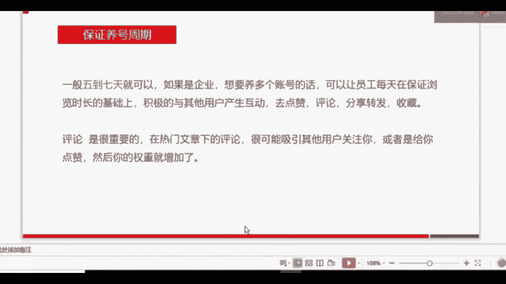

就很有可能会吸引到其他用户关注，你如果你对当前。

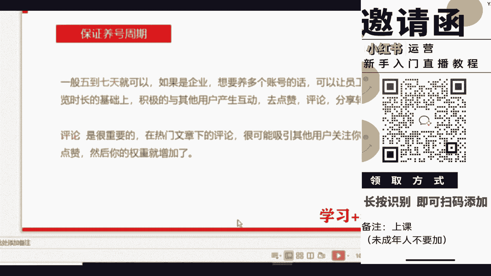

比如他分享一篇关于美白的文章好，你在他分享的一些产品可能相对比较有限，那么你在底下回复一下，关于你对美美白的一些简单理解，或者说你用过比较好用的一些美白的产品，那么这个时候其他用户觉得诶你也比较专业。

那他有可能会给你点赞，或者是点到你的主页以后去看去看你的账号，或者先关注你，跟你产生一些互动和行为，能理解吗，所以评论是很重要的，特别重要，通过评论以后，用户跟你产生了一些互动行为以后。

你的权重就会自然而然地增加了。

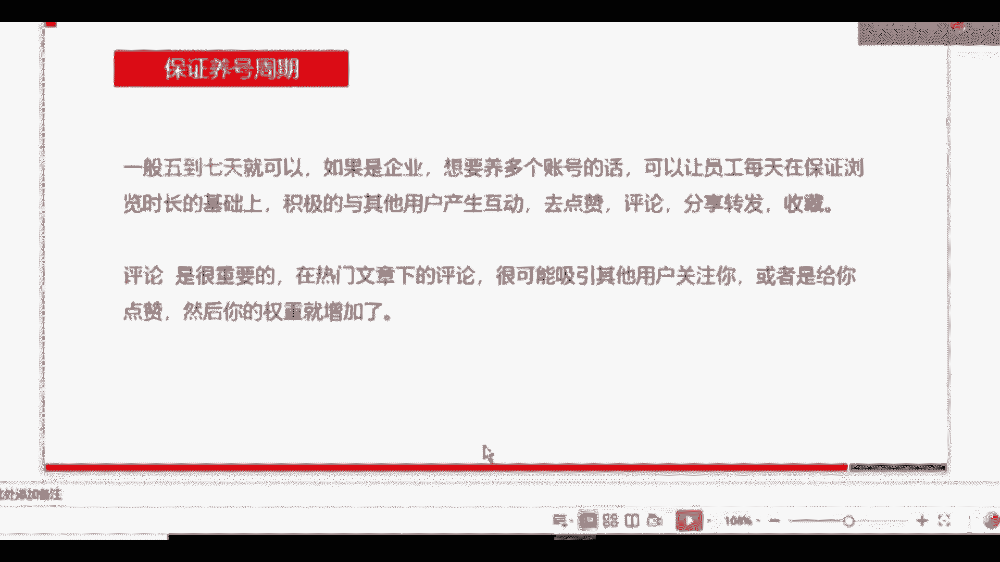

刚才咱们已经讲到了啊，关于这个养号策略的三个大的步骤。

我们再回顾一下，第一个就是要完善注册资料，刚注册的时候一定要填写完整注册资料，第二个定时定向的去浏览其他用户的信息，定时呢我们一般推荐是上午，定向是什么意思，如果你要做护肤。

那你就搜关键词跟护肤有关的关键词，定向的去浏览一些别人写的护肤的一些文章，那么系统就会给你分配跟护肤有关的一些流量，那么对于你后续发表图文，发表笔记有一个很好的一个作用，第三个呢是保证养号周期。

咱们不要一注册账号就开始发，因为这个时候你的权重比较低，流量分配比较少，数据量不是很好，系统没有办法判断，一个账号到底是真的还是假的，所以我们一定要保证养号周期。

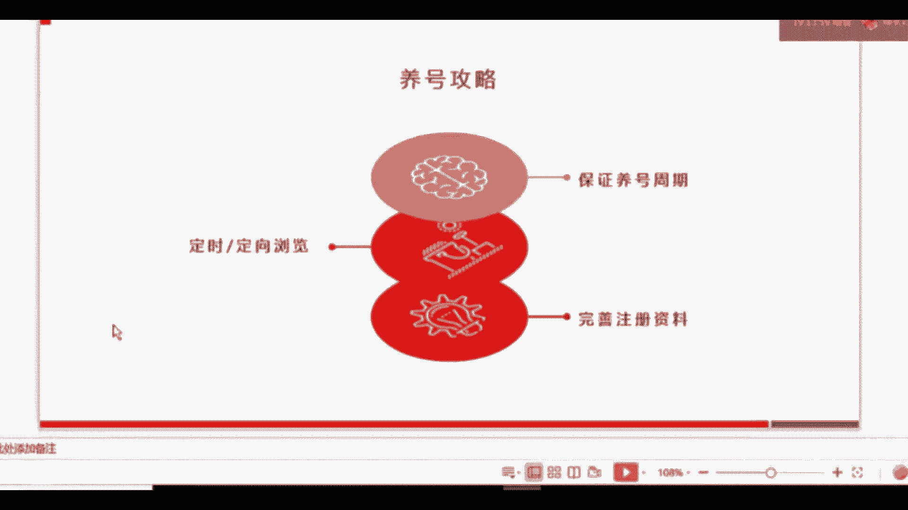

一般情况下5~7天就可以了，在这个养号周期当中，一定要积极的去跟别的用户产生互动行为，不仅仅是帮你吸粉或者帮你去啊，引导一些用户来关注你，同时是为了增加你的权重。

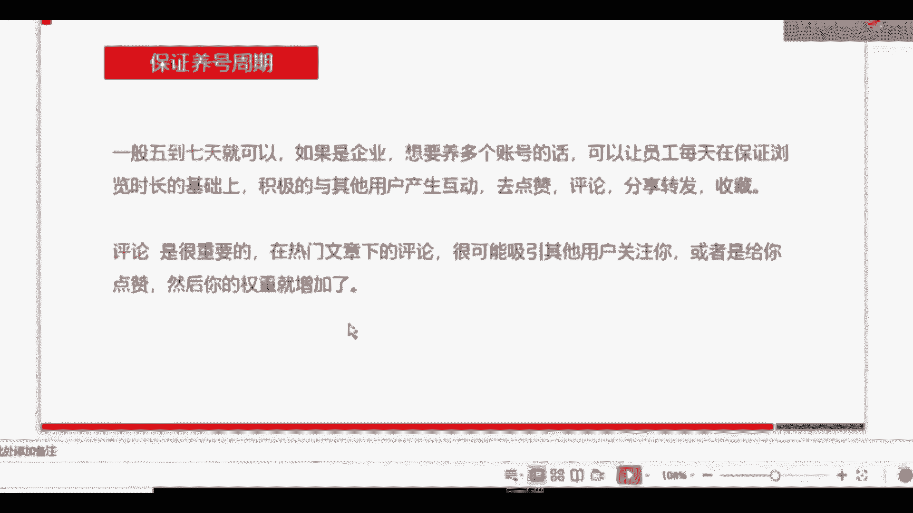