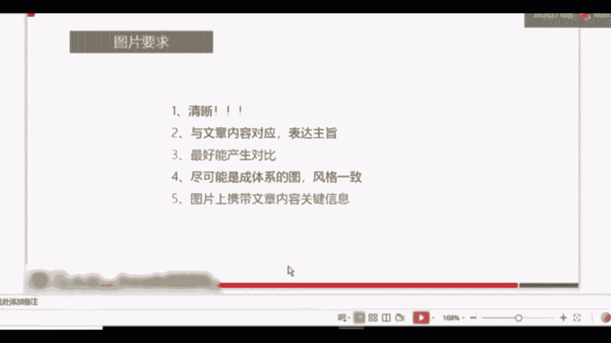
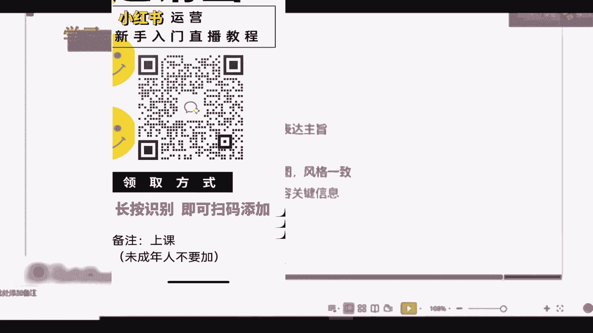
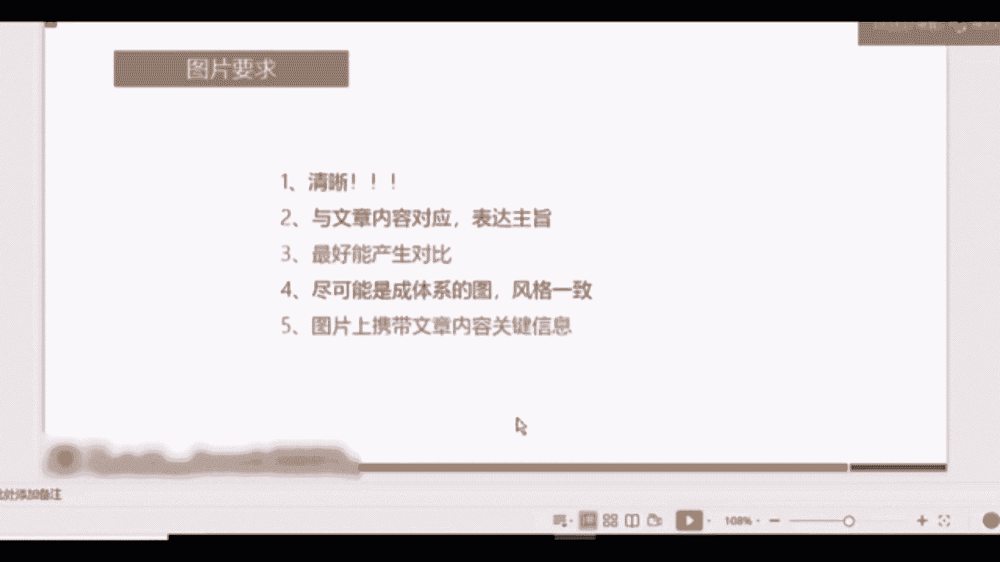
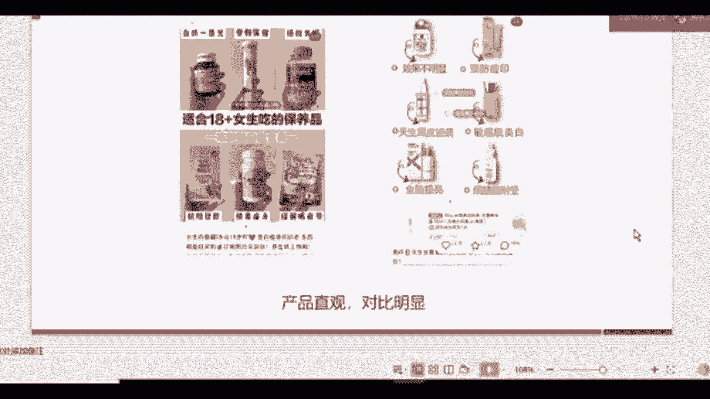
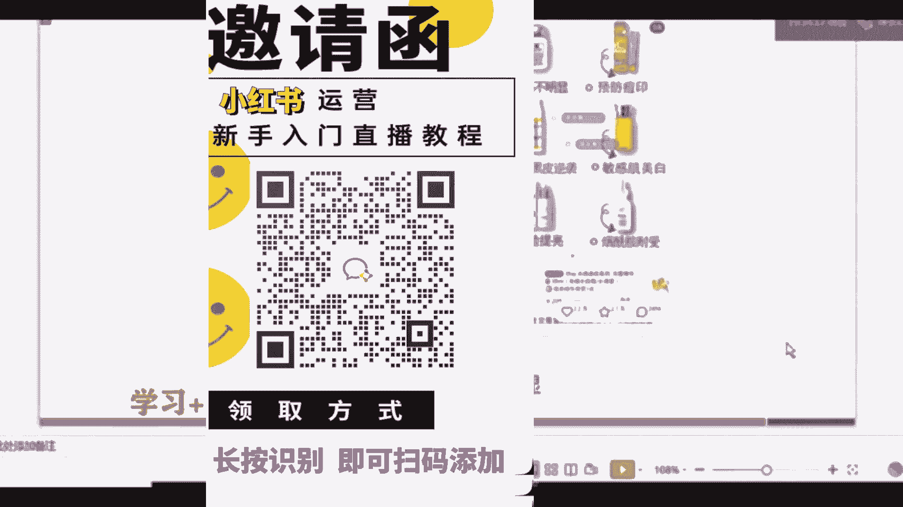
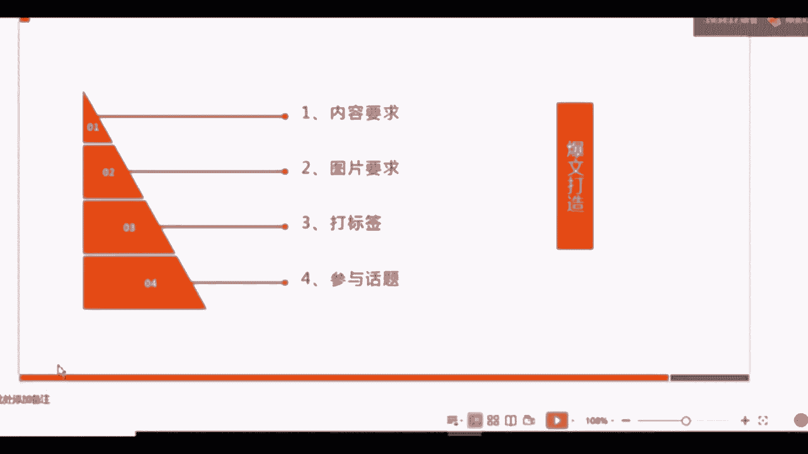
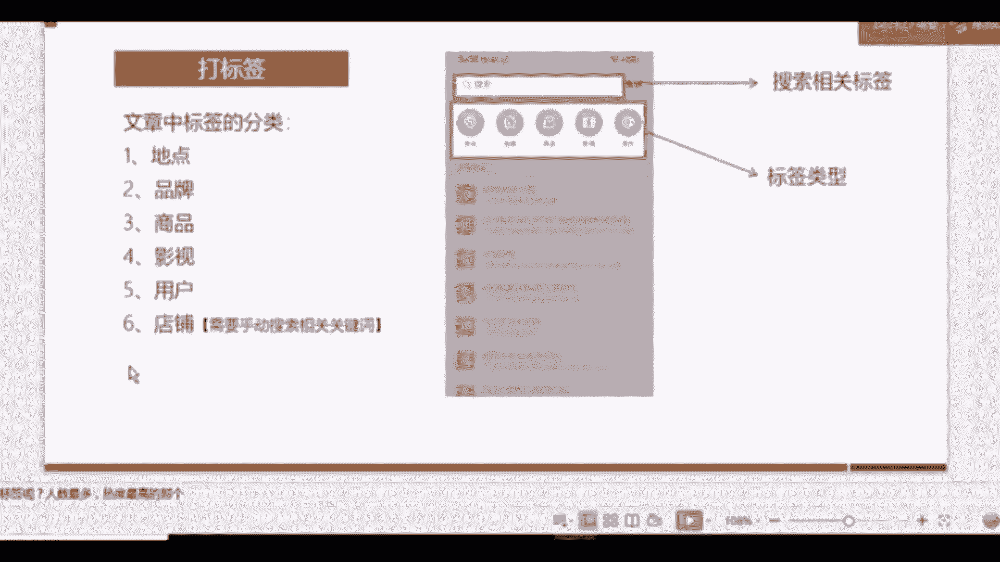
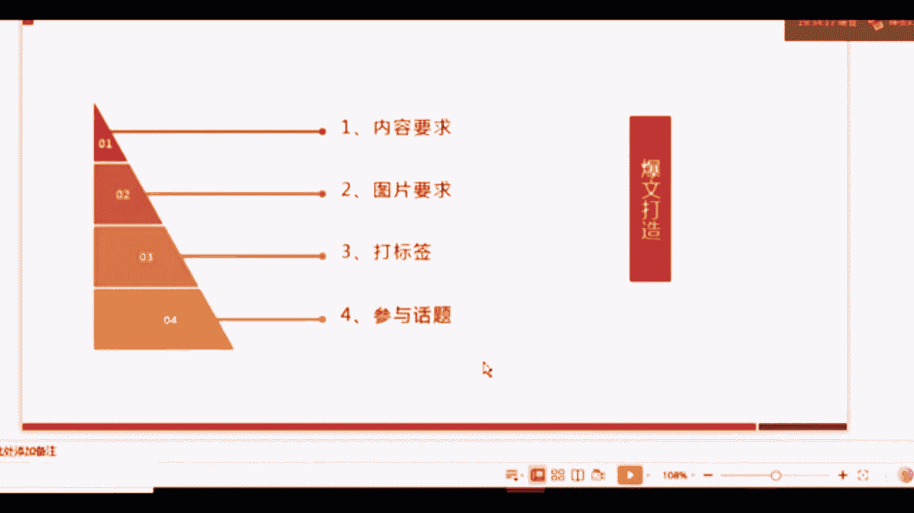
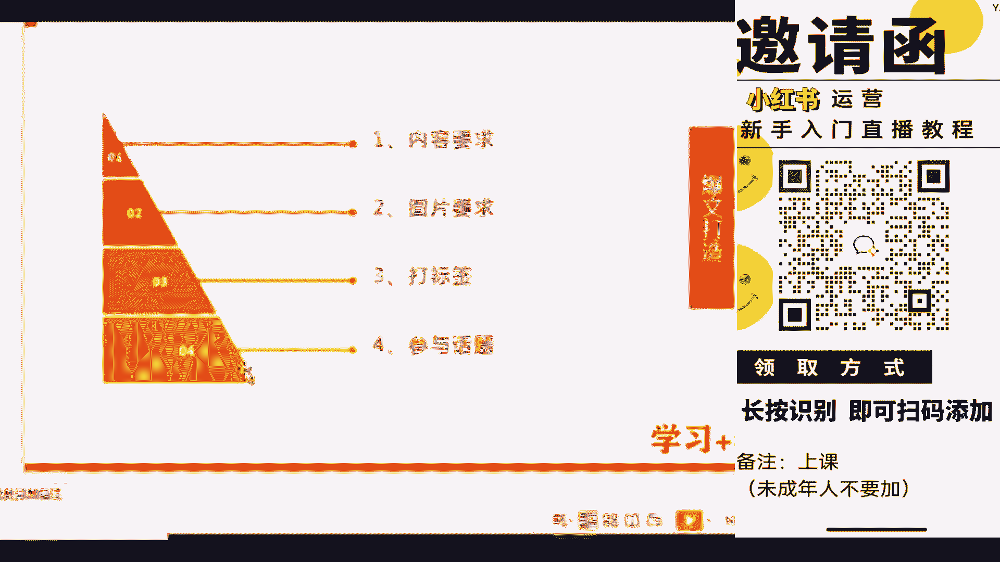
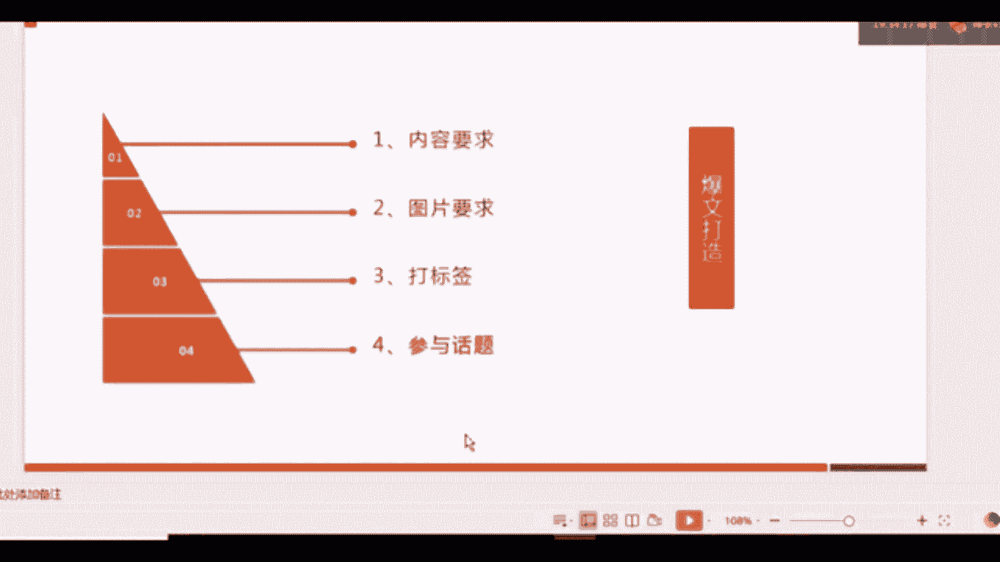

# （2024新版）强推！零基础保姆级自学小红书运营教程（方法+实操），小红书开店必学全套运营逻辑和流程，小红书起号／小红书开店／小红书运营 - P16：6.小红书爆款图片及其他要求 - 红书含苞待放 - BV1jAxWeJEE6

好第二个呢就是关于图片的要求，咱们刚才讲的那些都是关于内容的要求。

那么知道了关于内容的要求以后呢，我们接下来就要看图片啊，图片的要求主要有五点，第一个一定要清晰，一定要清晰，如果是你自己拍，找像素高一点的相机，手机或者相机都可以，如果是你在网上找的话。

不要找那种已经有这种马赛克，或者有糊掉的部分的图片，一定要清晰，第二个呢是要与文章的内容所对应，表达好他的主旨与文章内容对应，因为如果你上面讲的是面膜啊，上面图片放的是面膜，底下你写的是关于美白的产品。

图文不对的话，这是最基础最基础的错误，一定不能犯，第三个是最好产生对比，这个咱们后边会有例子，因为它很关键，也是现在做小红书的账号上啊，这些用户他用的比较多的一个办法，第四个是什么呢。

就尽量是成体系的图。

风格要一致，这个也很简单，字面意思大家理解一下就可以。

第五个呢是图片上携带的文章内容，关键信息要体现出关键信息，三跟五相对来讲，是现在大家做小红书的时候用的最多的办法，接下来我们要看一下例子啊，124都是比较简单的，大家字面理解一下就可以了。

首先是三，这个就是一个对比图啊，在夏天到来的时候，很多的女生对于美白都有强烈的需求，那么这个时候，很多的关于美白产品的一些文章就会出，应运而生，那么做的比较好的类型呢，他们都有一个特点，就是什么。

就是把对比图放在了第一张图，也就是能展示出来的那个图上，大家可以看一下上面的，这个上面呢是大一上半年，下面是大一下半年，然后3月份4月份跟现在为什么要放对比图呢。

我们在营销当中讲了一个很关键的营销方式是，什么叫描绘愿景，描绘愿景什么意思，告诉用户，你用了我的产品以后能怎么样，大家可以看宜家的画册啊，宜家出的一些画册，上面不仅仅是放了宜家的产品。

而是放了像比如说小孩子在沙发上躺着在看书，然后呃这个其他的家人在一一块玩耍，在烘培，其乐融融，他会把他的产品融入到一个场景当中，那么就会给用户产生一种什么样的心理反应呢，就是你买了我的产品以后。

你就有可能会产生这样的场景，这就是帮助用户在描绘愿景，那么对比图它就是一种利用了这样一种特点，他首先描述了用户的痛点，就是我想要美白嘛，我有美白的需求，其次呢他帮用户已经造出了一种愿景。

你用了我推荐的产品，或者你看了我的文章，你就可以达到这样美白的一种效果，那么用户点进去的概率就会增大。

这是第一种办法，然后接下来咱们刚才讲了，就是你的图片上要携带关键信息，这种情况是针对于什么呢，测评类会用的很多，为什么，因为咱们整个小红书的文章只能放1000个字，那么1000个字，如果你要测评。

比如说八款九款，像第一个啊，他可能要测十几款产品的话，怎么办，那么1000字是肯定不够你用的，这个时候对于用户来讲，你把图片，把所有你拍到的产品图放在同一张图上，标注好这个产品，它的特点对于用户来讲。

第一认知很简单，他的认知成本比较低，产品很直观，我知道我想买哪个，我针对于它的特点。

我就知道我想买哪个，可以买哪个，对比很明显，那么对于用户来讲，他看你的这篇文章的可能性就会增大。

你的曝光量就会增大，好刚才讲了关于图片的五点，关于文章的几点，那么接下来咱们讲关于元素，刚刚讲关于版式的两个内容和图片，接下来咱们讲关于元素，元素呢，小红书上目前两只有两个元素，第一个是标签。

第二个是话题。

那么标签我们先来看一下标签，刚才大家看到了我的那个图片上，就会有一堆很多的标签，有看到吧，关于图片上也有很多的标签，那么图片上现在能够打的标签有这么八大类，大家可以看一下啊，有这么八大类。

首先呢前五类是直接展示在标签页上的，就是你点一下图片，我们上传好图片后，直接点一下图片就可以看到标签就可以看到啊，这个我现在截图的这个页面，其中前五个是直接在标签页上的，如果你想放店铺信息。

也就是你的产品现在已经入驻到小红书上了，这是针对于企业来讲啊，如果你想放产品信息，同时店铺已经入驻到小红书了，那么你可以直接在搜索框去搜索，你们的品牌名称，它就会出现你们的店铺。

你就可以把店铺信息加入到标签当中，第七个是语音标签，在这个位置啊，大家长按可以录制15秒的语音标签，但是相对来讲，这是小红书，目前啊用户反馈比较鸡肋的一个项目，比较鸡肋的一个功能啊，但大家也可以采用。

如果你只是可以传达你的声音，第八类呢是自己创建的标签，在搜索框当中，比如说我想搜索啊关于情人节的一些标签，可能他没有，比如说啊我爱某个品牌，你搜了这个名称以后，他没有这个标签怎么办，底下有一个添加符号。

可以添加这个标签，可以自己创建我爱某个品牌，这就是关于标签，那么我们搜到标签以后怎么选择呢，只有一个就是选择热度最高的，或者跟你的话题相关性最高的，刚刚我选择的是啊如何美白，在文章当中打标签。

标签还有一类啊，刚刚是在这个图片上打标签，那么标签还有一类是在文章当中打标签，那么文章当中打标签呢，它没有七和八，就没有语音标签，也不能自己去创建标签，只能够根据现有的一些标签去添加好。

关于打标签呢。

咱们就讲到这里，其实打标签很简单，你们真正进入到小红书操作的时候，你就会发现打标签就是选择的过程，选择别人已经写好的一些标签信息。

添加到你的图片或者文章当中就可以了，那么最后一个很关键的就是话题，就是话题。

我们来看一下，这是我之前出的另外一篇文章，另外一篇文章，它的最后一个末尾的地方有一个篮字，这个就叫话题，那么话题怎么添加呢，一篇文章只能够添加一个话题，一篇文章只能够添加一个话题，话题怎么添加呢。

我们再把我们的内容书写完整以后呢，在内容的下方有一个话题的选项，我们点进去以后就可以出现这样一个界面，然后你就可以去搜索你想要添加的话题，比如说我这篇是关于美白的产品评测，产品推荐。

那么我在底下就添加了怎样美白这样一个话题，在美白的这个话题里，怎样美白是排行最高的一个话题，我把它添加进去以后，用户通过搜索怎样美白，他就可以看到，他就可以看到啊，我的这篇文章。

所以话题呢是一个很关键的因素，大家如果写文章，一定要把标签和话题添加进去，因为很关键，好我们总结一下，除了版式和元素的技巧以外，就是刚刚咱们讲关于版式，就是内容和图片元素，标签和话题。

除了这两个板块的技巧以外呢，一定要记住定时更新，保持活跃，多去浏览，多去刷别人的文章，而且保持自己定期的更新，这样才能增加你账号的权重，才能让系统给你分配更多的流量，这个在其他平台也是适用的。

