# （2024新版）强推！零基础保姆级自学小红书运营教程（方法+实操），小红书开店必学全套运营逻辑和流程，小红书起号／小红书开店／小红书运营 - P71：71、整体运营思维 快速掌握爆款逻辑 - 红书运营 - BV1Pi421v7aJ

哈喽哈喽哈喽嗯呃测下麦啊，这边所有的在直播间的小伙伴们，能够清楚的听到我的声音的话啊，能够看到我这边电脑桌面的话啊，声音各方面如果都没问题，公屏上呢来扣一个小一好不好，动作快啊，确认一下啊，都没问题吧。

能够听到声音的啊，能够看到桌面的，没问题的话，扣1OK啊，没问题就行啊，呃老规矩啊，正式的直播分享呢在两点钟开始啊，现在呢还有点时间，大家可以抓紧时间准备一下啊对吧，这个该上厕所，让他抓紧时间去上厕所。

对不对，然后呢把你们自己的这个什么花生瓜子，啤酒饮料什么的啊，准备好好不好，为什么呢，因为今天这一个内容的话，全程是干货啊，我不希望说等一会你们讲说哎，有什么别的事情要处理对吧，导致错过一些细节。

那后期的话可能整个的内容呢，就很难去很好的去执行，或者是很好的去吸收，好不好，O那么在正式的开播之前呢，还是老规矩啊，按照国际惯例呢，先把直播间的那些小规矩呢我先说一说对吧，免得我们直播的时候呢。

出现一些不必要的麻烦啊，那么呃首先呢第一个要求好不好，兄弟们，那在整个直播过程中的话，我希望大家能够积极互动，那在我分享到某一个知识点的时候，对不对，如果说你能够听明白，能够听懂的话啊。

记得扣一回复好不好，如果说听不明白，听不懂没关系，你也可以直接跟我讲，那确实很多小伙伴听不明白的话，没关系啊，我也会呃再一次跟大家进行讲解分享，那么尽量的让每个人呢都能够去有所吸收，好不好。

因为很多的地方呢，有很多的小伙伴呢会觉得好像听懂了，但是呢又没有明白对吧，又不好意思问啊，到最后呢发现一个点就是咳今天整个的直播呢，我感觉我好像什么都听到了，但是又好像没什么都没听到对吧，就这种感觉。

然后呢整个的时间就浪费掉了啊，这种情况我是觉得很浪费的啊，啊很没有意义的对吧，所以呢大家一定要积极互动啊，再一个呢就是我在直播过程中呢，呃习惯的是提问的方式来展开啊，那为什么这样说呢，因为很多时候啊。

你们的思维方式呢可能会比较跳脱一点对吧，会比较活跃一点，那么带着问题，然后跟着我的思路去思考的话，那么这样呢对你们的这个帮助，或者对你们的吸收跟理解呢也会更好一点，所以那么当我提问的时候呢。

大家可以认真的去思考一下这个问题，然后结合自己的实际情况，积极的回复好不好，这是第一个要求啊，然后呢还有第二个要求，那么第二个要求呢，其实跟我们第一个要求呢是相关的啊，那如果说你在整个直播过程中。

有什么地方不明白不清楚的，欢迎大家提问啊，是允许提问的，但是啊这个提问呢仅限当前内容，相关的问题，如果说是跟我们当前分享的内容，不相关的问题呢，你们可以等到我正式内容讲完之后单独提问啊。

如果说是时间不允许的情况之下呢，也可以等我下播之后单独提问，那为什么呢，因为有很多的小伙伴呢，可能本身会比较基础一点，好吧，呃我我先问一下吧，啊今天目前在直播间的小伙伴们，有没有就是零基础的。

还没有开店的，对于店铺操作没有完全没有任何概念的，有没有有的话，公屏上打一个零好不好啊，如果说你是这种情况呢，就是对整个的直播啊，对这个这个拼多多啊，那完全没有任何概念的对吧，纯新手的公民可以打个零。

OK啊有的对吧，那像这些小伙伴，如果说是我们在直播中对吧，嗯每个人去提一个问题呃，我来回答问题的话，那么对他们来说可能吸收起来会比较困难，所以我希望的是我们所有的内容呢，能够具有到一个非常好的连贯性。

那么能够让大家更好的吸收理解好不好，所以会有到这么低的要求，然后大学生在线求带是吧，哈哈哈咳咳可以的啊，这个开水养鱼啊，就你就你就凭你这个名字啊，我就觉得你是一个人才啊对吧，可以的啊，然后第三个要求啊。

我说一下啊，这是最重要的要求，如果说大家在整个的直播过程中对吧，今天听到了西周分享的内容，诶，感觉好像还不错对吧，那么刚好呢也是自己没有做到位的，那一定要去实操，好吧，一定要去实操，为什么这样说呢。

因为再好的方法，你不去做，他肯定是没有用的，等于零，是不是啊，所以你想要你店铺提升，你想要让你的运营能力提升，那么去实操是必不可少的，好不好，三个要求，各位呃能够配合的没问题的对吧，都觉得没毛病的。

公屏上呢可以扣个一吧，好不好啊，我来确认一次，那呃整个的直播内容呢，是今天围绕着我们整体运营思维，然后快速掌握我们这个爆款操作的一个逻辑，来展开的啊，整个的方法呢呃没有说特别的这个复杂吧。

啊我尽量的由浅入深的去分享啊，能够让大家更好吸收，那呃整个的这个方式呢，大家如果能够去掌握的话，那你的运营思维，你的这一个店铺的操作的一个啊，整体的思维一定会有到有很大提升的，其实在座的有很多的小伙伴。

哪怕是已经开店的啊，可能在店铺运营思维方面呢，是没有一个完整的一个操作逻辑的，只是在凭感觉或者是主观意识去操作啊，那这种情况肯定是不对的，理解吧，因为做电商的话，它毕竟是一门生意啊。

那我们如果说没有一个整体的这个，思维框架的话，你去操作走一步看一步，那么很多时候呢你会陷入被动，对不对啊，还有5分钟时间啊，开始正式的分享，那么呃有多少小伙伴是已经开店的，目前呢店铺啊。

一天的订单呢是有50单以上的啊，公屏上可以打一个六，好不好，50单以下的这种的可以打一个一啊，我来确认一下大家的一个情况来动作快啊，那根据你们的一个情况呢，等一会呢也会呃。

涉及到我们分享内容的一个申请啊，那我希望的是真正意义上，能够具有到更好的内容给到大家，能够让大家更好的去吸收，而且能够帮助大家店铺提升啊，OK咳目前给到我这边反馈的呢，都是50单以下的，对不对啊。

可以的，那大概情况我了解到的，那么对于店铺操作来讲的话，其实单量的提升呢并不是那么的难啊，很多时候可能你们店铺操作上面会有一些短板，那么今天的话我希望能够去帮大家把处理清楚，还没有开店，是不是没关系啊。

没有开店的小伙伴也不用担心啊，那么没有开店的话，今天这个内容呢也是非常适合大家的啊，那不管你是已经开店的还是没有开店的，那同样的这个方法呢都是适用的对吧，毕竟它是一个整体的操作方法啊。

跟这个思维的一个提升，那么可以看到，像这边很多小伙伴跟着我一起实操的店铺，对不对，像这种啊，那么访客呢已经差不多1万左右的一个店铺，也跟着实操在做的对吧，做到访客将近4万了，3万7，对不对。

那像这种呢也有这种纯新手店铺的啊，看到没有来从纯新店开始，这个实测也有的，所以说不管你是有基础还是没有基础，你是这个没有开店还是已经开店的，那今天这一个内容呢，也都能够帮助大家。

更好的去梳理你的这个运营思维，提升你的一个运营操作水平好不好，OK呃还有这个两分多钟时间啊，那么应该差不多都来了吧，今天应该差不多都来了吧，来啊我这边再确认一次吧，所有的小伙伴已经准备好的。

公屏上呢六走一波好不好，动作快啊，我来确认一次啊，已经准备好的小伙伴公屏上六走一波啊，那如果都准备好，OK那我们就直接开始了，就不去再浪费时间了，因为我这个人呢比较追求效率哈，效率至上啊，做事情嘛。

我们做这个电商也好，做别的事情也好，都是要有效率的，对不对，OK啊，那行啊，直接开始了好不好，那在整个店铺操作过程中，我刚刚也提到过，反复提到过对吧，我们的这个整体运营思维呢是非常非常重要啊。

这个RK啊刚刚问了一个问题，那这样子吧，刚好时间还没到啊，刚好时间还没到啊，啊我我先把这个问题解决掉吧，好不好，这个阿K说这个层级啊有用吗，有朋友说让他去操作层级对吧，好兄弟们，各位来。

有没有人能够去回答这个答案的，觉得有用的扣一好不好，觉得没用的，扣二动作快咳成绩这个东西大家觉得有用吗，觉得有用的啊，扣一觉得没有用的，扣二，OK啊目前来说的话有扣一的，有扣二的啊，但是为数不多。

但是呃几个小伙伴是扣一的比较多一点啊，那我这边来点个名吧，我来确认一下好不好，哎这个志伟志伟你觉得是有用还是没用啊，志伟觉得有用的话，你扣个一觉得没用的话，扣个二好不好，店铺层级这个东西。

然后这个吧唧啊吧唧嘴的吧唧对吧，来你觉得有用吗，不懂啊，OK啊，这里说不懂啊，没关系啊，我不记呃，不清楚的小伙伴，不懂的小伙伴没关系，可以打一个问号啊，让我也知道你们的一个状态。

如果说确实很多小伙伴不清楚什么是层级的话，那我也给大家解释一下层级是什么，好不好，OK啊目前已经有好几个小伙伴说不懂了，那这样子啊，我直接说吧，好不好，呃，刚刚我们问到这个问题呢，叫做乘积有用吗，对吧。

兄弟们，这里我呢顺便说一嘴啊，层级这个东西听清楚了，有没有用，是看情况的，而什么东西是层级呢，来给大家解释一下啊，那平台它对我们的这个店铺啊是有考核的，这个大家都知道对不对，那你店铺的交易额。

啊会决定你店铺的层级，店铺的层级呢，其实就是我们店铺营业额的一个考核标准，你达到一定的交易额就可以升上升一个层级，那么我们可以理解为什么呢，哎我们在读书的时候，对不对，会有到这个考试。

考试呢会有这个分数对吧啊，或者说像现在呢考试也会给你打ABCD嘛，对不对，那你的分数越高，你的层级就越高，你的这个交易额越高，你的层级就越高，层级越高的店铺就是越优秀的店铺，各位这个没问题。

能够听懂的话，扣一好不好，刚刚说不知道成绩是什么的，扣个一啊，那么这个交易额呢，他考核的是过去30天的日均交易额咳，他考了这么东西，比如说我举个例子，我现在是一个纯新店啊，我的交易额是零对吧。

我现在还没有店铺层级，那我想要有层级的话，OK我第一层级是吧，第一层级，它的交易额呢就是零啊到1000日均好不好，假如说啊是0~1000日均，我现在是一个新店，我是一个零反客的店铺，我是个新店。

那么OK我现在就处于低层级，那如果说我想要去成为第二层级的话，我就需要我30天的日均交易额，达到1000以上啊，那么1000以上的话，就相当于我这30天的交易额的话，OK就要3万。

啊然后这个时候呢我就可以乘到啊，上升到第二层级好吧，是这么个东西，那我刚刚讲到说乘积呢它有没有用，是看情况啊，那到底看什么情况呢，其实道理很简单，兄弟们，我来说一下啊，那如果说现在我店铺是一个新店。

我店铺是一个零访客的店铺，你竞争对手同样的跟你一样，是一些零访客的店铺，是一些新店，对不对，那么平台呢它的考核它的一个竞争的环境，那么对我们来说它是一个相对公平的环境，各位能听懂吗。

能听懂这个点打一个一啊，如果说现在我是一个新店，对不对，那我的考核的竞争对手，跟我都是一样的一个店铺，那这个时候呢我去做层级，我把我的层级做高了，就比如说我把层级做到那个第三层级，或者第四层级，对不对。

哎，我的竞争对手呢变成了日均销交易额，三千五千的这样一个店铺，那我的竞争对手也发生改变了，虽然说我的层级上升了，但是我的竞争环境实际上是更恶劣了，那有人可能会说哎不对呀，我好像听说过层级越高，访客越多。

有没有人这样听说过这个这个这个这个说法的，有没有有的话，打一个二好不好，层级越高，访客越多，啊有没有听过这个说法来是要说的是吧，OK的啊，那么这个说法兄弟们你们是听到了没有错，但是这个说法是分情况的。

什么情况呢，如果说今天我们平台假如说啊有1000个访客啊，假如说啊兄弟们有1000个访客，那么第五层级的店铺，我们随便写一下啊，第四层级，第三层级，第二层级，第一层级啊，它分为五个层级啊。

假如说分为五个层级，那么第五层级的店铺呢，因为他的交易额多，所以他整个店铺呢肯定会有到这种爆款商品，它的排名会很靠前，是不是因为他交易额多呀，所以这个时候呢排名靠前，那么这1000个访客呢。

他进来平台之后呢，可能都能看到这个店铺，对不对，因为他靠前嘛，而这个时候呢，第五层级的店铺数量呢又是最少的，所以这个时候呢同样是店铺，人家第五层级的店铺呢，店铺少曝光多，所以能够拿到的访客也多，是不是。

那越往下呢，店铺数量越多，啊越往下越多对吧，然后呢同样的因为他们店铺的单品啊，营业额少啊，排名也会更更靠后，所以呢访客也就越少，他这么来的啊，他这么来的，但是有一个bug啊。

有一个bug他能够去拿到很高的销售额，能够拿到很好的排名，是因为商品数据好，是因为商品的权重高，能听懂吗，那并不代表说，我能够去做到一个很高的交易额的销量上去，就可以了，因为权重考核排名考核。

它不仅仅只是考核交易额，如果说只是考核交易额的话，那么有钱就是老大，那在资本市场上，我们这些小卡拉咪对吧啊，哎呀不管了啊，随便打一个打一个吧，啊小皮拉米去了啊，小卡拉米啊，小卡拉米啊。

那我们就根本就没法玩，是不是各位能懂吗，所以在这个时候呢，不是交易额越高，我们的访客就越多，不是说我的成绩越高，访客就越多，分情况它是综合考量的，那么前几呃是我记得我记得没错的话。

应该就是上个月有个哥们儿啊，他也是去做层级充了12万多的，将近13万的一个交易额啊，将近13万的一个交易额啊，扣点都扣了，有个八九百块钱啊，扣点，做完之后呢，店铺访客三五个，哭都没地方哭去。

所以如果说你是新店，不要去冲层级，对你来说没有意义，那什么时候说成绩有用有意义呢，OK当我现在的店铺正常经营啊，正常经营能够具有到一个不错的访客，但是我发现我的访客已经达到瓶颈了对吧。

我的访客一直处于一个比如说2000的状态，它已经不动了啊，上不去了好这个时候呢我试着去做大单，去突破层级，啊突破层级，那么这个时候呢可能会有意想不到的好处，就是我的整个流量池子变大了。

各位目前OK没问题，能够清楚的知道层级是否有用，层级在什么时候有用，公屏扣一，这两天平台流量咋那么少，新链接刷不动，这跟平台流量少不少没关系啊，蜗牛呃，跟我们当前内容不相关的问题，还是那句话啊。

等到下播之后单独问我好不好，在我分享过程中的话，只回答跟我们当前内容相关的问题，好OK继续啊，那呃这是我们刚刚开播的时候呢，小伙伴提了一个问题，我们也解释完了，也讲清楚了啊。

那么咳那这个时候呢我们就开始正式分享了，好不好，OK的啊，那针对到我们整个店铺操作来讲的话，我一直强调说整体运营思维，那么整体运营思维是什么呢，其实就是我们能够去真正意义上了解清楚。

平台的一些这个底层逻辑，能够去搞清楚我们应该去做什么啊，哪些是我们需要去做的一个问题，对不对，对于很多的这种小白对吧，新手可能你知道你不会做店铺，可能你也知道你店铺存在问题，但是哪里有问题。

你不知道应该做什么，你也不知道，甚至我现在跟你讲，你店铺有什么问题，你直接问我，我帮你去解答，你可能连问题都不知道怎么问，各位有这种感觉的，公屏上打一个一好不好，动作快。

怎样你们都知道你店铺的问题是什么吗，都清楚吗，哎呦那还不错，哎呦我我这个话放早了啊，前嘴刚放完，话说你们还不错啊，后一嘴就开始了啊，没错是我行行行行行啊，那么继续啊，那么继续，然后呢还有的很多小伙伴啊。

本身呢自己可能也不怎么会操作，然后呢就喜欢瞎操作，对不对，做到最后呢发现钱花了，电黄了对吧，是不是就有这种人对吧，我相信你们在座的大把的是吧，很多这种小伙伴就这样子的，哎然后呢自己想当然去做一些事情。

那我们真正意义上要去做店铺的话，这里呢我要搞清楚一个事情，就是我们店铺运营的核心要素是什么，这个问题啊，上午问你，上午你问我都不知道怎么讲，算对了啊对了，我记得了我记得了，来啊兄弟们。

这个问题大家思考一下，我们店铺运营的核心要素是什么，这是一个常识题啊，这是一个常识题，如果说不知道的打问号，如果说知道的，把你认为正确的答案呢发到公屏上好不好，呃，我来点个名吧，看你们这个回答问题。

一天天的人不不怎么积极啊，诶这个瑞香啊，瑞香来，你回答一下好不好，我看看还有没有谁比较熟悉的啊，哎看到这个郭小姐了啊，来郭小姐你也回答一下吧，啊瑞香不知道啊，然后2K说流量，然后开水养鱼。

说这个补单开车啊，OK还没有别的其他人呢，其他人呢，这个，嘚儿嘚儿嘚儿来，你回答一下，知道吗，我的天哪都都都不清楚啊，啊应该都是新手吧，是不是OK啊，那没关系啊，没关系啊，啊新手没关系，不可怕啊。

他回答就是DER哈哈哈哈哈，行吧行吧行吧啊啊真真真回答的说哎销售啊，OKOKOK啊，Ok，大家呢可能心里面还是有一些自己的想法的啊，可能说对于整个的一个操作方面呢，确实还是呃整体的一些思维方式啊。

或者说是整体的一些这个知识储备呢，还是有所欠缺啊，没关系啊，那今天我们一起来聊一聊这个事情啊，其实运营板块的话核心要素就三个啊，就三个兄弟们哪三个呢，我直接给你们打出来好不好，第一个流量啊，第一个流量。

第二个转化率啊，第三个就是我们的客单价，那我们做店铺是为什么，我们做店铺呢就是为了赚钱嘛，对不对，我们就是为了卖货嘛，是不是各位没毛病吧，是不是没毛病吧，那在这个过程中，我要实现我们的这个目的。

我要实现我赚钱的目的，我要实现我卖货的目的，那么我店铺呢就必须有流量，没有流量，你一切都是空谈，各位没错吧，那有了流量之后，如果说你的流量静电不转化，没有办法去进行一个订单的获取，是不是也等于零。

所以就有转化率的一个重要的考核标准，那么同样情况之下的话，OK我们店铺呢有流量，有转化之后，对不对，那我的客单价也会有一个要求，就是说我们能够去有到更高的客单价，带来更高的交易额，电商就是流量变现啊。

抖音淘宝都是一样诶，阿K说的有道理啊，其实我跟你讲你的这个说法呀，还是稍微的收敛了一点啊，我告诉你啊，其实我以前经常问大家一个问题，我说电商的本质是什么，甚至互联网的本质是什么，其实就是这四个字。

流量变现好吧，那我们想要去做这个事情的话，其实我们就要解决这些问题，哪些问题呢，我的流量怎么来的对吧，哎我的流量怎么来，啊那我怎么去转化，啊怎么转化，然后如何提高客单价对吧，这些问题搞定了啊。

那我们内部不就好了吗，是不是，那现在呢继续往后拓展啊，那么这个过程兄弟们注意了，这个一步一步去拓展问题的过程，就是让大家建立一个运营思维，运营模型，能够让你去很好的知道我们店铺的问题，根结在哪里啊。

好不好，来这个点的话，大家注意了啊，既然说我们刚刚提到了我们的要素呢，有三个流量转化跟客单价，那么现在我问大家流量是怎么计算的，来，这个问题有已经开业的小伙伴的话回答一下。

如果说是没有开店的小伙伴可能不清楚，没关系，不知道的还是老规矩啊，打问号好不好，已经开店的小伙伴们，如果说知道的，把答案发在公屏上，如果都不清楚没关系，还是一样的，通通问号走起来，让我看到你们的情况。

让我清楚知道你们的一个状态好不好，那么也方便呢，我开始分享啊，可以的啊，动作快，怎样都愣住了，你们什么情况啊，我的天不至于吧，都不知道吗，是我是我卡了吗，哦我刚刚卡了一下啊，这个这个网络提示有点问题啊。

刚卡了一下呃，诶听说到了一个答案，哎，曝光率乘以点击率啊，OK来来来来来来，我说一下啊，听说的这个答案呢啊算对啊算对，但是我们讲这个地方呢叫曝光量啊，不叫曝光率，啊曝光量乘以点击率好不好。

这个是我们流量计算的方式，那么各位现在问题是不是简单很多了，那我要去提高我的流量，我应该做什么，各位看到这边有没有答案，有答案了吧，那既然说我们的流量是通过曝光乘以点击率，来进行计算的。

我想要去提高我的流量无非就是两个点对吧啊，提高点击，提高点击啥，提高点击率对吧，提高曝光量对不对，两个点嘛啊展开就是两个点曝光量的提升，然后呢点击率的提升好，OK各位开始了啊，现在呢就开始到重点了。

这个是你们很多小伙伴比较关心的话题，哎呀谢楼，我店铺这个一天天的没什么访客对吧，今天就五个访客，今天就十个访客，今天就这个80个访客，100个访客，那访客好少怎么办对吧，OK那就是你没有流量嘛。

那流量怎么提升曝光量和点击率，那曝光量从哪些方面提升呢，嗯一步一步的去推，往后推细分我们的问题对吧，来曝光提高方式哪些渠道啊，这里文文这样写吧，哪些渠道吧哈我这样写的很写，写的更具体一点吧，哪些渠道啊。

提高可以提高吧吧，可以提高曝光，来这个问题思考一下，然后呢我来点一个名吧啊，看一看你们这个情况怎么样啊，呃瑞香，要不你来回答吧对吧，本身的话你也在操作店铺了对吧。

也是有也算是有一点点的小经验小基础了对吧，来这个问题你回答一下，推广除了推广呢，咳除了推广呢，如果说没有其他的答案的对吧，不知道的话，没关系，打问号好不好，然后呢，我们让其他的小伙伴们帮你补充一下。

问号啊，不知道了啊，OK来啊，好一说，还有我们的标题关键词，其实这个就是搜索端口嘛，对不对，然后这个呃伪军说还有各种的平台活动，啊排名价格啊，蓝胖子说排名价格，你这个排名价格说的有点太玄乎了啊。

我只能理解为是我们的收入排名，对不对，把它当这边来了啊，好不好，除了这些还有吗，还有哪些入口可以帮我们提高访客呀，主图主图跟这个提高提高曝光没关系啊，运行主图跟提高提高报告没关系啊。

主图跟我们点击率有关系啊，是这样的啊，他的一个体系不一样啊，那我直接说吧，就不等了啊，那其实呢曝光入口曝光渠道有很多，除了你们刚刚讲到的推广啊，搜索呀，平台活动啊，对不对，还有个像我们的内部啊，对不对。

还有我们的内部嘛啊，还有我们的这个这个，这个这个这个叫什么来着啊，相似商品嘛，对吧，还有像我们榜单嘛啊，这都是曝光入口，是不是这都是曝光入口，那有了这些渠道，有了这些入口。

我们如果说能够去把自己没有打开的入口打开，它是不是也多了一个渠道，那如果说我现在还没有任何访客，那我就针对到对应的这些渠道去不断的开拓嘛，对吧，但是这里我要提醒大家推广啊，做广告推广。

做付费推广一定是最后的一个步骤，不要上来就去做付费，那为什么呢，这个东西我之前讲了很多次对吧，这里呢我就不去再重复了，大家记住就可以了，不要直接上来就去做付费推广，大家能够记住的话，公屏扣一好不好。

这个原因我就不再去多解释了，之前解释过很多次，但是呢你们要记住这一个是，就是不要上来就直接做付费推广好不好，那这个很关键啊，因为它会影响到后期的一个访客提升，跟我们的流量获取问题，那在整个的操作过程中。

各位我们回过头来看一看啊，搜索也好，活动也好，内幕也好，相似商品也好，榜单也好对吧，那么归根结底在这的各个入口里面，其实都会涉及到一个东西啊，什么东西呢，我们产品的排名或者是我们产品的抓取对吧。

你关键词排名没有，你没有关键词抓取的一个数据，OK你不可能得到搜索曝光，在活动渠道里面，哪怕你去报名的活动，你没有活动的坑惨，你没有活动的抓取效果，你也拿不到很好的活动排名，没有办法得到很好的曝光。

是不是啊，包括我们的内幕也一样的诶，你在这个类目里面没有很好的产出，你没有活动的，没有这个类目的排名，你也得不到曝光，箱子商品也一样的对吧，也需要抓取条件，榜单也是一样的，通通都跟排名有关系。

通通都跟抓取条件有关系，那么在这里面呢，我们先说一个最基础的最核心的啊，也是我们很多小伙伴最最最最容易犯错的地方，什么地方呢，搜索端口的，标题，各位标题这个东西大家都有在写对吧，你们很多人都在写标题。

基本上呢每个人只要是有发布商品的话，你都知道有标题这么个东西，但是标题你们真的会写吗，这个问题很严重，如果说你不会写标题，那么可能会导致你后期很难获取到一个，好的产品排名和很好的曝光。

那各位你们可以说一说你们的标题怎么写的，有没有这种就是直接复制同行的，有的话，公屏扣一，如果说你是直接使用供应商的，科二啊，OK还有小伙伴说哎系统推荐的好吧，扣个三吧好吧，还有小伙伴，他说哎。

我发布商品呢，是在这个哎这个这个机柜商品里面啊，机柜商品直接复制的啊，直接发布同款的啊，它就有标题，那我们把它归纳成我们第一种复制同行好不好，OK还有呢就是像这个一说的，哎我复制过来稍微改一改对吧。

可能说哎我稍微的什么呃，这一个复制一点啊，另外一个复制一点啊，我来拼凑一个标题对吧，那么这种呢我们通通归纳为复制同行好吧，OK各位，那么这里就遇到一个问题，如果说我们是这样去写标题。

如果说我们这样去操作的话，会面临一个非常非常严重的问题，有多严重呢，你可能很难拿到曝光，你们这样做的小伙伴们有没有发现，就是你商品上架之后，产品的访客几乎没有，有没有有这种情况的话，公屏扣一。

哪怕你去操作了销量，操作了评价，你的访客也很难提升，是不是，没错啊，已经有这样的情况发现了啊，还不错啊，早发现早治疗早好对吧，就跟我们生病看看医生一样的，对不对，那在这个过程中。

为什么说他会有这样的一个问题呢，其实道理很简单对吧，来兄弟们，我给你们举个很简单的例子，这个店铺做女装的，这个店铺做女装的啊，这个店铺做女装的这个店铺呢，这个呃哥们啊，这哥们呢叫曲绝啊，这哥们叫曲绝啊。

他的这个名字叫曲绝啊，那他店铺呢最早的访客是做到了将近1万对吧，后面跟着实操之后呢是做到了3万多，对不对，我们先不管他后面做了多少访客吧，前面做了差不多快1万访客也还不错了对吧。

那么这个至少比你们大多数小伙伴要强，那今天你说哎这个哥们叫取决啊，那我的名字叫伪军啊，我的名字叫蓝胖子，我的名字叫莎莎对吧，我的名字叫这个一，那不行啊，叫取决的话，我店铺做的好啊，我去把我的昵称改了去。

我改成取决，那是不是等于说我店铺能做好了呢，各位当然不是啦对吧，就跟我们商品也是一个道理的，别人的商品能够卖得好，别人的产品有销量，你去复制它的标题，复制过来，你去用到它的标题，复制使用起来没有意义的。

你跟他一样的名字，你跟他或者是差不多的名字都会导致一个问题，就是你们之间的竞争永远是你在劣势，各位能懂吗，因为关键词考核它是根据我们产品产出啊，根据我们产品的这个销量，根据我们产品的这个客单价啊。

根据我们产品的转化率，根据我们产品的UV价值啊等等啊，这些数据来的，各位能理解吧，你在这些数据上没有达到一定的考核标准，哪怕你跟它的名字一样，那么它永远在你的前面展示，甚至你可能连展示的机会都没有。

因为平台上的商品太多了，各位这个逻辑能够明白的，现在公屏上打一个六，能够明白就行，所以这个时候呢我们在写标题，在养权重的时候一定是要有技巧的啊，我们在写标题，养群众的时候一定要有技巧呃。

那自己写的话不是更没有竞争力了吗，Ok，自己写，首先有一个东西叫做原创，啊叫做原创，在平台上呢对于我们商品呢有一个考核，叫做新品考核，各位有知道吧，有很多类目都有新品标，这个大家知道吧。

我们可以在这样子啊，我随便去打开一个呃搜索女装吧，我搜索女装好吧，因为女装呢是啊这个肯定很好去看到的，大家也能也能够比较熟悉的一个产品吧，我们搜索一个连衣裙吧。

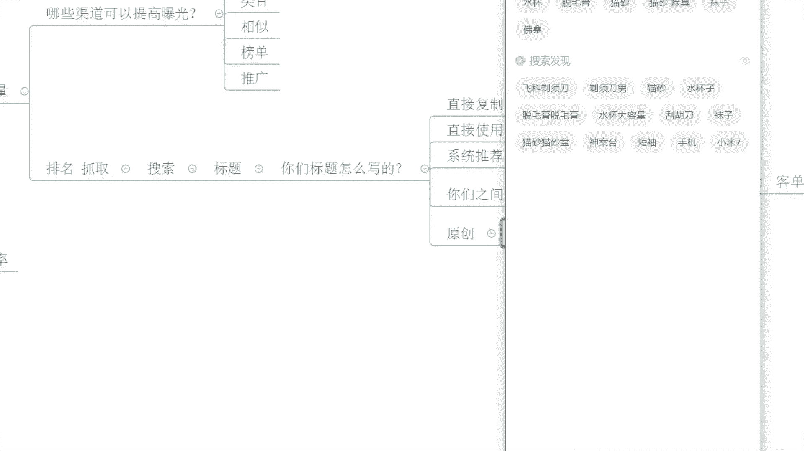

好不好，来我们输入一个连衣裙啊，给大家举个例子啊，举例说明一下。

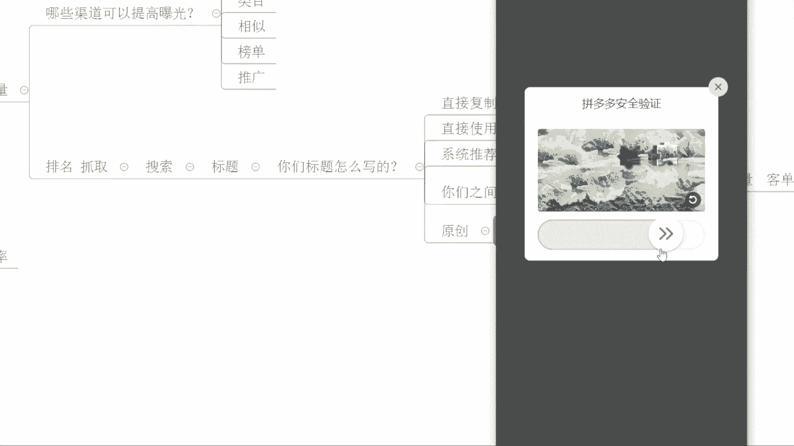

哎呀这个小程序里面小程序里面好像还没有啊。

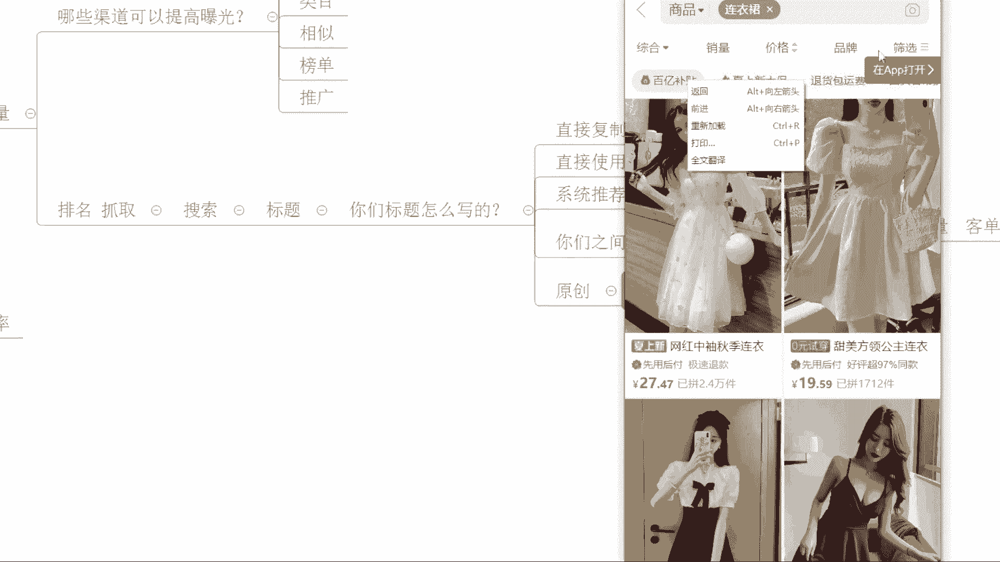

没有这个筛选项啊，没有这个新品选项的三选项啊。

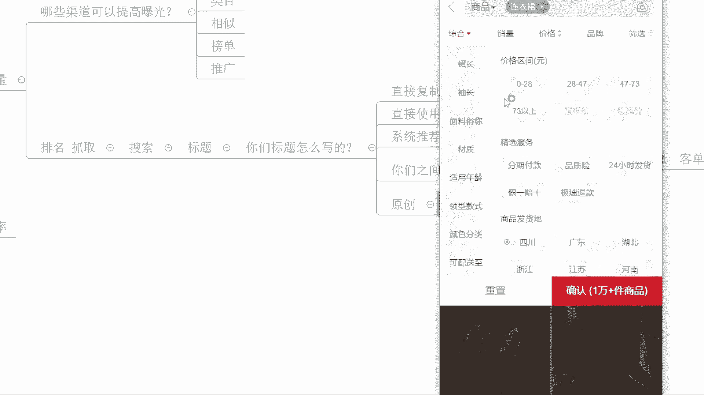

有点麻烦啊，有点麻烦呃，我电脑上没有装这个没有装这个模拟器啊，啊你们你们可以自己这样子啊，如果说现在是方便的小伙伴呢，你们可以自己呢手机打开啊。

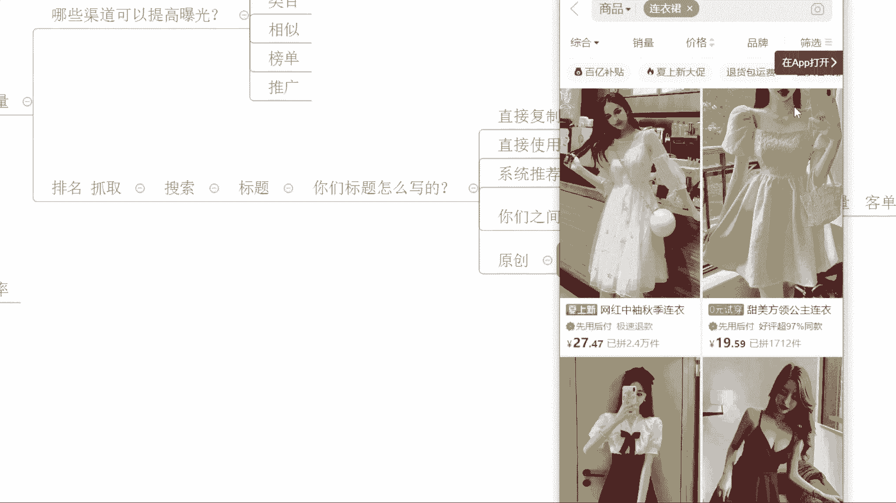

自己手机打开随便去搜一搜，像什么连衣裙啊对吧，或者是像这个呃这种嗯男装女装这种产品啊，这种内部呢他们都是有新品标的，这个大家可以自己搜索看一看啊，这里我就不去展示了啊，我就不去给大家展示了。

因为我电脑上没有装模拟器啊，所以呃通过这个小程序呢，它是找不到它的，对不对，那么就只能辛苦一下你们自己了，那么这里我说一下这一个考核呢，会考核到我们产品标题，从生意参谋上取得关键词，是不是也是系统。

Ok，关键词注意啊，关键词都是系统的，这个没有毛病啊，这个是没有毛病的，但是组合方式会影响原创啊，会影响，新品考核能懂吗，有新评考核他是会有加权的，这是第一个啊，这是第一个，第二个也是最重要的一个点。

各位呃，我我就不跟你们绕弯子了吧，我说一说我自己，包括说我带实操的小伙伴，我们做标题的时候玩的一个黑科技吧，好不好，行不行，我给你们说一个我自己啊，我自己和实操小伙伴做标题的，黑科技玩法好吧。

那么这个黑科技玩法到底怎么样，我也不跟你们去说啊，你们自己看数据就好了，好不好，像这些店铺刚刚你们有看到这些店铺，对不对，这个店铺很明显的啊，很明显的，最早的访客是多少，将近1万。

后期的话是有做了这个操作，并且做了一些新的链接，去做后期的整个增长数据啊，听清楚没有，做一毛的付费推广，全是自然曝光做出来的，当然了，他的数据提升这么快啊，也不是说完全是因为这个方法啊，这个我实话实说。

我也不会跟你们去吹牛逼对吧，它呢之所以访客后期提升这么快速呢，跟季节也有关系啊，这个实话实讲啊，我不会去跟你们说，哎这个范围多好多好，不至于啊对吧，实事求是嘛对吧，咱们也没必要这样子去这种吹牛对吧。

没必要啊，那整个方法的话起到了一个非常关键的作用，但是啊好吧，那这个方法怎么玩的呢，听清楚各位，现在呢我们去到我们的拼多多对吧，那我要去写标题的时候呢，我肯定会去借助到。

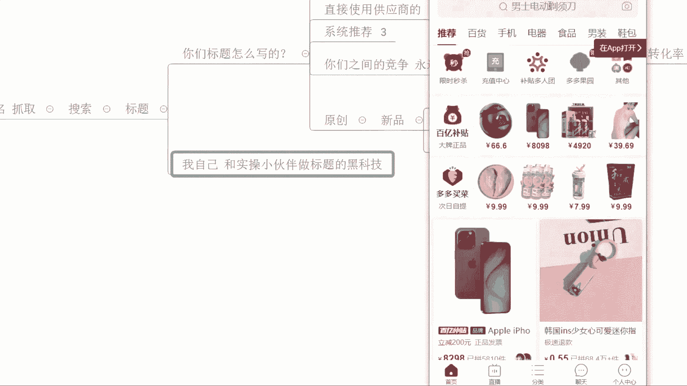

我们刚刚有看到搜索结果页里面，有的一些关键词。

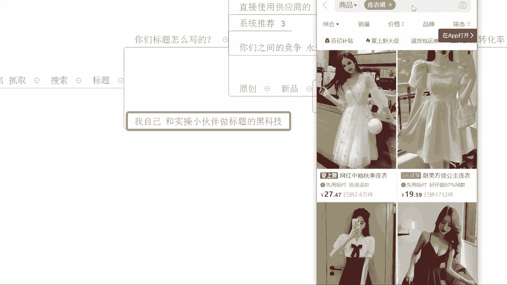

什么关键词啊，下拉通关键值，对不对，各位没错吧，你们在写标题的时候会不会用到这些关键词嗯，会的，公屏扣一，哪怕你是复制的标题，那么大多数也是覆盖了这些词的，有没有，有没有有吧，OK那么这里的话。

我直接跟大家讲一个小操作好不好，那么这个操作的话我可以这么说啊。

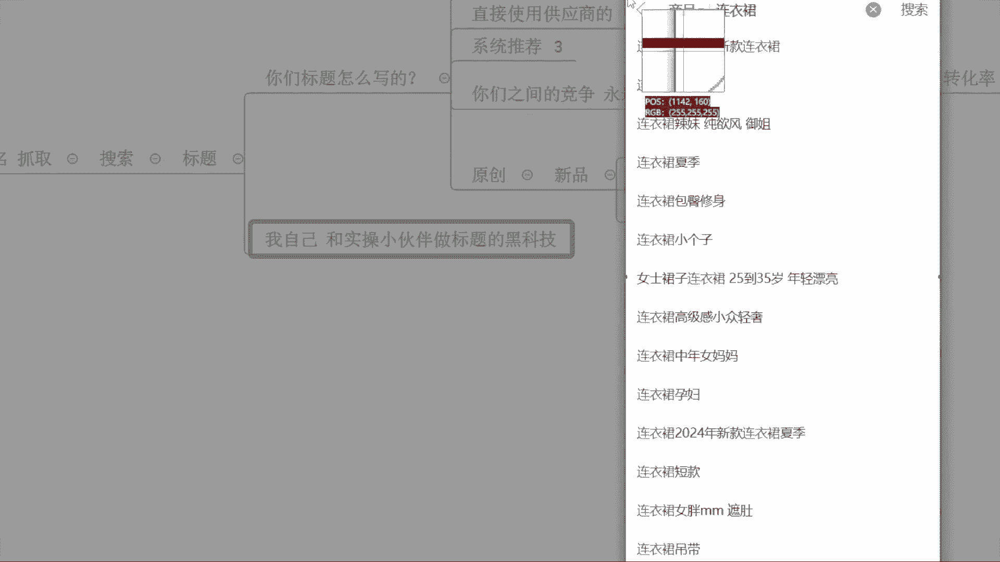

有可能会颠覆你们的认知啊，有可能会颠覆你们的认知啊，来这里面呢呃好巧不巧啊，好巧不巧，刚好有用到，刚好有出现啊，刚好有出现啊，啊我们用到的这个表，这个这个关键词啊，刚刚有出现啊，来这些关键词。

它首先是平台上的热搜词，这个大家认可吗，这些关键词是平台上的热搜词，认可的小伙伴打个六，认可的小伙伴打个六啊，这一次，那么这些词之所以会出现在我们的下拉框，两个原因，一个是相关性。

另外一个呢就是搜索热度，对吧，它和我们上面输入的关键词相关性高，会出现在这最下边，同时呢它的搜索热度够高，也会出现在这下边，那么这个地方的话，像我们自己在写标题的时候。

我自己带实操的小伙伴一起写标题的时候，我们就会利用到这个点，那我在做标题的时候呢，大多数词呢我也会选择使用到这个下拉框的词，这个没有毛病，但是我会空出一部分的位置，留出来做一些冷门词啊。

我会自己去做一些冷门词，那冷门只是什么呢，我给大家解释一下，就是在这个平台上对应的这个商品用的人少，收的人少的词最起码一点啊，输的人少不少，我们不管最起码用的人少，那你说哎希罗我怎么判断用的人少不少呢。

你去搜这个词，你去搜，比如说哎我搜了一个这个呃连体连衣裙啊，打个比方啊，我们就这么说吧，啊我打个比方而已啊，肯定是没有这么个东西的啊，那我就说了这个词搜完之后，在我们整个排序里面去看。

没有一个产品有到这个这个关键词，OK那这个词就是冷门词，有的时候还会出现提示对吧，有的时候还会出现这个提示，哎你是不是这个这个产品啊，啊这个这个东西搜不到，OK不慌嘛啊不慌啊。

你我发现你们真的太着急了啊，那现在就开始到我们的高潮部分了啊，没人说怎么办，不是完蛋了吗，哎来放心吧，完蛋不了，为什么呢，因为我的标题里面除了有这个冷门词之外，还有其他的热搜词啊，嗯还有其他的热搜词。

那前期如果说我们的平台上直接去搜热搜词，能搜到我吗，能搜到我吗，搜不到对不对，因为我没有权重，直接搜热搜词，搜不到我，因为我，没有权重，但是各位注意了，我如果加入了这个冷门词的话。

我用冷门词搭配热搜词来搜索的话，那我只要能够被系统收录，一定是可以搜到的，各位能听懂吗，能听懂扣一，只要我的产品是被系统收录的，那我一定是可以收到的，其实收入条件很简单，破零好吧，收入的条件很简单。

破零就好了，破零操作大家都会吧，应该没有谁不会的，对不对，这个你可以通过分享和通过其他方式，什么方式都行是吧，找你的朋友什么的，做一做就OK搞定啊，搞定那搞定之后完成收入，这个时候冷门词加热搜词呢。

基本上是能够找到我的产品的，那这个时候呢有小伙伴说找到我产品有什么用，也没有意义啊，我还是没有人收啊，对吧，OK听清楚了，很简单，来各位，刚刚我提到过，我说哎刚好有出现一个关键词。

是我们在用的一个词。

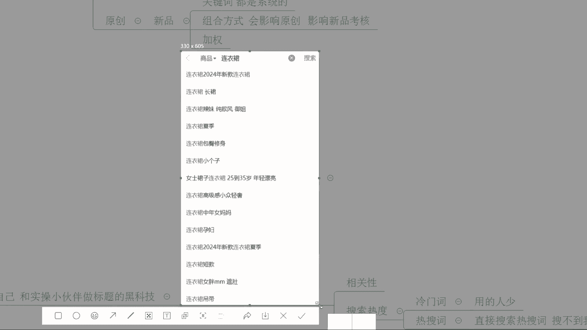

各位有看到这个词吗，有看到这个词吗，有看到这个词吗，女式裙子连衣裙，25~35，年轻漂亮，各位有看到的公屏打个六好吧，有看到的公屏打个六，这个词在之前几乎是没有什么搜索数据的。

这个词在之前几乎是没有什么收入数据的，我直接告诉大家，那他为什么会在这个地方啊，那他为什么又会成为热搜词，因为后期慢慢慢慢发现有很多人收他啊，有很多人搜他，那为什么会有人搜它，会有会有人去点击它对吧。

当他出现在下拉控制，又会有人有人去点击它对吧，怎么来的嗯，他不可能天生就有吧，因为这个词一开始就没有人收啊，如果只是因为相关性的话，也不可能直接相关的这么的一个关键词是吧，不太现实好，我告诉大家。

当没有人收的时候，这个词是冷门词对吧，但是如果说出现大量搜索的时候啊，当它的搜索量，到一定数据的时候，这个词就会变成热搜词，然后就会出现在下拉框，就会出现在各种的推荐搜索选项里面去，对不对。

那么前期没有任何人使用的时候，没有任何人搜索的时候，像类似这种词，我们可以做一个小操作对吧，啊搜索搜索注意搜索就可以了，搜索这个词的目的是干嘛呢，提升关键词的搜索热度，对吧。

而这个词刚好又是我自己在使用的，我自己在使用的啊，所以这个时候搜索这个词的过程，可以提升关键词的搜索热度之外，也可以提升我产品的搜索热度，各位这两个热度能够明白的话，打个一所有人动起来啊，好不好。

这个东西很关键啊，这个东西很关键啊，来好OK那这个东西到底有多关键呢，各位搜索热度增加，关键词的搜热度增加它可以成为热搜词对吧，我的产品思索热度增加，可以告诉销呃，告诉平台，我们的产品有大量的用户需求。

于是乎也会增加产品的推荐权重，它是相辅相成的，好不好，它是相辅相成的，而在这个时候，各位一开始没有人搜的时候，这个词可能就没有什么感觉，但是如果说它热度够高，比如说出现在下拉框，好兄弟们，OK了。

搞定了，这个时候就会有到很多人会选择去点击它，完成搜索，那么它的热度也会越来越高，当这个词的热度越来越高的时候，哎我们会发现一个问题，可能就会有到很多的同行来用这个词了，对不对，但是在同行用这个词之前。

我已经完成这个词的覆盖，为什么，因为我，啊我有很多产品已经在这个词有产出了，而且我的产品做好了人群细分，市场细分，各位到这里能够听懂的话，能够明白的话，公屏打一啊，你们是在找词用词，按照平台给你的。

给你的路走，我是在自己趟一条路出来，所以这就是区别好不好，你可以看到像这些店铺对吧，刚刚给你们看到这个店铺做女装的嗯，本来可能他整个访客提升很难了对吧，但是用到这种玩法去做。

马上把所有后期覆盖的这些产品呢铺开，把持热度做上去，然后整体数据快速拉伸，怎么样，各位啊，六是吧，干不干，各位觉得干不干，觉得干的啊，公屏打个六吧，好不好，觉得干的公屏打个六啊，OK啊。

呃还可以说哎那多少的量才能确认下拉框呢，这个没有没有固定的啊，这个确实没有固定的，因为不同的产品啊，这里我说一下啊，不同产品不同的类目啊，不一样的啊，这个我没有办法告诉你具体的数据啊。

这个东西是这样子的，那么额我们在做的时候呢，如果说你去直接做这种大词啊，我说一下，比如连衣裙嘛，对不对，他直接是一个大词嘛，那它的难度也会比较大一点，如果说我们做的事，比如说连衣裙长裙。

做这个长尾词本身它是二级词嘛对吧，做它下面的细分关键词的话又会容易一点啊，所以你操作不同的关键词，难度也不一样，啊是这样的，那对于整个操作来说，可能说哎C罗，那你说的这个东西我怎么去做呀，那没办法啊。

你只能自己去尝试着去啊，设计一个关键词出来之后去做热度做多少，这个东西我没法给你判断，因为需要涉及到具体产品分析，如果说你做确实，而且呢我自己做，我怕我做不好，我不知道做多少，OK没关系啊。

那么也可以跟着一起实操好不好，到时候呢具体的一个规划方面的东西，我也会带着你去做，都是OK没问题的啊，如果说有兴趣想做实操的，觉得哎齐了，我自己做的店铺确实呃容易走弯路，确实做不好的对吧。

我想要跟你实操的，可以直接微信找我啊，我微信都有吧啊有没有说谁没有我微信的呀，嗯如果没有我微信的小伙伴公屏打个一好，我看一下应该都有吧对吧，毕竟你们都是这个啊，看过分享视频过来找我的对吧。

然后也应该都是有我这个微信的啊，呃实车多少钱啊，啊可以说只要实车多少钱啊，这样子这样子这样子啊，我我先给你阿阿K说一下吧，然后其他小伙伴呢如果说是这个有兴趣的呢，可以听一下啊，如果没兴趣呢。

可以稍微等一等啊，一会儿呢我把这个啊实操方面的东西呢，稍微稍稍微简单介绍一下啊，啊介绍完之后呢，我们继续往下分享好吧，各位稍安勿躁啊，稍安勿躁，那呃跟着实操的话啊，我说一下实操费用啊。

这个肯定是要收费的，对不对，如果说你说哎这个免费带啊，那不太现实对吧，我可能带不过来，那这毕竟呢不是像我做直播分享对吧，这我说免费分享分享对吧，抽出时间来都OK的，因为实操的话确实精力要的比较多。

所以他要收费啊，那么呃实操费用的话，目前呢是限时价，那限时价啊，4288好不好，限制加4288，然后呢是直接带到什么呢，带到可以独立运营的啊，你能够脱离我的帮助，清楚地知道店铺操作每一个阶段不同的情况。

需要去做什么，怎么去做，为什么做啊，这个要独立运营啊，当然了，独立运之后不是说我就不管你了啊，后期呢有这种店铺操作方面的问题呀，或者是平台有什么更新的玩法呀，都可以随时找我。

相当于呢我就是你的店铺顾问啊，而且后期是没有费用的，各位明白吧，这是费用，然后另外我也说一下啊，呃具体的一个操作方式，那跟我实操的话啊，不需要你去什么看直播看视频了啊，不需要看视频看直播啊。

是我直接干嘛呢，加我私人号啊，加我私人号，然后单独指导的啊，我直接根据你的店铺情况和你的个人情况，跟你讲，当前你的店铺需要去做什么，那为什么要做这个，怎么去做，快速提升你的运营能力好不好。

但是啊这里我也说一下啊，不是说愿意花钱就可以了，那我也有一些小小的要求来满足我要求的呢，你可以来啊，如果说不满足，不要来一对一吗，我的天OK啊，说什么一对一这种都是都是割韭菜的啊，不要信这种东西好不好。

不要信这种东西啊，我是单独指导啊，单独指导，那跟着13人要求是什么呢，听清楚了，如果说你是有那种侥幸心理的对吧，想着什么一夜暴富的，不要来做电商，就是做生意需要的是脚踏实地，一步一个脚印。

如果说你想的是哎今天我这个呃花了钱了对吧，哎我跟C罗花钱了啊，我什么都不干啊，我就这么能够躺着赚钱啊，那算了啊，不要来来了，也做不好的好不好，然后另外还有什么呢，那种自己的想法特别多对吧。

然后呢特别有主见，啊然后别人说什么不愿意听的，这种的啊不要来啊，来了的话是吧，我给你讲什么，你也不去听，也不听了，也不做，做了又不去好好做是吧，那这种就浪费大家时间，没有意义对吧。

我希望的是我们相互之间呢，能够具有到一个很好的衔接，把店铺快速做起来好吧，这是我的要求，而呃这个操作方式的话啊，这里我也说一下，如果说你是新手小白对吧，有可能小伙伴是小白嘛，对不对，像这个啊橘子啊。

我记得你就是一个新手来的，对不对，那呃如果说是小白的话，OK听清楚了，那整个的过程呢，首先第一步对吧，我先带你做市场分析好吧，然后接着往下呢我们再去做竞品分析，做好竞品分析之后。

OK我们再去做我们产品的爆款定位啊，爆款选品对吧，然后再往后呢做好我们的一个产品货源对接啊，最后呢我们接着再做我们的店铺搭建啊，产品布局，啊视觉策划，再到我们产品的一个啊商品运营。

到后期我们还会可能涉及到更多的一些，活动的一些设置啊，对不对，啊包括说我们的付费推广啊啊等等啊，这所有的实操方面的内容呢都是我亲自指导啊，带着去实操的，那你是零基础呢，就从零开始好不好。

如果说你是有经验，有基础的OK子账号开给我，啊我针对店铺分析啊，然后指出，问题啊找到解决方案，好吧这就是时尚的一个方式方面的一个东西啊，简单介绍一下，那如果说是有兴趣的小伙伴呢，像这个2K对不对。

可以直接在这个呃微信找我好不好，微信都有的咯对吧，有没有说是没有微信的都有吧啊有微信的话，直接微信找我就可以了啊，那么这里呢我们就继续咯，好不好，这里我们继续啊，然后呃整个的一个操作的话啊。

很细我的天阿K啊，你这个话说的很细啊，能有多细对吧，让我让我这个有点唉怎么说呢，看到这个这个这个这个描述啊，啊我让朋友也来看你直播可以啊，没问题啊，没问题啊，没问题啊，呃那我们继续咯，好不好。

来兄弟们啊啊所有小伙伴一起啊，公屏上扣个一好不好，所有小伙伴一起公屏扣个一啊啊，那么刚刚介绍了一下实操方式，那继续呢，我们上面啊没有完成的一个内容分享好不好，不要开车啊，我我从来不开车的啊。

我从来不开车的对吧，就像我说的啊对吧，做店铺的话，我们先做自然流对吧，最后才去这个做做推广对吧，唉，OK啊行了啊啊既然说都准备好的话，那我们继续啊，那刚刚呢我们也提到过了，关于我们这个关键词的部分。

对不对，怎么去啊，突破做好我们产品的啊，这个搜索的一个覆盖啊，跟我们关键词的一个权重排名，那这些东西做好之后，当我们产品能够去有到一个不错的曝光，有到一个相对比较好的产品的访客之后。

如果我的转化站没问题，那是不是等于说我的店铺我的商品就盘活了，各位觉得是这样的，没问题的，这个逻辑通的公屏上打个六可以吗，好吧，动作快啊，那访客方面呢，我们通过这种方式呢可以去解决它，对不对啊。

能够去吸引到一定的访客数据，当然了，前提条件是我的图片没问题，对不对，图片上你确实也OK的话，那么我们能够具有到一个比较不错的曝光，能够得到一个比较不错的产品排名，那这个时候呢自然而然我有访客了。

那访客进来之后呢，关键点呢就要到后期呢，我们能够去如何去获取到我们一个很好的转化，对吧，那么转化方面呢又受什么影响呢，嗯哎在哪里啊，转化来点击啊，这里点击啊，转化啊，嗯转化方面我们又去怎么操作呢。

来可以说一下啊，可以说一下，哪些因素影响转化率啊，老规矩啊，不知道的话打个问号好不好，不知道打问号啊，如果说知道的话，把你们自己认为对的答案发出来，我点个名吧好吧，来莎莎，还有君君美男子，对不对。

来可以把你们认为对的答案发出来啊，还有这个阿波罗对吧，还有CN啊，很多人都在都是些老面孔啊，对不对，都是些老面孔啊，OK这边讲到说哎有道这个价格客服啊，价格价格是你们都有提到过的啊，然后还有说客服的啊。

还有说这个主图的，还有吗，D s2，优惠，啊评价，还有吗啊，销量和评价，来继续啊，继续继续，我觉得还不错啊，还不错啊，今天你们都应该是在动脑筋的啊，我觉得挺好的，可以的可以的可以的，有没有其他要补充的。

有没有其他要补充的啊，详情啊，详情，好继续，如果说没有要补充的话啊，公屏打一个一吧，好不好，如果说没有什么要补充的了，觉得已经差不多就这样了啊，可以公屏打个一，OK啊没有补充的了，行行行行行行好。

我发现一个问题啊，兄弟们，其实你们很多人呢在谦虚啊，很多人在谦虚，经常有人说哎呀C罗，我感觉我这个做电商的话，感觉我这个什么都不亏啊，我感觉我自己这个完全是一个一脸懵逼的状态，对吧，我说一下其实还好啊。

你看啊，当我把问题拆分完之后，对不对，我我一个问题一个问题往前去拆分推推导啊，去拆解这个问题的时候呢，大家其实这个思路还是能跟上的嘛对吧，那从这点可以证明，其实你们现在呢是已经具备了一定的。

这个运营思维，只不过呢可能还是比较碎片化，对不对，没有一个相对来说可能完整一点的，这个运营体系的一个思维对吧，导致呢你们在解决问题的时候，只能够去解决一些简单的基础的，某一个点的这种小问题。

大一点的方向的问题呢，你可能就会比较懵了对吧，是这样的一个情况的，但是我觉得还好啊，那今天的这样的一个呃思维的一个，这个呃推导的一个过程的话，我觉得大家应该是有到一定帮助的，对不对，那在整个过程中的话。

像我们很多小伙伴呢做店铺就是这样子的啊，缺乏这种思维，那今天的话我觉得应该还好一点啊，可以帮你们去把这个呃思维模型给建立起来啊，那整个操作过程中我们提到说转化率，转化率怎么提高，或者哪些因素影响。

你们回答了很多很多很多对吧，那么在这里面呢有有价格，有客服，有主图，有DSR，有优惠，有评价，有销量，有详情，其实它每一个项目都是跟我们转化有关系的，那像价格呢，可能是我们相对来说。

可能会比较直观的一个东西，对不对，没错吧，这个是我们可能最多的回答最多的一个问题，就是说价格，那用户呢进来我店铺之后会看我的价格，他觉得价格合适就会买，觉得价格不合适，那就走掉了啊。

或者是我们去能够有到一个啊不错的优惠对吧，让他能够去在我店铺里面下单，但是这里有道一个很严重的问题，各位价格多少多跟少或者贵和便宜啊，贵和便宜，啊，贵和便宜啊，它是相对的对吧，它相对的啊，那我举个例子。

今天我说我有一个东西啊，这个东西是什么，我们先不管它啊，这个东西呢啊他，一个啊一个要1000块钱对吧，这个东西是什么，我们现在先不管它啊，我们就说他要1000块钱，你会觉得哇也不便宜啊。

这1000块钱啊对吧，但是我要告诉你啊，它是一枚火箭对吧，1000块钱你会觉得哇好划算，是不是啊，这什么火箭这么便宜，是不是，所以它相对的一个概念的啊，那我们每个人的心里面呢都会有到一个价格的。

什么自我的一个认知，啊或者价格感知吧，这样子可能可能可能会这个呃，可能会更好一点啊，我们每个人心里面都会有自己的一个，价格感知的一个能力，对不对，我会觉得从主观意识来判断贵和便宜，没错吧。

那在这个过程中，贵和便宜我们要去引导消费者产生一些观点啊，改变它的价格感知，然后来体现出我自己的价格优势，当然这个解释可能这样，听起来大家会觉得很玄乎对吧，那我再一次呢举个例子给大家看一下。

你们都用的什么手机啊，我先问一下吧，好不好，你们都用的什么手机啊，是用的IPHONE呢还是华为呢，还是其他品牌的手机呢，你们买手机的时候是去官网买呢，还是去这个啊，比如说淘宝啊，大哥大，呵呵开始啊。

呃这个我墙都不服就服你啊，你调皮啊调皮啊，OK啊，有小伙伴说诶那这个我用的是苹果对吧，好，那假如说啊假如说啊有有用小米的对吧，用华为的啊，假如说我们随便拿个拿个这个手机举例子，好不好。

我们我们就说大哥大把吧，我们就说大哥大把吧，唉今天呢有一款大哥大对吧，哎这个大哥大呢，我觉得是一个非常不错的产品啊，所以呢我想去买啊，我想去买，然后呢进到这个店铺之后，发现啊这个大哥大呢功能很好。

对不对，诶又能是这个呃这个拍照功能也很强大对吧，呃这个图片处理的功能也很强大啊，还有美颜啊，像素呢又很高，可以拍月亮，对不对啊，同时呢啊它还有很好的智能系统对吧，非常棒啊。

而且呢手机的一个这个品质啊也很好，质感也不错啊，质量很好，各种的这个配置呢也很高对吧，这个CPU啊对不对，这个显卡呀啊显示屏啊啊对吧，都是很棒的啊，我觉得还不错，但是呢他就有到这么一个情况。

就是我在前端，我在啊这个广告页，或者是我在浏览页看到的时候呢，这个大哥大呢它的价格是999块好吧，这个大哥大，我一开始在外面看到的价格呢，是999块啊，嘶当时我觉得还不错对吧，我觉得是我所能承担的。

是我所能接受的一个价格，对不对，各位能听懂吗，这个价格一开始我在外面看到了，我在外面的广告看到了啊，看到之后呢，我觉得这个价格是我能够接受的，哎我也对这个产品的好像感兴趣，对不对。

于是乎呢我就点击进去了，我就去看了他，我进去看的时候呢，我发现诶它有不同的规格啊，它有不同的规格，那最便宜的999块的这个规格啊，啊这里我就我就我就把它放在下面，两个就放这吧啊999块的这个规格呢。

哎他的这个呃手机的这个运行内存呢，打个比方啊，六个G啊，六个G，然后呢，他的这个呃呃手机内存呢128G好不好，128G来，各位没问题吧，没问题吧，没问题吧，这是我进去之后看到的这样的一个一个规格。

那么这个规格呢确实999块钱，我觉得挺好的，划算啊，我也能接受，但是啊往后呢这个时候呢就会有到另外的规格，对不对，第二个规格啊，他可能就卖的是1299啊，打个比方啊，1299啊，12991299呢。

他的手机配置呢别的东西都一样，只有最大的问题是什么呢，内存不一样对吧，内存不一样啊，内存多少呢，这个地方呢它是八个G对吧啊，手机内存呢是512个G，好再往上呢它还有一个规格对吧，价格呢是1599啊。

1599他是八个G加一个T，啊加1tb啊，Etb，对吧啊，这里我也我也把这个B打上去吧，啊这个B啊这个B打上去啊，来OK好，现在我们再回过头来看一看啊，刚刚我提到的这个价格感知问题，999的外购价。

就是我自己对这个产品的一个啊自我的认知，我一开始已经接受了这个价格，对不对，各位觉得没毛病的，公屏扣一好吧，这个时候大家动作快一点啊，动作快一点啊，因为时间确实比较紧张，后面还有很多内容啊。

如果分享不完的话，等一会可能又会拖到下一次的一个，一个直播去了啊，好那么这个就是我对于这个产品的一个认知啊，我觉得这个价格很好啊，很划算，我已经认可了这个价格了，当我进来这个店铺之后。

我看到这个规格之后，OK我看啊，六个G128G啊，我就会回忆起来以前内存不足的痛苦，然后再往下一看，哎呀这个就贵个300块钱，内存大这么多呀对吧，就贵个300块钱，内存大这么多。

而且运行内存还大两个G完美呀，而且可以完美解决我以前的一些痛苦对吧，我的内存不足，对不对，哎我想想大腿一拍哎呀，就他了，是不是，那有人可能会说哎齐罗，那为什么他不去拍大腿，买这个一百一千五百九十九的呢。

因为这个价格呢超预算了啊，这个价格超预算了对吧，跟原来的999呢差的太多了，而这一个规格其实在正常的设计逻辑里面的话，就是为了做对比啊，最低的这一个去设置一个价格锚点，然后进店之后呢。

去通过对比营销体现出第二档的价格优势，让用户成交第二档，然后通过第三档来进行对比啊，知道吧，当然有人买第三档更好咯，无所谓对吧，但是大多数人会选择购买第二档，各位这个能听懂的，没问题的，公屏扣一。

那么这个就是我们的价格模型啊，我们在设置价格的时候，在进行价格设计的时候呢，就要注意这些东西，而整个的操作可能有小伙伴会说了，哎西楼我也不是卖手机的呀，你说这个东西跟我有什么关系对吧。

对我来说没有任何意义啊，是不是OK的啊，OK的，我们可以结合产品的实际情况，来去做这个动作啊，去设置到不同的SQ的一个规格啊，呃阿K说引流款利润款啊，可以这么理解吧，可以这么理解啊，可以这么理解啊。

然后整个的操作呢还有到更多的一些细节啊，需要求我们需要我们去注意的啊，好需要我们注意的，包括说我们刚刚提到的这些这个客服板块啊，对不对，那用户进来我店铺之后，他会进行咨询嘛，那这个咨询的时候。

我们如何去快速响应它对吧，怎么去做好引导，怎么去做好我们产品的推销，也是一个非常重要的部分，而还有道一个非常重要的点是什么呢，图片啊，图片我们做店铺的话，其实卖的不仅仅只是产品，卖的是图片。

因为用户一开始的时候他是看不到产品的，他能看到的唯一能看到的就是图片，是不是，所以我们要想让转化好我的图片，一定要好，我的图片，一定要能够去刺激或者吸引消费者对吧，那让他能够认可我的产品，是不是。

各位你们图片是怎么做的，来我问一下嗯，你们图片怎么做的，来阿波罗，你的图片怎么做的呀，问一下你啊，看看你怎么做的，然后还有像这个瑞香，还有这个桑博是吧，你们怎么做的呀，自己做的OK，自己做，啊自己做啊。

然后2K说不知道这个朋友在搞好，我说一下啊，兄弟们，我们对于产品的图片来说，不是说想当然的去做啊，不是说想当然的去做，也是要有一个操作逻辑的啊，也是要有操作逻辑的，我在做图片之前。

就要去分析清楚我们用户的需求，我们用户的痛点，啊啊这小号就是你朋友是吧，OK啊可以的可以的可以的啊，小号啊，欢迎小号来到希罗的直播间，对不对，小号啊啊可以听一听啊，那么到时候有问题呢也可以多交流啊。

也可以加到我的微信，到时候可以多聊一聊好不好，那么呃对于整个的店铺操作来说的话啊，有很多的小伙伴呢也都会想着说，哎我图片呢自己去做对吧，但是兄弟们视觉板块啊除了要要求我们自己做，做到原创之外。

还有一个非常非常重要的点，就是能够去促进转化，设计思维和运营思维是有本质区别的，兄弟们听清楚没有嗯，设计思维可能是更好的去展现我的产品对吧，让它更好看啊，整个的一个视觉感官更舒服。

但是运营思维的话是要去通过刻画，强调卖点来突出我们产品的优势，所以他是不一样的，那我举个例子吧，好不好啊，你们做什么产品的呀，来瑞香啊，瑞香我现在是做家具的，对不对是吧，没没记错吧，我没记错吧，瑞香。

对啊，那本身呢你像啊瑞香呢呃也做了一段时间了，图片也是自己做的，那这里呢我可能以他的产品来举例子，大家可能会更加好理解一点，包括说瑞星可能也更加好理解一点啊，大家可以把思路跟上对吧。

那今天啊今天啊听清楚了啊，没关系啊，小号啊产品不一样没关系，我们把这个思维逻辑给他搞清楚就好了，今天啊假如说我们要去买一款家具啊，兄弟们，假如说我要去买一款家具啊，额就就不说别的了啊。

我就说买一买一张床吧，好吧，我买一张床，啊我要买一张床，兄弟们，我想问大家一个问题，那我们的需求是什么，我的痛点是什么，各位你们能分得清需求和痛点吧，你们能不能分得清需求跟痛点啊，如果说能分得清的话。

可以把我们的需求跟痛点说出来，如果说分不清的话，没关系，把你自己的这个想法也说出来都可以的，如果分得清的话，OK的，那你认为你的需求是什么，你的痛点是什么啊，我们作为消费者啊。

注意这个是作为消费者啊来的啊，我现在要去买一个家具，对不对，作为消费者，那我要买一张床，我的需求是什么，我的痛点是什么，可以把你们认为的对的答案发出来来，瑞香你说可以的，那可以的话，把答案发出来吧。

其实我说实话啊，大多数人可能需求是什么，痛点是什么，是分不清的，痛点和需求，很多时候很很咬得很紧密啊，有的很紧密，真的这样子的，有很多人可能说分不清的，包括说有很多所谓的一些很牛逼的这个商家。

很牛逼的这种运营，可能做了很多年都很难去区分清楚啊，都有的啊，这很正常，所以大家不用说哎觉得自己搞不清楚这个东西，觉得很丢脸或者怎么样的，不至于啊，不至于好不好，OK然后OK说需求就是睡觉舒适。

痛点就是床不够舒适，你这个解释啊，呃我愿我愿封你为全场最佳啊，2K啊，我愿封你为全场最佳啊，好吧，这个这个真真厉害了啊，真厉害了真厉害了啊，很牛啊很牛啊，呃这，啊然后瑞香说痛点是之前的床不好的地方。

需求是满足自己哪些需要，OK床的需求是什么呢，睡觉了对吧，睡觉嘛，但是细分到睡觉的话会涉及到很多点啊，会涉及到很多点，对不对，哪些点呢，嗯刚刚这个RK说到一个舒适啊，这个词我先把它写进来吧。

啊我先把它写进来，我不能说他这个错啊，我不能说他这个错啊对吧，确实这个东西你不能说他错啊，但是呢确实这个这个这个答案呢，不是很不是很好啊，那呃除了这个睡觉之外，我们讲到功能诶，没错啊，开水提到一个点。

一个人睡，两个人睡，更多人睡对吧对吧，这个是一个一个一个很很细节的点啊，这是一个很细细节的点啊，开水啊，不错啊，有点悟性啊，那除了睡觉之外，我们还有就是更多的功能需求诶，我几个人睡对吧。

如果说是我对这个床，这个床有储存的需求对吧，没错吧，哎我们我们我们有很多时候啊，我们需要有这个床有储存空间对吧，那么这个也是需求，是不是没错吧，OK了啊，那痛点是什么呢，比如说有的时候这个床呢。

他可能会嘎吱作响对吧，这个大家懂得啊，他有的时候会有异响啊，对吧会有印象啊，然后有的时候呢，这个船可能说呃这个，呃怎么怎么怎么讲呢，他用到的一些材质啊，容易老化对吧，容易老化啊，比如说有的这个床头。

它的这个靠背对吧，是这种啊，PU材质的或者是皮材质的，哎它都容易去老化啊，会容易氧化对吧，那今天呢我们用到的这个全金科，全新的一个科技面料，对不对，诶它可以避免老化这个功能啊，避免老化这种现象。

OK那么这也都是我们的一个啊，一个一个一个痛点展开的一些东西对吧，那我们要去让我们的消费者买我们的产品，就要对应的找到需求，同时呢要去强调我们的用户痛点，以痛点来刻画我们的卖点，各位能听懂的公屏打一。

啊那这些东西呢也都是我们需要去做的对吧，那图片上面我们能够做到位的话，OK的后期我们才能够具有到更好的产品转化啊，这些东西都是影响转化的啊，还有很多很多东西，对不对，而这一点的话我我讲真的啊。

很多时候呢，有很多的新手小伙伴是没有办法去驾驭它的啊，对那么我们在做的时候啊，我们在做的时候，对于店铺操作，对于我们产品的图片的设计的话啊，记住啊，我给大家，我给大家讲一个一个一个一个概念啊。

我给他讲一个概念啊，叫做QFABE啊，啊就是QFABE啊，什么意思呢，就是你在做这个事情的时候，你在做这个策划的时候呢，你就一定要去思考这些东西，Q是什么呢，是问题谁的问题，用户的问题，用户的痛点对吧。

然后F是什么呢，F是我们产品的特征，或者是我们产品的特点，然后A是什么呢，A是我们产品的优点啊，优点是根据特征产生的啊，优点啊，哎我的产品有什么特征，那么这个特征有什么优点，懂吧。

那么再往后呢是我们的啊产品的利益啊，B啊，你就是我给用户，因为我用了什么样的一个，我因为我的产品有什么特征，它有什么优点，这个优点给我的客户，给我的消费者带来了什么样的一个利益点啊。

最后呢一个一呢就是证据啊，证据做一些科普啊，或者做一些调研方面的东西啊，做一些背书，那么用这些东西来证明我们产品的优势提升，转化好不好，这个逻辑在主图设计，详情设计都能用上啊。

而视觉策划呢是我们运营要去做的事情，当我们做好策划之后，我才能够去让我的美工，按照我的要求去拍摄图片，去制作详情，制作组图好吧，而不是说想当然随便去做，如果想让大家随便去做的话。

说难听一点就是凭运气了是吧，你凭什么能够运气比别人好呢，这是很现实的问题，好不好，那这些东西呢都是需要有非常好的这个呃，运营思维跟这个逻辑分析能力才行的啊，那同样的也需要一定的经验。

如果说你们大家自己操作的时候呢，有不清楚的也可以跟着一起去呃，实操或者是跟我多交流都可以的，好不好，那么来啊呃整个的一个呃内容呢，到目前为止觉得OK的没问题，还是能够跟得上的，公屏上打个一好不好。

觉得确实有点呃吸收不过来的，可以打个二好吧，我可以看一下，我先看一下啊，大家的情况，因为确实呢，呃有的小伙伴可能基础会比较薄弱一点，有的时候呢说的一些东西呢，可能会呃涉及到一些在知识盲区啊。

可能会接触起来，接触起来会比较麻烦一点啊，这都没问题的，大家可以根据自己实际情况说吧，怎样啊，是都能够跟得上呢，还是说都跟不上啊，你们你们什么情况，嗯这个停你你能你能跟上吗，你能跟上吗。

OK小号说你带人带多久啊，啊小号是刚来直播间的，没有听到的啊，这样子吧，这样子呃，我问一下吧，我问一下啊，有多少小伙伴是目前啊就自己做店铺呢，确实没有一个操作思路啊。

自己目前自己目前自己坐垫没有操作思路啊，然后呢呃想要去找一个人带的这样的小伙伴，公屏可以打个一好吧，我我确认一下吧，啊我确认一下，如果有比较多小伙伴的话，我再介绍一次吧，好吧，我再讲一下吧，OK的啊。

像盐焗啊，小小啊，对不对，小浩啊啊都是有这种想法的，对不对，OK那没问题啊，那没问题，那我我我直接讲了，我直接讲了好吧，是这样子的啊，那跟我实操坐垫的话，目前呢费用啊，我说一下4288好不好。

后期呢是没有其他隐形收费的，如果说你们今天说想要去找一个人带，我觉得OK的，我这里完全是没问题的，为什么呢，因为我不是割韭菜，不是培训机构，不是代运营好不好，你们可以跟着我去实操坐店。

而跟我实操坐垫的话，听清楚我是直接带到你们可以独立运营为止的，啊现在就在找，就是问了个域名，感觉不靠谱，是不是OK可以的啊，其实很多时候就是这样子的，有的人呢他就是嘴巴吹的凶对吧，没有点东西的。

像我的话，其实你们听我的直播也好，看我的视频也好，对不对，有没有货大家感受到的啊，真的啊，有货的人讲的东西讲的话就不一样了对吧，那在我这里的话啊。

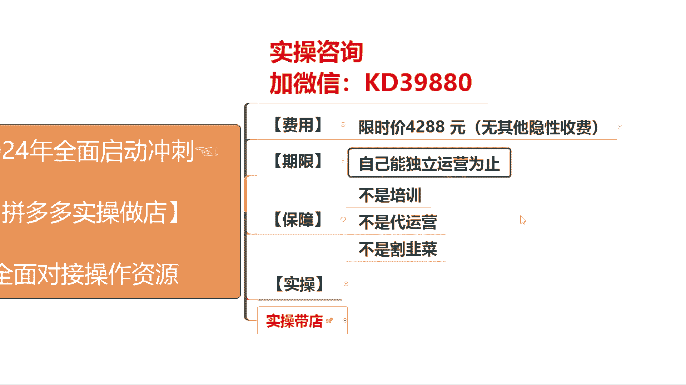

所有的实操听清楚了，这边小号包括说小小，包括说盐局对吧，那么可以看一下啊，所有的实操的话听清楚，根据你们的个人情况，根据你们的店铺情况进行单独指导啊，没有任何其他的什么让你去自己去看视频。

看资料这种东西的没有的啊，针对店铺直接来的啊，针对店铺直接来的啊，那这个是我们需要去注意的一个点啊，然后呢整个的内容好吧，看一下啊，是完整的爆款操作体系系统可落地的啊，从入门到进阶的完整的操作方法啊。

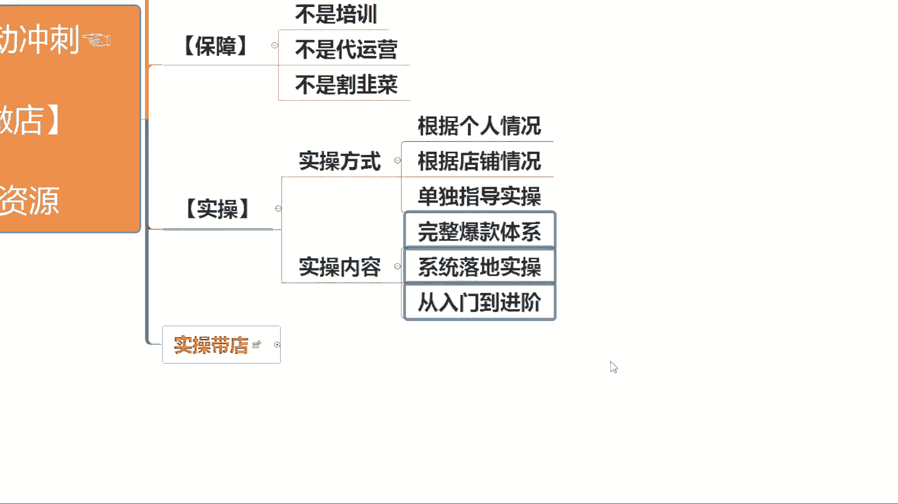

都会在我的市场里面展开对吧，如果说你是新手小白，可以看一下啊，那我会根据你们的个人情况，你是小白，我就从零开始，我直接带着你去做市场分析，产品定位啊，竞品分析，然后去做好货源，对一些产品的布局。

商品的上架啊，再到后面呢我们去做好我们产品的啊，这个呃上架之后的新品操作，产品权重获取关键词，产品打造，包括我们后期可能还涉及到活动提报，付费推广等等，所有的内容。

每一个操作步骤都是我直接带着你去实操的，所以这个是我们整个的啊，实操的一个一个方式啊，那么大家如果觉得OK这个方式可以的。

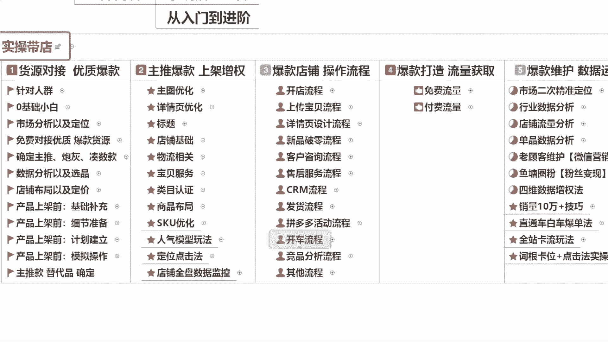

没问题的，可以直接来啊，这边呢也有到我的这个时尚微信，大家可以加一下啊，没有我微信的可以加一加，像小号啊，小号你可以加一下，你没有我微信，对不对，可以加一下啊，K d39880，我发公屏上啊。

我发公屏上，如果说是有我微信的小伙伴呢，也可以直接微信找我就可以了。

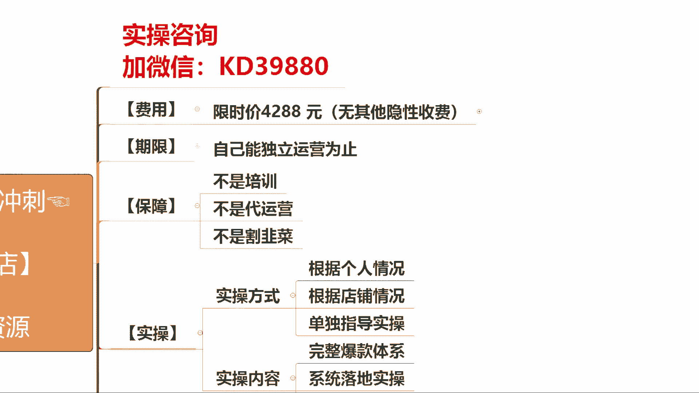

好不好，这个地方我就不去多提了啊，那么对于整个的操作来说，像小小对吧，之前呢讲的说哎小小说哎小老，我觉得还可以的对吧，我觉得这个呃电波操作呢像谢主，你分享的这个直播呢，包括说你分享这些东西呢挺干的。

我觉得不是那么的难啊，我可以自己先尝试操作对吧，培养没错吧，是不是，那么像目前呢也是说确实有这种想法，想要去找一个人跟着实操，那我觉得可以直接来的，为什么呢，因为说实话啊，说实话。

因为本身店铺操作有很多人跟小小一样，想的是自己去操作，自己去试，但是自己试的话会遇到很多很多的问题。

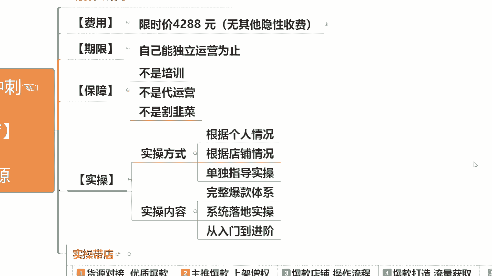

什么问题呢，首先第一个你没有方法，对吧，首先第一个你没有方法，然后除此之外呢，你还没有经验，对吧，另外的话你还没有资源，那么这个过程呢就会导致你整个的操作呢，会非常非常的浪费资金啊。

会非常非常的浪费时间，会浪费机会啊，然后小号说这不用费用的话，可以直接安排到我的对公银行账户的啊，支持开发票，支持合同签订啊，所以安全是有保障的，如果说你说诶这个呃费用方面的话。

是直接这个转给私人或者怎么样其他的方式，对不对，或者是通过什么淘宝啊，通过这个拼多多店铺去拍下单呢，说难听一点，说跑路就跑路的对吧，但是在对公账户操作的话，安全性有保障，因为它受到国家机关监管的。

对不对，呃，跑得了和尚还跑不了庙嘛，对不对，而且的话整个的这个实操的一些细节，包括说呃安全方面的话可以不用担心，那么合同里面会明文规定写的很清楚的，就是什么呢，如果说跟着我实操坐垫是让你去看视频看资料。

对你爱搭不理，对你飞扬了事的，没有代理实操全额退款好吧，小号包括说像我们的小小啊吧，包括说我们的这个盐焗小星球啊等等啊，那么你们都可以听一下对吧，所以说安全方面是有保障的，大家不用担心。

然后阿K说宠物没有带过吗，当然带过对吧，来我给你看一下，我带过店铺很多啊，像这个店铺刚刚你们看过的，对不对，做女装的啊，做女装的有看到吧，最早呢是差不多啊，八九千访客啊，跟着实操之后呢。

一天的访客呢干到了3万多，4万将近二，那么一天订单是2700单，对不对，7。24的一个转化率对吧，这个数据大家看的很清楚啊，这里我就不去多解释了啊，那么应该能看懂吧。

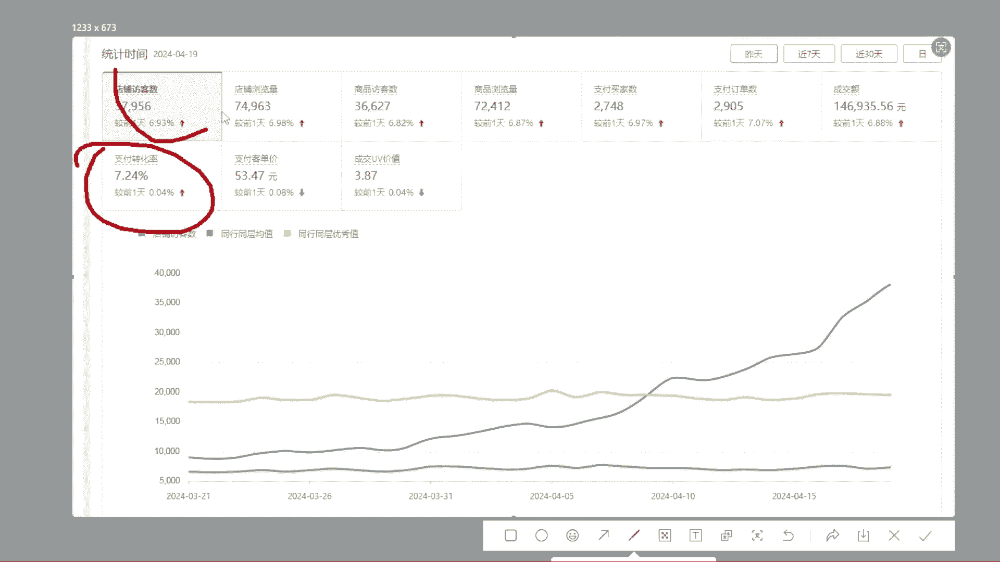

这些数据对吧，那这是女装的啊，包括像这一个做打火机的，对面做打火机的各个类目呢都有带啊，像这个店铺来19。47的转化率1900多，单一天，对不对，像这个2K你做这个宠物用品嘛，对不对。

我给你看一个宠物用品的店铺啊，那刚好前期是也有小伙伴是做宠物用品的对吧，来我给你找一找啊，周期要多久，这样子啊，我说一下啊，我说一下啊，呃宠物用品卖什么的，宠物用品卖的东西多了啊，像什么猫爬架呀。

狗窝呀，好好多店铺都是做宠物用品的，因为这里面宠物用品真的做的很多的啊，这两年宠物品真的呃因为市场的增速很猛嘛，对不对，来这个店铺，这个店铺做的是这个这个店铺，做的是那个啊小猫的这种玩具的啊。

做玩具的啊，做玩具的是吧，然后这个呃啊这这个这个整个操作的话，我说一下啊，我说一下啊，像这个店铺啊，做这个玩具的啊，可以看到啊，零访客起了一个店铺啊，零访客企业店铺对不对。

那么嗯整个的操作的话非常快速起来，对不对，从最早领访客呢是做到一天访客呢4000多，11。73转化率的，一天500多单，对不对，也就一个月不到啊，一个月不到，那整个店铺的一个操作的话，我也说一下啊。

操作的周期对于店铺来讲的话，正常跟着实操的话，两个月左右完全可以步入正轨，没问题的对吧，当然了，如果说你吸收效率高，操作到位的话，时间会更短，好不好，小号那现在这个节点上的话。

像你们很多小伙伴也在说哎想要去做618，对这个618有兴趣，那么就是一个非常非常关键的点了，有很多人，现在店铺呢可能还是处于一个这个数据啊，比较少的一个状态，对吧啊，没有什么太大提升，对不对。

现在很多小伙伴都是这样子的嘛，那如果说你是这样的一个情况，或者是你还没有开店，正想开店的话，OK抓紧时间去操作，为什么呢，原因很简单，就像刚刚这个小妖说的618，那拼多多平台呢有一个特点啊。

就是他每一次在大促前啊，会提前锁流量啊，为什么呢，因为他会把更多的这个活动流量呢，匹配给到一些头部商家，让他们能够去更好的消化吸收我们的流量，和其他平台做竞争，那么这个时候呢对于一些数据不好的。

或者一些纯新品的这种产品呢，你获取曝光会比较难，甚至你花钱去做推广，你都很难拿到曝光，所以我们一定要提前去做，那么这个时间节点的话，在5月的中下旬啊，按照前几天这边小二透露的消息呢。

是5月23号所流量啊，到时候大家可以看一下，到时候访客肯定会大面积下降的，尤其像你们中小卖家啊，肯定会这样子的啊，那么大家可以到时关注一下啊，这个你们来对比一下，看我说的是不是真的啊，那在这个过程中。

换句话说，留给我们现在去起电的时间，也就只有短短的一个月了，如果说你想去做练的话，再加速快速冲刺，不然你这个618就错过了，而且在618结束之后，还会因为节后综合症，对不对，平台流量会处于一个。

有将近半个月的低迷的状态啊，这是一个很重要的事情，好不好，所以这个是我们需要注意的事情啊，然后像这个小小还在吗。

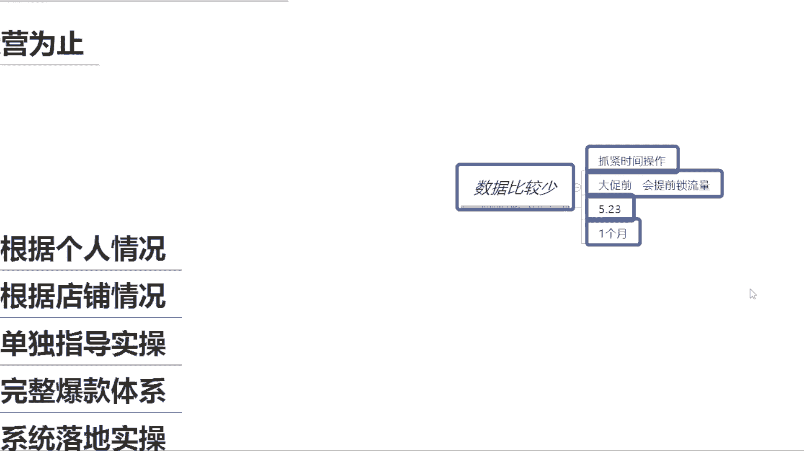

小雅还在吗，还有我们的这个盐焗小啊，也叫盐焗小，什么来着，盐焗小星球是吧，还在吗。

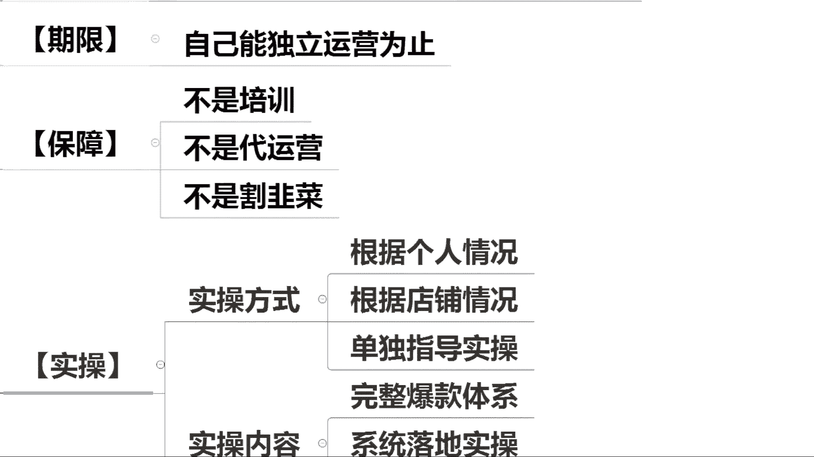

在是吧，OK啊在的话我觉得OK的，像小小本身你的话自己也是想要去找人。

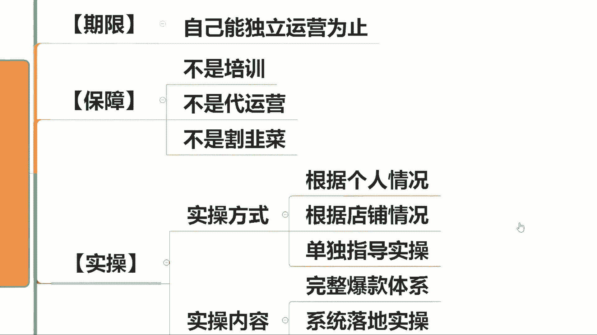

早晨时杀的嘛，对不对，我觉得可以直接来的，就不用耽搁时间了对吧，还有些人气选的星球对吧。

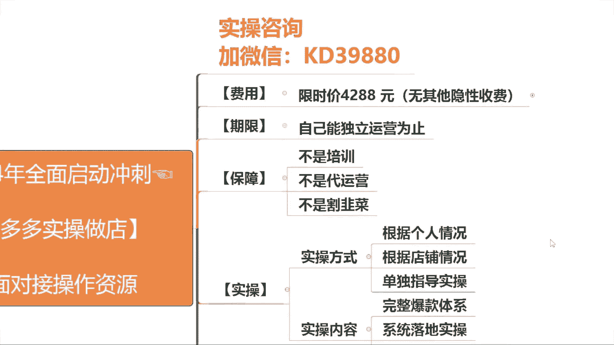

觉得OK的话可以直接来啊，然后像这个呃这个小小，我在微信上也给你发消息了，对不对，可以确认一下啊，是不是用的智商，然后还有像这个500啊，我又看到一个这个啊熟悉的面孔了，500也拖了很久的500在吗。

在的话扣个一啊，500在的话扣个一在的扣个一，500，在的话扣个一本身像我们店铺操作来讲的话，有的时候就这样子的，一步快步步快，对不对，如果说一直在拖，一直在拖的话，其实对于店铺操作是没有帮助的。

我们店铺想要去提升的话，不是说拖出来的，对不对，经常我说实话像以前的话都会遇到这种情况，就是有人说哎这个西楼现在做店铺还能做吗，我说能现在可以抓紧时间去做好的，我再看看，隔了半个月之后，诶。

七楼店铺现在还能做吗，我能你还没做啊，赶紧做啊，我再看看，过了半个月之后又来问啊，七楼店铺还能做吗，我说可以还能做，赶紧做啊，然后再看一下啊，再看一下，到到最后说哎呀，之前跟着这个一起做店。

那些小伙伴他们提前做了啊，店铺都做OK了啊，都已经很好了啊，我早知道之前就做了对吧，就这种话就来了啊，千金难买，早知道对吧，如果说真的想去做店铺的话，抓紧时间早点操作啊。

那么呃这个呃小小啊小小我我我讲真的啊，本身像你现在的一个情况的话啊，你也一直在尝试对吧，一直在操作，那么尝试这么久了，其实店铺操作你自己目前来说能力是否足够，你自己很清楚的对吧，然后呢。

你自己也确实说想要去找到一个合适的人，跟着实操，那我觉得可以直接下决定的，可以直接跟着来，不用一直拖的，你知道吧，你一直这样去想东想西的，没有什么没有什么对你没有什么帮助的啊。

或者说你有什么具体的一些想法对吧，有什么样的一个这个呃疑虑，你可以直接讲啊，你可以直接讲，我们快速的把这些疑虑呢先解决掉，那么早点做决定，早点操作，店铺早点提升，你说呢，那么这样的话。

我们整个店铺操作呢才能跟得上节奏啊，不然的话像你现在对吧，也不是一天两天了对吧，也不是一天两天了，那这样的话是不是浪费时间没有意义了啊，OK了OK了啊，你可以你可以说一下啊，你可以说一下啊。

你可以直接微信跟我讲，或者直接公屏上跟我说都可以的啊，那我们反正是抓紧时间把店铺早点做起来，这个是我们最重要的事情，对不对，不要去耽搁啊，然后盐焗小星球，你这边呢是怎么想的，也可以说一下好不好。

你这边怎么想的，也可以说一下啊，包括像我们刚刚讲到的500，对不对啊，一直也没说话啊，我看你在直播间的啊，咋滴，不好意思吗啊5004也是啊，一直在纠结一直在这个徘徊啊，我也不知道在纠结什么东西啊。

好不好，然后这个呃小号怎么样，看完了没有啊，看完了没有啊，应该不用看太久吧，对不对，应该不用看太久啊，OK的话啊，可以直接跟着来，嗯然后这个盐焗小星球啊，严俊小英雄，你这边怎么想的，可以说一下。

包括说微信这边对不对，我也给你发消息的啊，看到可以回复一下啊，OK了啊，OK了啊啊小号啊，但是我这里不是这种教学培训啊，你是跟我实操坐垫，这个是有本质区别的啊，你是直接实操啊，不是说教学啊。

这个东西不一样的啊，OK了，那我把付款方式发给你好不好，搞定之后呢，截图给我，然后我把信息日期表发给你，然后安排好之后呢，我们就下播直接开干啊，反正坐垫操作方面的话，我觉得是这样子的，对不对。

很多时候啊我们该否决要果决一点对吧，做店做事情都一样的啊，还是需要一些这个呃勇气，需要一些这个呃果断的一些态度的啊，啊盐焗小星球啊，我说一下啊，我说一下啊，呃目前来说的话啊，你现在是还没有开始操作的话。

我觉得是最好的时间跟着实操，为什么呢，因为店铺操作不是说你要去把店铺开起来，才跟着实操来，能听到的话，公屏上打一个一啊，能听到的话，公屏打个一啊，店铺操作的话，不是说你要去做好这些什么这准备。

那准备再开始的，不是的啊，我们店铺操作的话，有很多很多东西是需要我们在开店之前去做的，啊这个是我们需要去在开店之前做的啊，那哪些东西呢，像我们市场的分析，产品的定位，竞品的分析。

视觉策划等等很多很多东西，包括我们的价格定位啊，那这些东西如果说你一开始没有做好，你上架产品，你去操作，很有可能你会走弯路，比如说你选的这个产品，它没有市场竞争力，它市场体量并不大，你以为销量很好。

你去做你的投入成本可能是收都收不回来的，来盐焗小心球，能够明白公屏扣一，所以这些东西的话，不是说等我们开店之后再去做，而是一开始就要去操作的，所以现在你还没有准备好，你这些所有的准备工作。

都是由我带着石超宇完成的，能够听懂的话，OK的，可以直接来，好不好，就不用耽误时间，这些东西是你自己可能现在来说没有办法，或是能力还不够的，去做好这些判断跟分析，你是不够的，比如说数据分析吧。

你本身就是小白，你没有办法去做好一个完整的数据分析，你所以为的分析结果往往可能是错误的，那你按照你错误的一个分析结果去操作店铺，你能做得怎么样呢，你能做的很好吗，明显不太现实，你觉得是不是这样的道理。

你觉得是这个道理的话，公屏扣个一啊，你觉得是这个道理的话，公屏扣个一，而像整个的跟着实操的话。

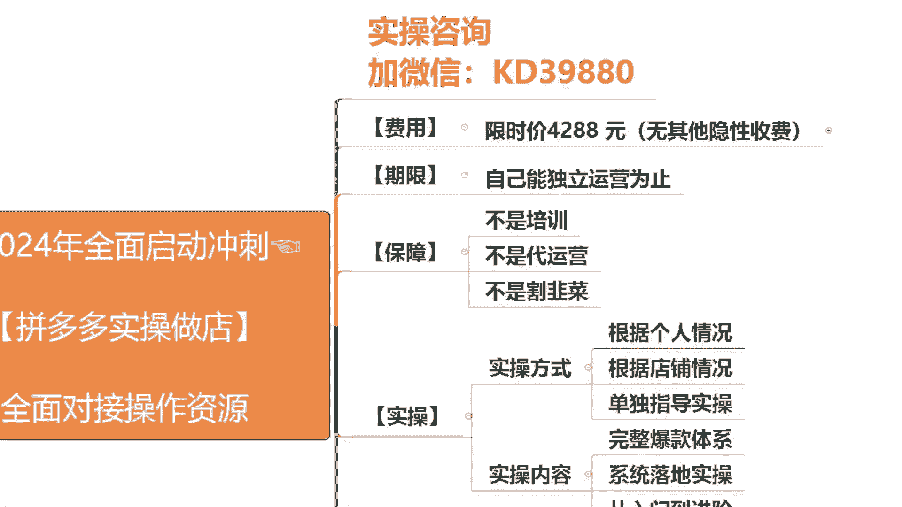

这些所有的细节啊都是我亲自把关的，你们是把纸照给到我这边，我会针对店铺分析的，所以这样的话你的提升会非常快速，OK啊，我看一下小号啊，好嘞好嘞好嘞啊，小号啊，有收到啊，有收到啊，有收到，恭喜小二啊。

成功拿下七六十二名额啊，然后小号这边我把信息日列表发给你一下啊，然后填写好之后呢，回传给我，然后下播之后我们直接开干好不好，就直接开始了啊，恭喜小号啊，攻击小号，然后点击小星球啊。

你刚刚也讲到说确实是这个道理，对不对，你也确实是属于这个情况的，那我觉得如果你真的是要去做店铺的话，那么可以直接来啊，那么可以直接来啊，就不用耽搁了啊，OK了没问题啊，OK啊啊，你跟小号一起嘛。

反正咱们多沟通嘛，对不对，我觉得没问题的啊，好好干啊，反正产品方面你们我刚也看过的，对不对，也都是OK的啊，可以直接搞啊，都可以的啊，然后这个呃盐焗小星球对吧啊，你可以说说你的想法啊，可以直接讲。

对不对，那如果说你你确定啊是要好好坐垫，是要长期坐垫的话，可以扣个一啊，你确定你是要好好做点，长期做点的话可以扣个一，然后像这个呃呃我有看到这个呃若雨啊，若雨啊，我有看到你啊啊若雨今天也来了啊。

可以的可以的可以的，啊若雨也是想跟着实操的落雨啊，其实你你的话啊，多的我就不多说了，对不对，咱们已经说的很清楚了，包括说给到你的一些这个帮助，我觉得应该是已经呃非常非常的这个有诚意了，啊是吧。

可以直接开始了啊，可以直接开始的好吧，想想办法直接开始啊，然后盐焗小星球呢，本人说哎也是想要去长期坐垫，好好坐垫，那其实这个情况就很清楚了，以目前你的能力呢是不足以去运营的，这个很现实的一个问题。

我们从客观角度来说，就这样的，你能力不足就要提高，是不是是不是这个道理，那既然这个道理的话，你一定会去找到一个啊你认为靠谱的人，或你认为合适的人去带你对吧，那么可能你会说哎那是道理，是这道理。

那为什么我要找你啊，修罗原因很简单，第一个点兄弟，我有没有货，在座的各位老板，很多人对我已经算是很了解了，大家都很清楚了，嗯我们我问一下好不好，兄弟们目前在直播间的小伙伴们啊，有看过我视频。

有看过我直播确实能够有提高，觉得C罗有点东西的对吧，C罗这个人啊运营水平还可以的，公屏上打个六可以吧，这个我就我就不靠我自己说了啊，大家可以把你们自己的直观感受说出来对吧，如果说觉得A7L你不行。

也可以直接说，没关系啊，没关系啊，咱们有什么说什么对吧，也不用去说什么客套话，对不对，觉得信号还可以的啊，运营能力还不错的啊，有点东西的，对不对，公屏上六走一波好吧，OK了啊OK了啊。

还行还行还行还行啊，还行啊，大家还是还我还是感谢大家认可的啊，还不错还不错啊，所以这方面的话啊，我觉得不用我去多说什么啊，像我分享了很多东西，有一点啊我可以大言不惭的说。

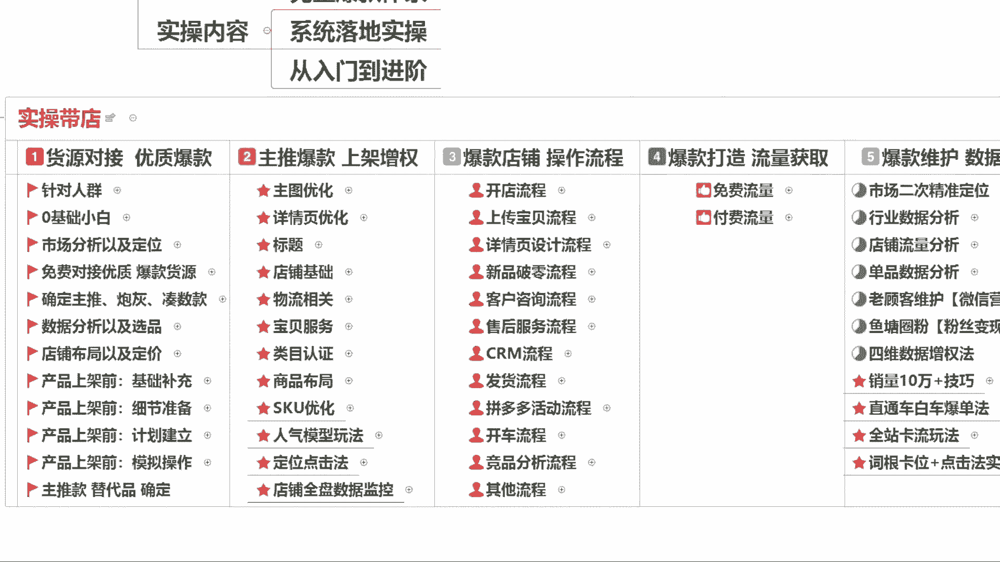

我分享的很多的这个啊视频也好，或者是直播也好，里面的内容，你们在别的其他地方你去买VIP课，你都听不到的，这一点我敢说啊，这点我敢说为什么，因为我有货啊，因为什么，因为我是做实操对吧。

我不怕你们在我这里听到什么东西啊，听到这些东西之后，你自己去做，我不怕，为什么，因为其实很多时候你们自己去做的时候，你们都是加入了自己的想法，自己的思维，然后你自己做的话都会有到一些偏差。

可能我讲的东西是啊，这个一你听成了二，或你理解为了二，然后你去做的时候呢都会有偏差的，这也是为什么说有很多小伙伴选择跟我，实操的原因好不好，然后这个呃盐焗小星球啊，能明白公屏扣一。

所以很多时候呢也有很多小伙伴说，唉C罗确实啊你真的很有货啊，我听你的直播也好，看你的视频也好，我都学到很多东西啊，啊我自己去试一试看对吧，为什么说很多人是事不好，就在这个地方啊。

因为你们听到的这些东西只是你以为的，只是你以为的，很多店铺运营呢要结合店铺实际情况来分析，来进行细分的优化啊，然后呢再加上呢要适合自己店铺，这个才是好的操作方式，对不对，所以这个很重要啊，原举。

那么呃除了这个地方之外，另外一点对吧，像跟我实操的话，刚刚我也提到过了赢局啊，安全另一方面不用担心，因为本身的话，费用方面，可以直接安排到我的兑付银行账户对吧，那么这个呢支持开发票。

支持合同签订的合同里面明文规定的是什么呢，如果说跟着我实操做点，我是让你看视频啊，看资料对你爱答不理，飞烟了事的，没有代理实操全额退款，所以这方面你也不用担心，而跟我实操的话对吧，能不能学到东西。

能不能有提升，这些店铺都能看得到的对吧，这些小伙伴都跟我实操的啊，数据摆在这里，对不对，多的我也不多提了，好不好，严局你觉得合适，公屏上扣个一，咱们直接来，你要觉得不合适，没关系，也可以直接讲好吧。

那么那你可以自己先去再琢磨中，再操作操作都可以的啊，那但是呢啊我实话实说自己去琢磨，自己去操作的话，大多数时候呢会浪费掉很大的一个投入成本啊，那么这些成本的话，可能会比跟实操的费用要多得多，好不好。

那对于整个超来讲的话啊，别的我就不去多说什么了啊，那有什么其他操作方面的问题啊，或者是有这个呃想要哥的12小伙伴呢，可以直接啊微信找我吧啊好不好来呃，其他小伙伴。

还有没有谁对这个并不是这方面问题有疑问的，可以提问啊，现在是提问时间，有想看实操的也可以直接说啊，给你们机会啊，给你们机会，如果说OK没问题呢，那我就准备下播了，好不好，如果说没问题，那我就准备下播了。

OKOK那行啊，那今天的直播呢就先到这里，好不好，我们下次直播再见。

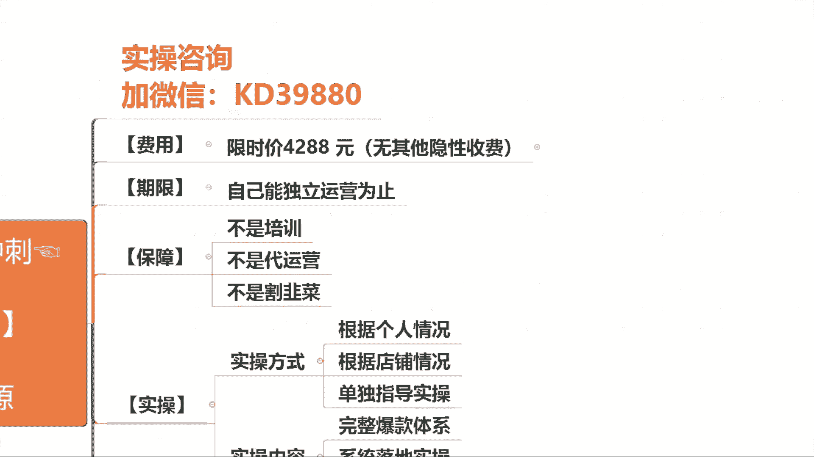