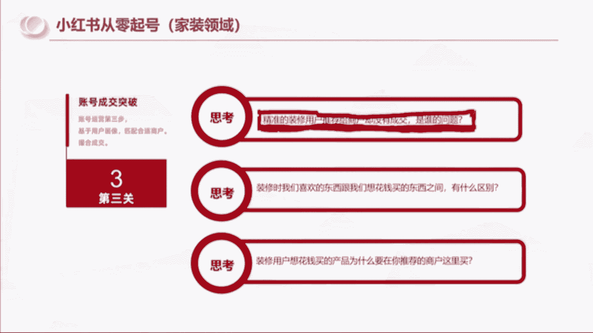
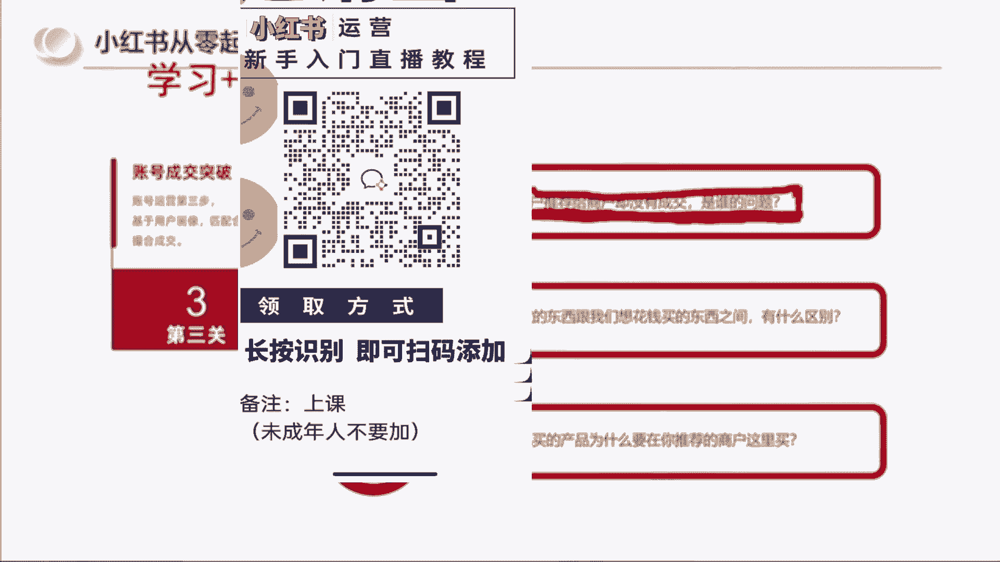
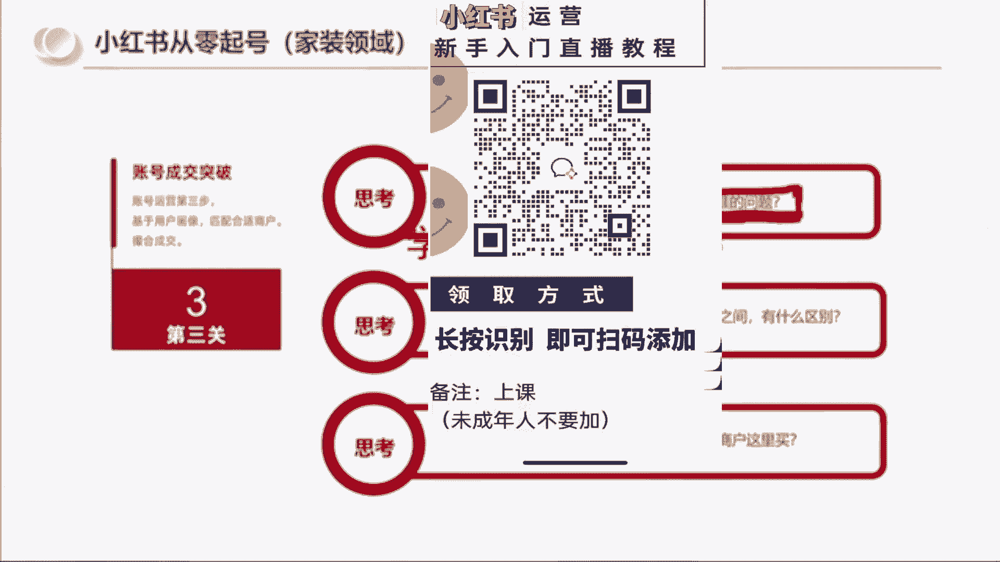
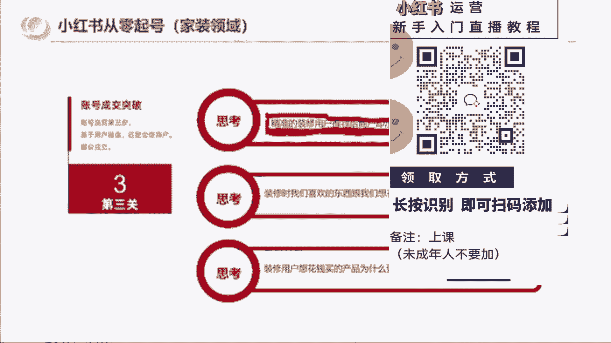
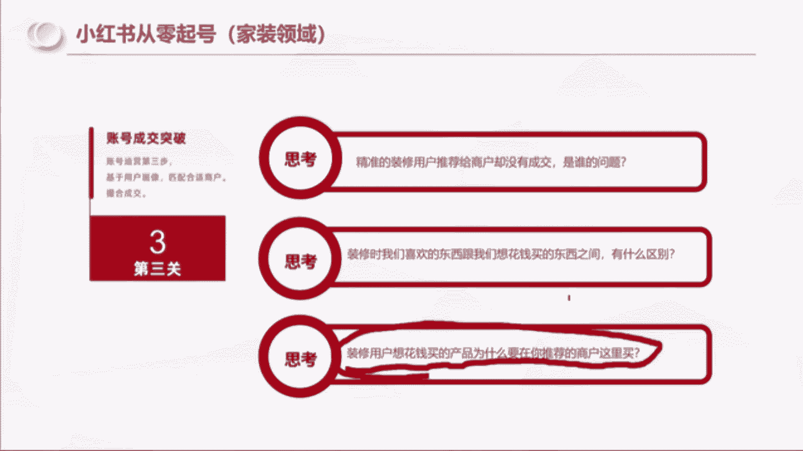
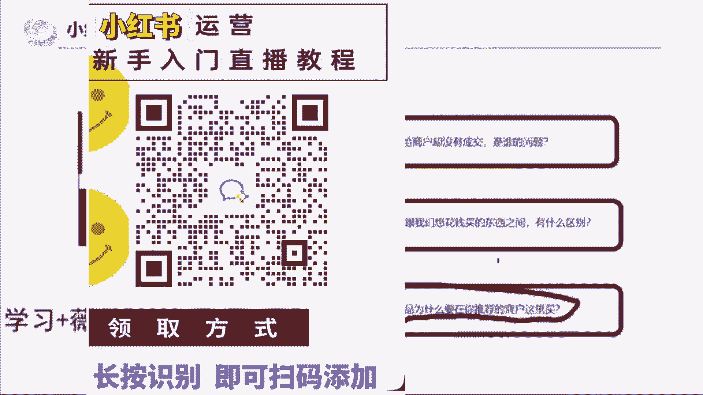
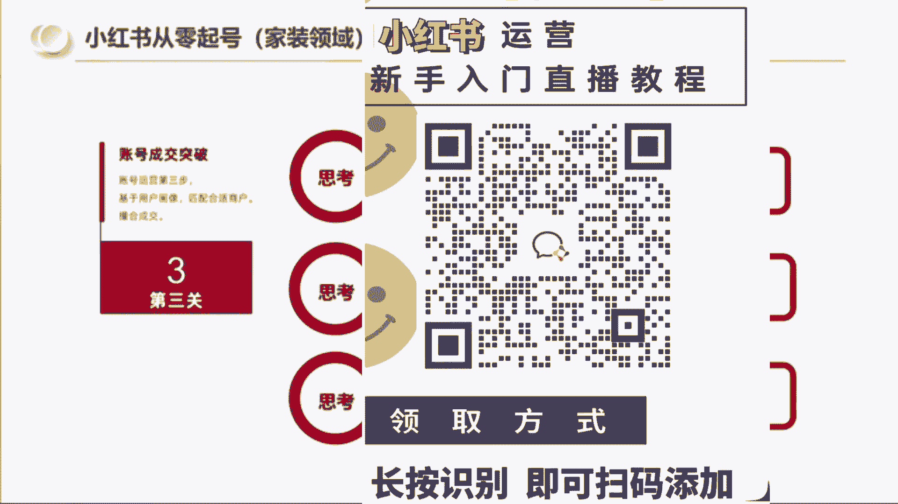
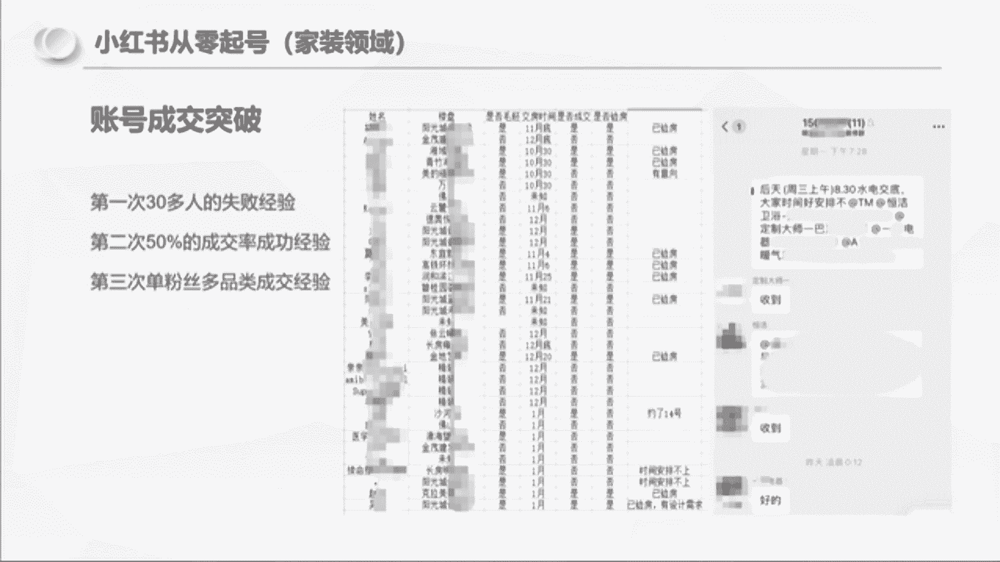

# （2024新版）强推！零基础保姆级自学小红书运营教程（方法+实操），小红书开店必学全套运营逻辑和流程，小红书起号／小红书开店／小红书运营 - P8：06.小红书从零起号第三步 - 红书含苞待放 - BV1jAxWeJEE6

然后我再问大家一个问题啊，这三个问题会跟大家相关，精准的用户推给商家没有成交，是谁的问题，是用户的问题还是商家的问题，还是博主的问题，博主把精准的用户推给商家，没有成交，是谁的问题，你们能弄明白吗。

没错啊，是商家的问题，这里我给大家分享一个事情，就是我在最开始去做这个模跑模型的时候啊，就是首先啊我这个装修的过程中，我所添加的粉丝，我是真诚的对他们的，所以我在做的事情是帮他们出。

找到好的产品去压了价格，去给他们做成交，并且我跟他们讲的很明确，我自己的成交价你不要问我，我肯定比你低，但是我做到一点。

我不赚你们的钱，就是比如说这个市场这个事情，这个东西人家商家正价卖1万啊。

我可以帮你们谈到九千五九千。

但是你不要问我是多少钱买的，因为我也不想骗你，所以我对他们也是真心的。

那这个地方我想跟大家分享一个什么事，就是说精准的用户给到商家没有成交，是商家的问题啊，这个大家答案都是对的，那我也不再去展开，所以如果说你们在小红书拿到了精准的流量，你挂了产品没有成交。

那就一定是产品的问题，明白吧啊以及我还会去思考，那装修时我们喜欢的东西跟我们想花钱买，买的东西有什么区别，这句话翻译一下是啥，翻译一下，就是比如说我们现在去逛商场，去买衣服，买鞋子。

我们最后买回来的是我们最喜欢的那一件吗，嗯同学们很多时候不是因为我们最喜欢的衣服，可能你一摸一看吊牌1500，一双鞋子，你一看1200，但是我们其实是带着预算去买东西的，可能我最喜欢的是1200。

但是我看了有一双鞋只要六七百，他在我的预算内，所以我会选择买预算范围内的，是不是，所以我会深刻地去研究说我搞装修的过程中，我到底看中了什么，我买了什么，为什么，那为什么我要去思考。

因为我要做的是用户成交，不是所有看上的就一定会买，而我要研究的是成交了什么东西，为什么会成交，而那些容易被别人看上的喜欢的，而又成交率很低的，那对我而言就不是好的商品，那还有一个问题啊。

就是装修用户想花钱买产品，那为什么要在我推荐的商户这里买呢，这是不是跟你们的问题有点像，小红书的用户在小红书刷笔记，不是只有你们在挂车，为什么要在你们的笔记下面买呢，这个逻辑你们是要想明白的。

所以我想的很明白，我告诉我粉丝群的人，我帮你们找的是好产品，而且我把找产品的这个过程我有告诉他们，比如说我星期一到哪里看到什么东西，我发给他发到群里。

星期二我看了什么发到群里，星期三我发了什么发到群里，然后我告诉大家我选哪一个，以及我能拿到的价格是多少。

所以我不是说因为装修啊。

跟你们卖的这些东西都不一样，它是一个非常高客单，而且非常复杂的东西，所以我会把整个的这个选品的过程，去分享给他们，然后会明确的告诉他们，这个东西A比B比C的东西，它好在哪，差在哪，然后再去告诉大家。

我为什么买A然后价格是多少。

所以在这个过程中啊，像嗯成交的突破，其实对我来说就已经很简单了啊，像这一个粉丝的话。

他基本上他家里，这个这个这个这个啊，这里应该是五六个东西，跟着我一起买了四个东西，在我看来他是很赚的，因为他没有花任何的时间，我跑游都不知道跑了多少箱油，而且还没赚钱。

